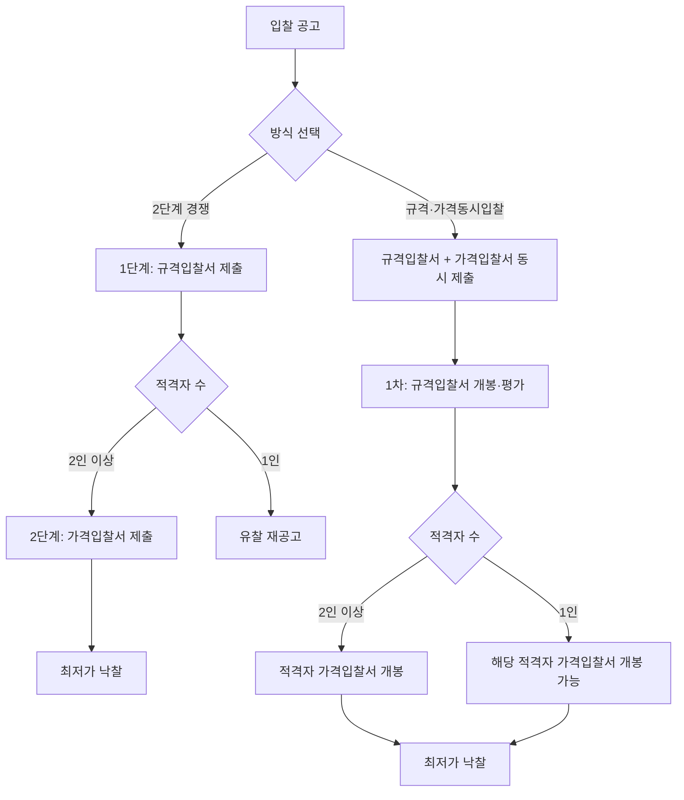

# 2단계 경쟁 및 규격·가격동시입찰 — 규격 적격자 1인 시 개찰 가능 여부

## 개요

규격과 가격을 분리·평가하는 두 가지 입찰 방법의 구조적 차이를 이해해야 한다. 핵심 구별 포인트: **규격 적격자가 1인일 때 가격 개찰이 가능한지 여부**.

> [!note] 왜 이 제도가 존재하는가?
> 발주기관이 규격을 완벽하게 사전 확정하기 어려운 물품(고도의 기술력·특수 사양 필요)에서, 가격보다 기술·규격 적합성을 먼저 검증한 후 그 적격자들 사이에서 가격경쟁을 시키는 방식이다. 목적은 두 가지다: ① 부적합 규격 제품이 낮은 가격으로 낙찰되는 것을 방지하고, ② 제조업체의 성능 향상과 기술 개발을 유도하여 품질경쟁을 촉진한다.

## 현행 규정

### 2단계 경쟁 입찰

- **개념:** 규격 등의 사전 확정이 곤란한 경우, 먼저 규격(기술)입찰을 실시하여 적격자를 선정한 후 그 적격자들에 한하여 가격입찰에 참여 자격을 부여하는 방식
- **시행:** 1995년 7월 6일부터 (교재 기재 기준)
- **유·무효 기준:** 각 단계별 **2인 이상의 유효한 입찰** 필요
- **규격 적격자가 1인인 경우:** 가격 개찰 **불가** — 유찰 처리

> [!note] 왜 2단계 경쟁은 적격자 1인이면 유찰인가?
> 2단계 경쟁은 규격입찰과 가격입찰이 **별도의 독립 절차**로 구성된다. 각 단계에서 유효 경쟁(2인 이상)이 성립해야만 다음 단계가 진행된다. 규격 적격자가 1인이면 가격 단계에서 독점 구도가 형성되어 실질적인 가격경쟁이 불가능해지므로, 입찰 자체를 무효화하고 유찰 처리하는 것이다. 이는 수의계약 우회를 방지하는 안전장치다.

### 규격·가격동시입찰

- **개념:** 규격(기술)입찰서와 가격입찰서를 동시에 제출받아, 1차로 규격입찰서를 개봉·평가하여 적격자를 선정하고, 이후 집행관이 보관하고 있던 해당 적격자의 가격입찰서를 개봉하는 방식
- **시행:** 1977년 4월 1일부터 (교재 기재 기준)
- **유·무효 기준:** 규격과 가격 합산 **2인 이상의 유효입찰**
- **규격 적격자가 1인인 경우:** 가격 개찰 **가능** (핵심 차이점)

> [!note] 왜 동시입찰은 적격자 1인이어도 개찰 가능인가?
> 규격·가격동시입찰은 입찰자가 **처음부터 가격입찰서까지 제출한 상태**로 입찰이 성립한다. 즉, 입찰 성립(2인 이상)은 최초 제출 시점에 이미 충족된다. 규격 평가는 가격입찰서를 이미 제출한 입찰자 중 적격자를 거르는 절차일 뿐이므로, 규격 적격자가 1인이더라도 입찰 자체는 유효하게 성립한 것으로 본다. 가격입찰서가 이미 봉인·보관 중이므로 담합 우려도 없다.

### 비교 표

| 구분 | 입찰 방식 | 규격 적격자 1인 시 | 낙찰 결정 |
|---|---|---|---|
| **2단계 경쟁** | 규격입찰 먼저 → 적격자만 가격입찰 | 가격 개찰 **불가** (유찰) | 최저가 낙찰 |
| **규격·가격동시입찰** | 규격+가격 동시 제출, 규격 개봉 후 적격자 가격 개봉 | 가격 개찰 **가능** | 최저가 낙찰 |

## 절차 비교 흐름도

## 적용 조건

- 2단계 경쟁: 적절한 규격 작성이 곤란하거나 계약 특성상 필요하다고 인정되는 경우
- 규격·가격동시입찰: 2단계 입찰과 유사하나 동시 제출 방식 — 외자구매([[Incoterms-2020-인도조건]] 적용 물품 포함)에도 사용

## 시험 출제 포인트

**출제 패턴:** 규격 적격자가 1인일 때 각 방식에서 개찰 가능 여부 — "2단계 경쟁에서는 가능한가?" "규격·가격동시입찰에서는?"

**핵심 암기:**
- 2단계 경쟁: 적격자 **2인 이상** 필요 → 1인이면 **불가**
- 규격·가격동시입찰: 적격자 **1인이어도** 가격 개찰 **가능**

**오답 유인:**
- "두 방식 모두 1인이면 개찰 불가" — 오답 (동시입찰은 1인 가능)
- "규격·가격동시입찰에서도 2인 이상 필요" — 오답
- 두 방식이 낙찰자 결정 방법에서 차이가 있다 — 오답 (둘 다 최저가 낙찰)

> [!warning] 혼동 주의: 유효입찰 기준의 적용 시점
> 2단계 경쟁의 "각 단계별 2인 이상"은 **두 단계 각각**에 적용된다. 동시입찰의 "2인 이상의 유효입찰"은 **최초 제출 시점**에 확인한다. 규격 평가 후 1인이 남아도 최초 성립 요건은 이미 충족된 것이므로 가격 개찰이 진행된다.

> [!example] 실무 적용 사례 유형
> 2단계 경쟁: 특수 군용장비, 첨단 의료기기, 대형 IT 시스템 등 발주기관이 스스로 완전한 규격서를 작성하기 어려운 물품에 적용. 규격 적격자가 1인이면 유찰 후 재공고 — 반복 유찰 시 수의계약 전환 검토 가능.
> 규격·가격동시입찰: 외자구매 계약([[Incoterms-2020-인도조건]] 적용), 복수공급자가 있으나 규격 합격자가 1인으로 줄어들 수 있는 품목에 주로 적용. 입찰 절차를 한 번에 완결할 수 있어 행정 효율이 높다.

## 관련 카드
- [[경쟁적대화에의한계약]] — 규격 자체를 확정하기 어려운 경우의 계약 방식
- [[희망수량경쟁입찰]] — 복수 낙찰자 선정 방식
- [[MAS-2단계경쟁-종합평가방식]] — MAS 2단계경쟁 종합평가방식(규격·가격 분리 구조 비교)
