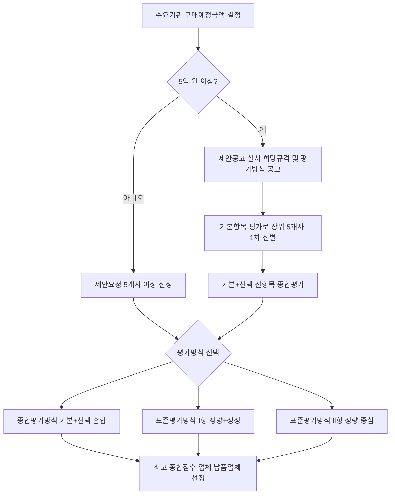

# MAS 2단계경쟁 종합평가방식 — 기본 평가항목 vs 선택 평가항목

## 개요

MAS 2단계경쟁에서 수요기관은 납품업체 선정 시 종합평가방식, 표준평가방식(Ⅰ·Ⅱ) 중 하나를 선택할 수 있다. **종합평가방식**은 기본 평가항목(수요기관이 반드시 포함해야 하는 항목)과 선택 평가항목(수요기관이 자유롭게 추가할 수 있는 항목)으로 구성된다.

근거: 물품 다수공급자계약 2단계경쟁 업무처리기준 (조달청고시 제2020-11호), 용역 다수공급자계약 업무처리규정 (조달청고시 제2024-33호).

> [!note] 왜 2단계 경쟁이 필요한가?
> MAS 1단계(계약 체결)는 사전에 가격을 협상하고 나라장터 쇼핑몰에 등록하는 단계다. 1단계만으로는 수요기관이 쇼핑몰에서 최저가 업체를 자동 선택하게 되어 품질 경쟁이 발생하지 않는다. 2단계 경쟁은 실제 구매 시점에 품질·서비스·납기 등을 재평가하여 진짜 경쟁을 유발하는 장치다. 5천만 원(중소기업자간 경쟁제품은 1억 원) 이상이면 의무적으로 실시한다.

## 현행 규정

### 평가방식 전체 구조

| 방식 | 성격 | 특징 |
|------|------|------|
| 종합평가방식 | 기본+선택 혼합 | 수요기관이 선택항목 추가 가능; 최고 종합점수 업체 선정 |
| 표준평가방식 Ⅰ형 | 정량·정성 병행 | 규정된 항목 내에서 정량과 정성 평가 병행 |
| 표준평가방식 Ⅱ형 | 정량 중심 | 정량 평가 중심으로 단순화 |

### 종합평가방식 기본 평가항목 (40점 이상 고정)

기본 평가항목은 수요기관이 반드시 포함해야 하며, 합계 40점 이상을 배점해야 한다.

| 평가분야 | 평가지표 | 배점 범위 |
|---------|---------|---------|
| **가격** | 제안가격의 적정성 | 20점 이상 60점 이하 |
| **적기납품** | 납기지체 여부 | 10점 이상 20점 이하 |
| **품질관리** | 조달청검사, 전문기관검사 및 품질점검 결과 | 10점 이상 20점 이하 |
| **신인도** | 불공정행위 이력 평가 결과 | −1.75~+2.5점 |

> 기본 4개 항목의 합계(신인도 제외)가 40점 이상이어야 한다.

> [!note] 왜 신인도는 '기본항목'인데 합계 40점 기준에서 제외되나?
> 신인도는 가점(+2.5)과 감점(−1.75) 방식으로 작동하며, 절대 배점이 없다. 40점 이상 기준은 배점이 확정된 항목(가격·적기납품·품질관리)의 합계를 의미한다. 신인도를 포함하면 가점 업체가 40점 기준을 낮출 수 있어 공정성 문제가 생기므로 별도로 취급한다.

> [!warning] 가격 배점 범위 혼동 주의
> 가격 배점은 20~60점 범위 내에서 수요기관이 선택한다. "60점 고정"이 아니다. 단, 표준평가방식 Ⅰ형에서는 2억 원 이상이면 60점, 미만이면 50점으로 고정된다 — 이 두 방식을 혼동하면 오답이 된다.

### 선택 평가항목

수요기관이 사업 특성에 따라 기본 항목 외에 추가할 수 있는 항목이다. 구체적인 선택 평가항목 목록과 배점은 수요기관이 제안요청서에 사전에 명시한다.

- 선택항목 예시: 납품실적, 사후관리(A/S), 약자기업 지원, 수출기업지원 등
- ₩5억 이상 주문(제안공고)의 경우: 기본항목 점수로 상위 5개사를 1차 선별한 후, 기본+선택 전항목으로 최종 평가

> [!note] 왜 5억 이상에서 2단계 선별을 하는가?
> 5억 이상 주문은 사전에 제안공고를 거쳐 다수 업체가 제안서를 제출한다. 모든 업체를 동시에 기본+선택으로 종합 평가하면 평가 부담이 과중해진다. 1차로 기본항목(가격·품질 등 객관 지표)으로 상위 5개사를 추린 후 2차로 선택항목까지 종합 평가하는 투트랙 방식은 평가 효율과 공정성을 동시에 확보한다.

### 표준평가방식 vs 종합평가방식 비교

| 구분 | 종합평가방식 | 표준평가방식 |
|------|------------|------------|
| 기본항목 | 4개 고정(가격/적기납품/품질관리/신인도) | 규정 항목 내 선택 |
| 선택항목 | 수요기관이 자유롭게 추가 | 없음 |
| 가격 배점 | 20~60점(범위 내 선택) | ₩2억 이상→60점, 미만→50점(표준 Ⅰ형) |
| 활용 상황 | 품질·서비스 차별화가 중요한 구매 | 단순 물품, 빠른 선정이 필요할 때 |

## 납품업체 선정 흐름

## 적용 조건

- 수요기관이 제안요청서(또는 제안공고)에 평가방식을 사전 명시해야 함
- 동점자 처리: ① 품질관리 점수 → ② 제안가격(A형) 또는 제안율(B형) → ③ 나라장터 추첨
- 수요기관은 제안서 평가에 필요한 서류가 누락·불명확한 경우 **3일 이내** 보완 요구 가능
- 종합쇼핑몰 자동선정: 동일 세부품명 계약상대자가 **15개사 이상**이면 10개사를 자동선정하며, 수요기관은 이 중 5개사 이상에게 제안요청

> [!example] 자동선정 방식의 실무 의미
> 수요기관이 일일이 5개사를 수동 선정하지 않아도, 나라장터 쇼핑몰 시스템이 자동으로 제안요청 대상을 추천한다. 이때 시스템이 추가로 2인을 자동 포함하는 기능도 있어, 실제 제안요청 대상은 수요기관 선정 5인 + 자동 추천 2인 = 최대 7인 구성이 가능하다. 카탈로그계약-견적요청기준의 5인 기준과 연결된다.

## 시험 출제 포인트

**MAS 2단계 경쟁 종합평가방식 기본 평가항목 vs 선택항목 구별**

출제 방식: 기본 평가항목의 종류(4개)와 배점 범위를 묻거나, 특정 항목이 기본인지 선택인지 구별하는 문제.

오답 유인:
- 신인도가 기본항목이 아닌 선택항목이라고 혼동 (신인도는 기본항목)
- 가격 배점을 60점으로 고정 이해 (20~60점 **범위** 내에서 선택)
- 기본항목 합계 요건을 40점 미만으로 혼동 (40점 이상 필수)
- 종합평가방식을 표준평가방식과 혼동 (선택항목 추가 가능 여부가 핵심 차이)

핵심 암기: **"기본 4개 = 가격(20~60) + 적기납품(10~20) + 품질관리(10~20) + 신인도(±)"**

## 관련 카드

- mas-two-stage-competition — 2단계경쟁 전체 메커니즘(물품 MAS; 표준평가방식 세부표 포함)
- mas-services-mechanics — 용역 MAS 2단계경쟁(SW MAS 별도 채점 구조)
- mas-governing-regulation — 근거 고시·훈령 조항 인벤토리
- [[MAS-최소계약상대자]] — MAS 계약상대자 수 기준(법령 2인·실무 3인)
- [[2단계경쟁-규격가격동시입찰]] — 일반 물품 입찰의 2단계 경쟁 방식(MAS 외 비교)
