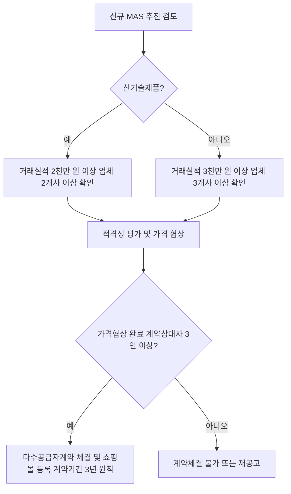

# MAS 최소 계약상대자 수 — 정의상 2인 이상, 계약체결 원칙 3인 이상

## 개요

다수공급자계약(MAS, 多數供給者契約)은 법령 정의와 실무 운영에서 계약상대자 수 기준이 서로 다르다. 시험에서는 이 두 기준의 구별이 자주 출제된다.

근거: 조달사업에 관한 법률 제13조 (정의), 물품 다수공급자계약 업무처리규정 (계약체결 원칙).

> [!note] 왜 정의는 2인, 실무는 3인인가?
> 법령은 "2인 이상"이라는 최소 요건만 명시하여 MAS의 법적 성립 조건을 설정한다. 실무적으로는 수요기관이 [[MAS-2단계경쟁-종합평가방식|2단계 경쟁]] 시 최소 5개사에 견적을 요청하므로, 계약상대자가 3인 미만이면 의미 있는 경쟁 자체가 불가능해진다. 3인 이상 원칙은 경쟁 가능성을 실질적으로 보장하기 위한 운영 기준이다.

## 현행 규정

### 두 가지 기준

| 구분 | 인원 | 근거 |
|------|------|------|
| **법령상 정의** — 다수공급자계약이 되기 위한 최소 요건 | **2인 이상** | 조달사업에 관한 법률 제13조 |
| **실무 계약체결 원칙** — 가격협상 완료 후 계약상대자 수 | **3인 이상 원칙** | 물품 다수공급자계약 업무처리규정 |

### 법령 정의 (조달사업에 관한 법률 제13조)

> 수요기관이 필요로 하는 수요물자를 구매하기 위하여 품질·성능 또는 효율 등이 같거나 비슷한 종류의 수요물자를 수요기관이 선택할 수 있도록 **2인 이상**을 계약상대자로 하여 체결하는 계약

이 정의는 MAS가 무엇인지를 규정한 것으로, 최소 2인만 확보되면 법령상 MAS에 해당한다.

### 계약체결 원칙 (업무처리규정)

실무에서 가격협상이 완료된 계약상대자가 **3인 이상**이어야 종합쇼핑몰에 등록하여 MAS 계약을 체결하는 것이 원칙이다.

```
가격협상 완료 → 3인 이상의 계약상대자와 다수공급자계약 체결
→ 나라장터 종합쇼핑몰에 등록 (계약기간 3년 원칙)
```

### 신규 수요물자 MAS 추진 요건

MAS를 신규로 추진하려면 해당 수요물자를 제조·공급하는 업체 수 기준도 있다.

| 구분 | 요건 |
|------|------|
| 일반 물자 | 연간 거래실적 **3천만 원 이상** 업체가 **3개사 이상** |
| 신기술제품 | 연간 거래실적 **2천만 원 이상** 업체가 **2개사 이상** |

> [!note] 왜 신기술제품은 기준이 낮은가?
> 신기술제품(조달청이 인정한 혁신·신기술 품목)은 시장 자체가 형성 초기라 3개사 이상 요건을 충족하기 어렵다. 기준을 완화(2개사, 2천만 원)하여 신기술 공급업체의 공공시장 진입을 장려하는 정책적 배려다.

## 절차 흐름



## 적용 조건

- MAS 계약은 물품·용역 모두 적용
- 계약기간: 원칙 **3년**
- 최근 3년간 납품실적이 10건 미만인 세부품명은 MAS 추진 불가

> [!warning] "3인 이상"은 절대 요건이 아니다
> 원칙상 3인이지만, 시장 상황에 따라 예외적으로 2인만 계약이 성립된 경우에도 법령상 MAS 정의(2인 이상)는 충족된다. 시험에서 "3인 미만이면 MAS 불가"라는 선택지는 오답이다.

> [!example] 실무 맥락: 계약상대자가 줄어드는 경우
> MAS 계약 기간 중 특정 업체가 계약 해지·부도·폐업하면 계약상대자 수가 3인 미만으로 감소할 수 있다. 이 경우 기존 계약은 유효하게 유지되며(법령상 2인 요건 충족), 조달청은 해당 세부품명에 대해 추가 업체 등록 공고를 통해 경쟁성을 회복시킨다.

## 시험 출제 포인트

**MAS 계약 최소 계약상대자 수 기준**

출제 방식: "2인 이상"과 "3인 이상" 중 어느 것이 법령 정의인지, 어느 것이 실무 원칙인지 구별하는 문제.

오답 유인:
- 법령 정의를 "3인 이상"으로 혼동 (실제는 2인 이상이 정의, 3인이 실무 원칙)
- "3인 이상" 원칙을 절대 요건으로 혼동 (예외 있음)
- 신기술제품 업체 수 기준(2개사)을 일반 기준으로 혼동

핵심 암기: **"법령 정의 = 2인 이상 / 계약체결 원칙 = 3인 이상"**

## 관련 카드

- mas-governing-regulation — MAS 근거 법령 및 훈령·고시 체계
- mas-two-stage-competition — 2단계 경쟁(납품업체 선정) 상세 메커니즘
- mas-services-mechanics — 용역 MAS와 물품 MAS의 차이
- [[MAS-2단계경쟁-종합평가방식]] — 2단계경쟁 종합평가방식 기본·선택 평가항목 구조
