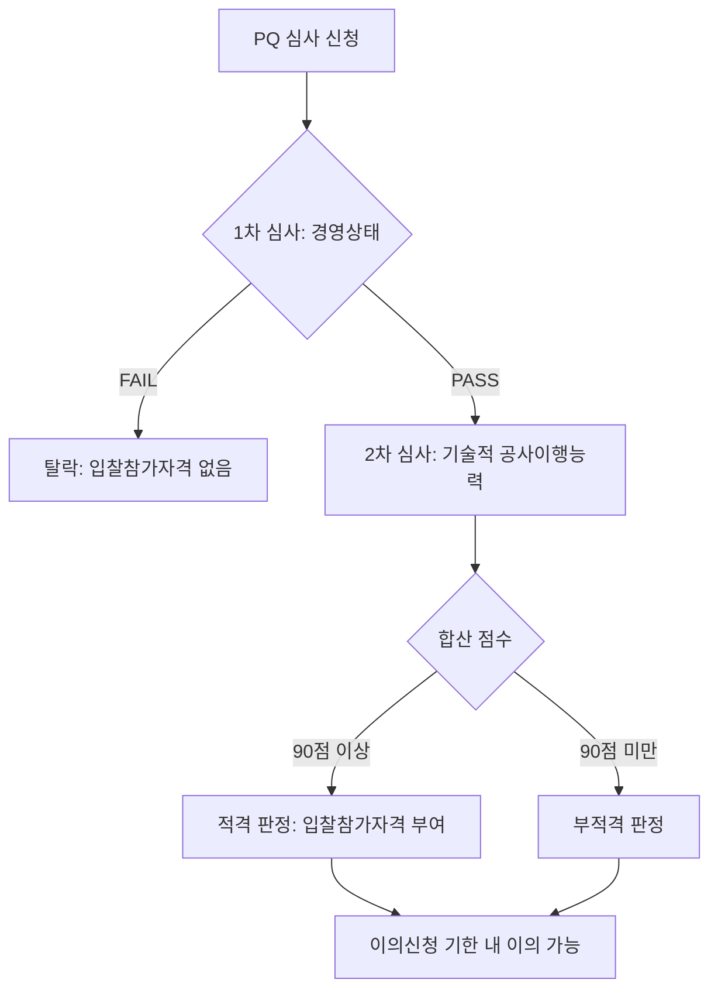

# PQ 2차심사 — 심사분야별 평점 배분 (조달청 기준)

## 개요

입찰참가자격사전심사제(Pre-Qualification, PQ)는 입찰 전 시공경험·기술능력·경영상태·신인도 등을 평가해 적격업체에만 입찰참가자격을 부여하는 제도. 추정가격 300억 원 이상 공사, 200억 원 이상 난이도 높은 공사에 적용.

> [!note] 왜 이 제도가 존재하는가?
> 1993년 이전 공공공사는 최저가 위주의 가격경쟁 입찰이 원칙이었다. 그 결과 시공능력이 검증되지 않은 업체가 대형 공사를 낙찰받아 부실시공 사례가 반복됐다. 이에 정부는 1993년 7월 100억 원 이상 공사 중 지하철·교량·댐 등 14개 공종을 시작으로 PQ 제도를 도입했고, 이후 국가계약법 제정(1995)과 함께 22개 공종으로 확대됐다. **가격경쟁 → 능력경쟁**으로의 전환이 제도의 핵심 취지다.

## 현행 규정 — PQ 심사 구조

### 1차 심사
경영상태 부문: **Pass or Fail** 방식 (통과 시에만 2차 심사 진행)

> [!warning] 시험 함정
> 1차 심사(경영상태)는 점수가 없다. "1차 심사 몇 점 이상"이라는 선택지가 등장하면 오답이다. Pass/Fail 구조임을 명심할 것.

### 2차 심사 — 기술적 공사이행능력 (100점)

| 심사분야 | 배점 |
|---------|------|
| 시공경험 | 40~45점 |
| 기술능력 | 45점 |
| 지역업체 참여도 | 5점 |
| 시공평가결과 | 10점 |
| 신인도 | ±5점 |

- 2차 심사 합격 기준: **90점 이상**

> [!note] 왜 시공경험이 40~45점 범위인가?
> 지역업체와 공동계약 시 지역참여비율에 따라 평가분야별(경영상태·신인도 분야 제외) 평가점수에 **가산비율**을 적용한다(「조달청 입찰참가자격사전심사기준」제7조 제4항). 지역업체 참여도가 높을수록 시공경험 배점이 45점에 가깝게 조정되는 구조이기 때문에 범위(40~45점)로 표시된다.

### PQ 심사 흐름도

## 적용 조건

- 300억 원 이상 일반공사
- 200억 원 이상 공사 중 난이도 높은 공사: 교량(기둥 간격 50m 이상 또는 길이 500m 이상), 터널, 항만, 지하철, 공항, 소각로 등
- 공동수급체 구성원 시공비율이 **10% 미만**이면 결격 (일반공사); 1000억 이상 일괄·대안입찰 및 지자체 공사는 5% 미만 결격
- 이의신청 접수기한: 결과 공시 후 **3일 이내**

> [!note] PQ 통과 후 다음 단계 연결
> - PQ 합격 후에도 [[하도급-적정성심사-기준하도급율|하도급 적정성 심사]]가 계약 단계에서 별도로 진행된다.
> - 추정가격 88억 원 이상 공사(공공기관 265억 원 이상)는 [[WTO-GPA-옵셋금지-원칙|GPA 국제입찰]] 대상이 될 수 있어 별도 공고기간(40일) 규정이 적용된다.
> - PQ 대상 공사의 입찰공고 기간은 [[공사입찰-공고기간-기준|현장설명일 전일로부터 30일 전]]이다.

> [!warning] PQ vs 적격심사 혼동 주의
> PQ는 **입찰 참가 자격**을 부여하는 사전심사이고, [[하도급-적정성심사-기준하도급율|적격심사]]는 **낙찰자를 결정**하는 사후심사다. 두 제도 모두 90점 기준이 등장하지만 적용 단계가 다르다.

## 시험 출제 포인트

- **핵심:** "PQ 2차심사 심사분야별 평점 배분 (조달청 기준)"
  - 시공경험: **40~45점**, 기술능력: **45점**, 지역업체: **5점**, 시공평가결과: **10점**, 신인도: **±5점**
  - 합격 기준: **90점 이상**
- 1차 심사(경영상태)는 Pass/Fail 방식 — 점수 없음
- 2차 심사 총점 100점 + 신인도 ±5점

## 관련 카드
- [[공사입찰-공고기간-기준]] — PQ 대상 공사의 공고기간 (30일 전)
- [[종합심사낙찰제-동가입찰-낙찰자결정]] — PQ 통과 후 적용되는 낙찰자 결정 방식
- [[건설공사-범위-제외공종]] — PQ 심사가 적용되는 건설공사의 범위 정의
- [[WTO-GPA-옵셋금지-원칙]] — PQ 대상 대형 공사의 국제입찰 시 GPA 원칙
- [[하도급-적정성심사-기준하도급율]] — PQ 통과 후 계약 단계의 하도급 적정성 심사
