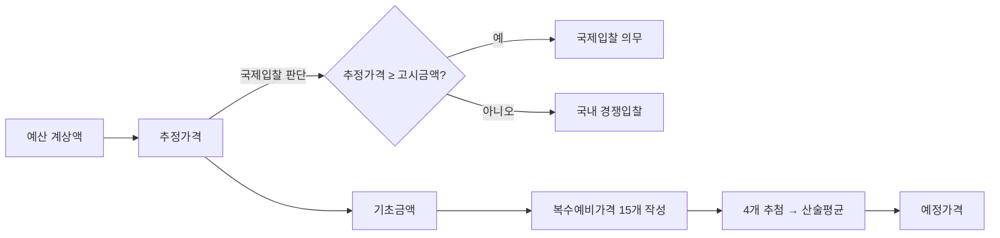

# 가격 용어 정의 — 추정가격·기초금액·예정가격·고시금액

## 개요

공공조달 입찰에서는 동일한 계약에 대해 목적이 다른 여러 가격이 공존한다. 이 네 가지 용어를 혼동하면 국제입찰 대상 판단, 적격심사 배점, 수의계약 가부 판단에서 오류가 발생한다. 모두 「국가계약법 시행령」제2장(제7조–제9조)에 근거한다.

> [!note] 왜 이렇게 많은 가격 개념이 필요한가?
> 각 가격은 서로 다른 정책 목적을 위해 설계되었다.
> - **추정가격**: 계약 확정 전에 행정 판단 기준으로 쓰이는 잠정 가격 — 부가세·관급자재 제외로 순수 계약 규모만 측정
> - **기초금액**: 예정가격을 무작위 결정하기 위한 출발점 — 복수예비가격 제도의 핵심 투명성 장치
> - **예정가격**: 낙찰자 결정의 최고 상한 — 밀봉 보관으로 사전 유출을 제도적으로 차단
> - **고시금액**: 국제 통상규범(WTO GPA) 이행을 위한 문턱 — 초과 시 국제입찰 의무화

## 현행 규정

### 네 가지 가격 비교

| 용어 | 정의 | 부가가치세 | 관급자재 | 주요 용도 |
|------|------|-----------|---------|---------|
| **추정가격** | 예정가격 결정 전, 예산에 계상된 금액 등을 기준으로 산정한 가격 | 미포함 | 미포함 | 국제입찰 대상 여부, 입찰공고 방법, 적격심사, 수의계약 기준 |
| **고시금액** | 국제입찰 대상 여부 판단을 위해 행정안전부장관이 고시한 금액 | — | — | 추정가격 ≥ 고시금액이면 국제입찰 의무 |
| **기초금액** | 복수예비가격 15개 산정의 기준이 되는 금액; 입찰마감일 **5일 전** 공개 | 포함 | 미포함 | 예정가격 도출 기준; 적격심사·시공경험 평가에 활용 |
| **예정가격** | 입찰·수의계약 전에 낙찰·계약금액 결정기준으로 미리 작성·비치하는 가액 (예산 범위 내 최고 상한) | 포함 | 포함 | 낙찰 여부 판단; 기초금액으로부터 4개 복수예비가격의 산술평균으로 결정 |

> [!info] 용어 정의 — 부가가치세와 관급자재
> **부가가치세(附加價値稅, VAT)**: 재화·용역의 공급 및 재화의 수입에 대해 부과하는 간접세로, 현행 세율은 공급가액의 **10%**다. 공공조달 계약에서 계약금액은 통상 VAT 포함 금액으로 표시되지만, 입찰 자격·한도 판단 기준인 **추정가격은 VAT를 제외**한 순수 공급가액 기준으로 산정한다. 위 표에서 "포함/미포함" 열이 바로 부가가치세 반영 여부를 가리킨다.
>
> **관급자재(官給資材, government-furnished materials)**: 발주기관(甲)이 직접 구매하여 계약상대자(수급인)에게 지급하는 자재를 말한다. 수급인이 자재를 직접 조달하지 않으므로 계약자 입장에서는 도급금액 산정 대상 밖이 된다. 추정가격과 기초금액 산정 시 관급자재를 **제외**함으로써 계약자가 실제로 조달해야 할 범위만 측정한다. 예정가격에는 포함되어 전체 발주 규모를 반영한다.
>
> → 두 항목의 포함/제외 여부가 추정가격·기초금액·예정가격을 구별하는 핵심 기준이므로 위 표와 함께 암기한다.

### 파생 용어

| 용어 | 산식 |
|------|------|
| **추정금액** | 추정가격 + 부가가치세 + 관급자재 |
| **공사예정금액** | 추정가격 + 부가가치세 + 도급자 설치 관급자재 |

### 가격 생성 흐름

### 예정가격의 구성 비목

물품대 / 운반비(납품장소도인 경우) / 설치비(현장설치도인 경우) / 교육훈련비 / 인·허가 비용 / 시험·검사비용 / 세액(부가가치세·관세·특별소비세 등) / 기타

## 적용 조건

- 추정가격은 부가가치세와 관급자재를 **포함하지 않는다** — 자주 출제되는 오답 선택지.
- 기초금액은 부가가치세를 **포함하되** 관급자재는 포함하지 않는다.
- 예정가격 비치 시 밀봉 보관 의무 — 입찰 전 누설 금지.
- 유찰 시 예정가격조서를 재밀봉하여 계약담당과장이 보관.

> [!warning] 추정가격 산정의 특수 케이스
> 리스·임차·할부구매 등 총계약금액이 확정되지 않은 계약의 추정가격은 다음 기준 적용:
> - 계약기간이 정해진 경우: 총계약기간 추정액
> - 계약기간 미확정·불분명: 1월분 추정지급액 × 48
> - 선택사항이 있는 경우: 선택사항 포함 최대 조달가능액

## 실무 맥락

> [!example] 예정가격 유출 사건의 구조적 문제
> 복수예비가격 제도 도입(2005년 조달청 개선) 이전에는 예정가격 단일 결정 방식으로 인해 예가 사전 유출이 담합의 핵심 수단이 되었다. 발주기관 담당자가 업체에 예정가격 수준을 알려주거나, 업체가 복수의 경로로 예가를 역산하는 방식으로 입찰 경쟁이 형해화되는 문제가 발생했다. 복수예비가격 도입은 예정가격을 입찰 당일 무작위 추첨으로 결정함으로써 사전 유출의 실효성을 차단하는 것이 핵심 목적이다.

> [!info] 추정가격과 추정금액의 실무적 구분
> 실무에서 "몇 억짜리 계약"을 말할 때는 보통 **추정금액**(부가세·관급자재 포함)을 쓴다. 반면 적격심사 배점, 수의계약 한도, 국제입찰 기준 판단은 모두 **추정가격**(부가세·관급자재 제외)을 기준으로 한다. 
> 두 용어의 혼용이 실무 오류의 주요 원인이다.

## 시험 출제 포인트

**핵심 혼동 포인트** — 시험은 네 용어를 정의 바꿔치기로 출제한다:
- "입찰 전 낙찰기준으로 미리 작성·비치하는 가액" → **예정가격** (기초금액과 혼동 주의)
- "국제입찰 대상 여부 판단 기준금액" → **고시금액** (추정가격과 혼동 주의)
- "복수예비가격 산정의 기준" → **기초금액** (예정가격과 혼동 주의)
- 추정가격 vs 추정금액: 추정금액이 부가가치세·관급자재를 **추가** 포함

> 네 용어 정의를 제시하고 맞는 용어를 고르는 문제. 정답은 **예정가격**(낙찰·계약금액 결정기준으로 미리 작성·비치하는 가액) — 보기는 기초금액 정의를 예정가격으로, 예정가격 정의를 기초금액으로 뒤바꿔 출제.

## 관련 카드

- [[예정가격-결정방법]] — 예정가격을 결정하는 3가지 방법과 기준가격 우선순위 6단계
- [[예정가격-작성예외]] — 예정가격 결정 생략이 허용되는 4가지 예외 조건
- [[원가-구성-및-비율]] — 예정가격 산정 시 원가계산가격을 쓰는 경우의 5비목 구성
- [[낙찰자선정방식-비교]] — 예정가격이 낙찰 기준이 되는 적격심사·최저가 방식
