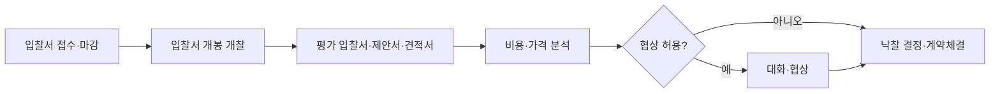

# 개찰 및 낙찰 절차 — 단계별 구조와 발주기관별 차이

## 개요

개찰 및 낙찰 절차는 입찰서 제출 마감 후 입찰자가 참석한 자리에서 입찰서를 개봉(개찰)하고, 발주기관의 기준에 따라 낙찰자를 선정·발표하는 공식 절차이다. 근거 법령: 국가계약법 시행령 제40조.

> [!note] 왜 공개 개봉이 원칙인가?
> 입찰자가 참석한 자리에서 입찰서를 개봉하도록 의무화하는 것은 **입찰 비밀 조작 방지**를 위해서다. 개봉 전에 특정 금액 정보가 유출되면 다른 업체의 투찰 전략이 침해되므로, 공개 개봉은 절차적 공정성의 핵심 장치이다.

## 절차 흐름도

## 현행 규정 — 6단계 절차

| 단계 | 내용 |
|------|------|
| 1단계 | 입찰서 접수 및 마감 |
| 2단계 | 입찰서 개봉(개찰) — 입찰자 참석 자리에서 개봉; 전자입찰은 지정 절차에 따름 |
| 3단계 | 평가 — 방법에 따라 입찰서·제안서·견적서 평가 |
| 4단계 | 비용/가격 분석 |
| 5단계 | 대화(협상) — 허용된 경우에 한함 |
| 6단계 | 낙찰 결정 및 계약체결 |

## 적용 조건

- 입찰자 불참 시: 입찰사무에 관계없는 공무원 입회하에 진행
- 전자입찰: 입찰공고에 표시한 절차와 방법에 따라 개찰 및 낙찰선언
- 낙찰 결정에 장시간 소요되는 경우(적격심사, 종합심사 등): 해당 절차를 거친 후 낙찰선언 가능

> [!warning] 개찰 후 오류 발견 시 취급
> 정정공고는 **개찰 전까지만** 가능하다. 개찰 이후 공고 오류(예: 예정가격 산출 하자)가 발견되면 정정공고 대신 **입찰 전체를 취소하고 재공고**해야 한다. 이 구별이 시험에서 오답 유인으로 자주 등장한다.

## 발주기관별 낙찰 기준 차이

| 계약 방식 | 낙찰 기준 |
|----------|----------|
| 물품·공사 적격심사 | 예정가격 **이하** 최저가 순으로 적격심사 |
| 협상에 의한 계약 | 기술점수(80%) + 가격점수(20%) 합산 최고득점자 |
| 물품 | 예정가격 이하 |
| 재정지출 부담 계약 | 예정가격 이상(서비스 매입 등) |

> [!example] 실제 분쟁 사례 — 예정가격 결정 하자와 낙찰 취소
> 지방자치단체 입찰에서 복수예비가격 상하범위를 공고와 달리 기초금액의 ±2%로 시스템에 잘못 입력한 사례가 있었다. 이로 인해 특정 범위 외 업체들이 낙찰 가능 범위에서 원천 배제되었고, 개찰 후에도 입찰 절차 전체가 무효 처리되었다. **개찰이 완료된 후에도 중대한 예정가격 하자가 있으면 낙찰이 취소될 수 있다**는 원칙을 보여 준다.

**시험 함정:** "각 단계별 세부 기준과 절차는 발주기관 공고문에 따라 **다를 수 있다**." 즉 발주기관별 절차가 반드시 동일한 것은 아님 (Q11 출제 핵심).

## 시험 출제 포인트

- **핵심:** "개찰 및 낙찰 절차 — 발주기관별 절차 동일성 여부" → **동일하지 않다**. 발주기관별 기준과 절차가 다를 수 있으며, 공고문 확인이 필수.
- 6단계 흐름: 접수 → 개봉 → 평가 → 가격분석 → 협상(선택) → 낙찰·계약

## 관련 카드
- [[낙찰자선정방식-비교]] — 적격심사·협상·종합심사 비교
- [[전자입찰서-제출규칙]] — 전자입찰 시 개찰 절차
- [[입찰보증증서-보증기간]] — 개찰 전 입찰보증 납부 기간 기준
- [[입찰설명회-목적-기대효과]] — 입찰 참가 전 사전 설명회와 개찰 절차의 관계
- [[일반경쟁입찰-장단점-절차]] — 개찰·낙찰 절차가 적용되는 대표적 입찰 방식
