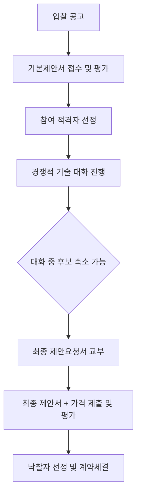

# 경쟁적 대화에 의한 계약 — 적용 대상 요건

## 개요

경쟁적 대화에 의한 계약(단계적 협의에 의한 과업 확정방식)은 사전에 규격을 확정하는 기존 조달관행에서 탈피하여, 입찰대상자들과 기술적 대화를 통해 계약목적물의 세부내용 및 이행방안을 조정·확정한 후 최종 제안서를 평가하여 낙찰자를 선정하는 **문제해결형 계약방식**이다.

> [!note] 왜 이 제도가 도입되었는가?
> 기존 조달 방식(일반경쟁, 협상에 의한 계약)은 **발주기관이 규격을 미리 확정할 수 있다**는 전제를 기반으로 한다. 그러나 첨단기술·비상용화 혁신제품·복합 IT 시스템처럼 발주기관 스스로 무엇이 최적의 기술적 해결책인지 모르는 경우에는 사전 규격 확정이 불가능하다. 이를 억지로 규격화하면 부적합한 규격서로 인해 낙찰 후 계약 이행에서 품질 문제가 발생한다. 경쟁적 대화는 발주기관과 입찰대상자가 함께 과업을 설계하는 **공동 문제해결** 방식으로, EU 공공조달 지침(2004/18/EC)에서 먼저 도입되고 한국은 2020년 이후 국가계약법 시행령 제43조의3으로 수용하였다.
>
> 또한 협상에 의한 계약은 우선협상대상자 선정 후에도 협상이 계속되어 절차 지연·불공정 경쟁 문제가 제기되었다. 경쟁적 대화는 대화 단계와 최종 제안서 단계를 분리하여 절차 투명성을 높인다.

## 현행 규정

### 정의

입찰대상자들과 계약목적물의 세부내용 등에 관한 경쟁적·기술적 대화를 통하여 계약목적물의 세부내용 및 계약이행방안 등을 조정·확정 후 제안서를 제출받고 이를 평가하여 국가에 가장 유리하다고 인정되는 자와 계약을 체결한다.

### 적용 대상 요건 (4가지)

| 요건 | 내용 |
|---|---|
| ① 규격 사전 확정 곤란 | 기술적 요구 사항이나 최종 계약목적물의 세부내용을 미리 정하기 어려운 경우 |
| ② 대안 다양 | 물품·용역 등의 대안이 다양하여 최적의 대안을 선정하기 어려운 경우 |
| ③ 상용화 미진 | 상용화되지 아니한 물품을 구매하려는 경우 |
| ④ 복잡·고난도 | 계약목적물의 내용이 복잡하거나 난이도가 높은 경우 (중앙관서의 장이 정한 경우) |

- 적용 분야: 전문성·기술성이 요구되는 물품·용역

### 절차

> [!note] 절차의 핵심 특징
> 경쟁적 대화의 절차적 특징은 두 가지다: ① 대화 단계에서 후보자를 단계적으로 줄일 수 있어 비효율적 참가자를 조기에 제거할 수 있다. ② 예정가격을 사전에 작성하지 않는다(비예가 방식) — 발주기관이 사전에 가격 기준을 정하지 않으므로 협상·기술 대화의 결과에 따라 가격이 형성된다.

### 협상에 의한 계약과의 차이

| 구분 | 협상에 의한 계약 | 경쟁적 대화에 의한 계약 |
|---|---|---|
| 사전 규격 | 사전 확정 후 공고 | 대화를 통해 확정 |
| 예정가격 | 작성 (비예가 방식도 가능) | 작성하지 않음 (비예가) |
| 대상 | 전문성·기술성·긴급성 | 규격 사전 확정이 어려운 첨단·복잡 과업 |
| 협상 범위 | 우선협상대상자 선정 후 협상 지속 가능 | 대화 단계와 최종 제안 단계 명확히 분리 |
| 적용 유형 | 상용화된 물품·용역의 전문성 요건 | 비상용화 혁신제품, 규격 미확정 복합 과업 |

> [!example] 실무 적용 사례 유형
> 국방부가 차세대 지휘통제 소프트웨어를 도입하려는 경우를 가정한다. 발주기관(국방부)은 어떤 기능이 필요한지는 알지만, 어떤 아키텍처·기술 스택·AI 알고리즘이 최적인지 알 수 없다. 협상에 의한 계약이면 규격서를 먼저 만들어야 하는데, 이 규격서가 기술에 대한 지식 부족으로 잘못 작성될 위험이 높다. 경쟁적 대화는 3~4개 후보 업체와 기술 대화를 통해 사양을 공동으로 확정한 후 최종 제안서를 받는다 — 혁신 조달([[공공혁신조달플랫폼]])에서 주된 활용 방식이다.

## 시험 출제 포인트

**Q9 (과목3) 출제 패턴:** 경쟁적 대화에 의한 계약의 적용 대상 요건 — 4가지 요건 중 해당·비해당 구별.

**핵심 암기:**
- 경쟁적 대화의 핵심: **사전에 규격을 확정하기 어려운** 경우
- 상용화된 물품은 적용 제외 (상용화되지 않은 물품이 적용 대상)
- 예정가격 작성 없음 (비예가 방식)

**오답 유인:**
- 단순 노무 용역에 적용 — 오답 (전문성·기술성 필요)
- 규격이 명확한 물품에 적용 — 오답
- 협상에 의한 계약과 동일하다 — 오답 (규격 확정 방식에서 근본적 차이)
- "상용화된 물품 구매" — 오답 (비상용화 물품이 적용 대상)

> [!warning] 시험 함정: 4가지 요건 중 "복잡·고난도" 조건
> 4가지 요건 중 ④ "복잡·고난도"는 **중앙관서의 장이 인정한 경우**라는 추가 조건이 있다. 나머지 ①②③은 객관적 사실 요건이지만, ④만 기관장의 판단이 개입된다. 시험 문항에서 "중앙관서의 장의 인정 없이 내용이 복잡하다는 이유만으로 적용 가능한가?" 형식으로 출제될 수 있다 — 불가능하다.

> [!warning] 시험 함정: 예정가격 작성 여부
> 경쟁적 대화에 의한 계약은 **예정가격을 작성하지 않는다(비예가)**. [[협상에의한계약-배점기준]]은 예정가격을 원칙적으로 작성한다. 이 차이는 시험에서 자주 혼동을 유도한다.

## 관련 카드
- [[협상에의한계약-배점기준]] — 사전 규격이 확정된 경우 적용하는 협상 방식
- [[협상에의한계약-협상적격자-선정]] — 협상 단계에서 적격자 선정 기준
- [[2단계경쟁-규격가격동시입찰]] — 규격 적격자 1인 시 처리 방식 차이; 규격 사전 확정이 어려운 또 다른 방식

:::tip[실무에서 이 규정 적용하기]
고객 계약별로 이 기준을 자동 적용하고 싶다면 → [공공조달관리사 워크플로우 플랫폼](https://kr-public-procurement-demo.up.railway.app)

조달관리사 실무 워크플로우 플랫폼 — 규제 변경 알림, 클라이언트별 적격심사 점수 자동 계산, 계약 이행 이력 관리.
:::
