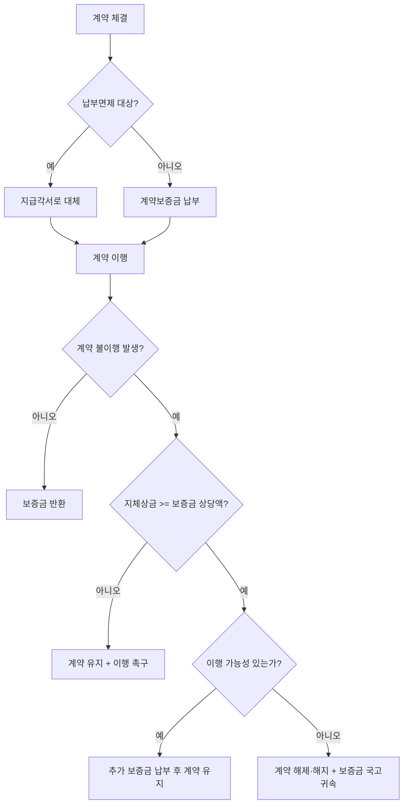

# 계약보증금 납부면제 — 면제 대상과 법적 성격

## 개요

계약보증금은 낙찰자가 계약 체결 후 계약상 의무를 이행하도록 담보하는 금전적 장치이다. 계약 불이행 시 국고에 귀속된다. 일정 조건을 충족하는 경우 납부가 면제될 수 있다.

> [!note] 왜 계약보증금 제도가 필요한가?
> 계약보증금의 정책 목적은 두 가지다. 첫째, 계약 이행의 확보 — 보증금 상실 위험이 계약상대자에게 이행 유인을 부여한다. 둘째, 손해 입증 부담의 제거 — 계약 불이행 시 국가가 실제 손해액을 일일이 입증하지 않아도 약정액을 즉시 귀속시킬 수 있다. 이 두 번째 목적이 계약보증금을 **손해배상의 예정**으로 보는 근거가 된다(원천: 국가계약법 시행령 제50조·제51조 법률쟁점 해설).

## 현행 규정

### 계약보증금 납부면제 가능 대상

국가계약법령에 따른 계약보증금 납부면제 대상은 다음을 포함한다:

- **국가기관·지방자치단체·공공기관** 등을 상대방으로 하는 계약
- **소액수의계약** 등 소규모 계약
- 계약담당공무원이 필요하다고 인정하는 경우 이외에는 **지급각서**로 대체 가능

**핵심 원칙:** 신용불량자, 이전 1년 내 부정당업자 제재를 받은 자, 심사 포기 전력자 등은 면제 불가

### 계약보증금의 법적 성격

> [!note] 손해배상의 예정 vs. 위약벌 — 왜 구별이 중요한가?
> 원천 조문(국가계약법 시행령 제50조·제51조)에 따르면, 계약 불이행 발생 시 "손해에 대한 별도의 입증책임 여부에 상관없이 국고에 귀속"하도록 규정하고, 계약보증금 이외 별도 손해배상 규정을 두지 않는다. 이 두 가지 특성이 계약보증금을 **손해배상의 예정**으로 보는 근거다. 위약벌이라면 국가가 실제 손해를 별도로 입증하여 청구해야 하므로 실무상 제도 목적에 어긋난다.

| 구분 | 손해배상의 예정 | 위약벌 |
|------|--------------|-------|
| 입증책임 | 채권자가 손해 입증 **불요** | 손해 발생·손해액 **입증 필요** |
| 감액 가능성 | 법원이 부당히 과다하면 감액 가능(민법 제398조 제2항) | — |
| 계약보증금 해당 여부 | **해당** | 해당 안 함 |

- **손해배상의 예정**으로 보는 것이 일반적 (위약벌이 아님)
- 계약 불이행 발생 시 손해 입증책임 없이 국고 귀속
- 손해배상 예정액이 부당히 과다한 경우 법원이 감액 가능(「민법」 제398조 제2항)
- 손해배상의 예정이 폭리행위에 해당하는 경우에는 무효(「민법」 제104조)

### 계약보증금 국고귀속 요건

계약담당공무원은 다음의 경우 계약보증금을 국고에 귀속시킬 수 있다:
- 계약상 의무를 이행하지 않아 계약이 해제·해지된 경우 → [[계약의-해제와-해지]] 참조
- 지체상금이 계약보증금 상당액에 달하고 계약수행 가능성이 없음이 명백한 경우

> [!info] 계약수행 가능성이 있으면 귀속하지 않을 수 있다
> 지체상금이 계약보증금 상당액에 달한 경우라도, 계약상대자의 **계약이행 가능성이 있고 계약을 유지할 필요가 있다고 인정되는 경우**로서 계약상대자가 이행 미완료 부분에 상당하는 계약보증금을 **추가 납부**하는 때에는 계약을 유지할 수 있다(물품구매계약일반조건 제26조). 즉, 귀속 + 해지가 자동이 아니라 재량 판단이 개입한다.

## 계약보증금 처리 흐름

## 적용 조건

- 납부면제 시 지급각서(지급확약서) 제출이 원칙
- 면제 제외 대상: 신용거래불량자, 최근 1년 내 [[부정당업자-제재와-불공정조달행위-구별|부정당업자 제재]] 전력자 등

> [!warning] 면제 제외 대상 — 시험 핵심
> 면제 제외 대상이 시험의 핵심 포인트다. 부정당업자 제재를 받은 자는 제재 후 **1년 이내**에는 계약보증금 납부면제를 받을 수 없다. "부정당업자 제재를 받은 자는 영구히 면제 불가"는 틀림 — 1년 경과 후에는 가능하다.

## 시험 출제 포인트

- **출제 패턴 (계약보증금 납부면제 대상의 범위):**
  - 면제 제외 대상(면제 불가)이 시험 핵심 — 신용불량자·부정당업자 제재 전력자 등
  - 면제 시 지급각서로 대체
- 계약보증금의 법적 성격: **손해배상의 예정** (위약벌과 구별 — 위약벌은 손해 입증이 필요)
- 귀속 요건: 계약 불이행 시 **별도 입증책임 없이** 국고 귀속
- 감액 가능: 법원이 예정액이 부당히 과다하면 감액 가능(민법 제398조 제2항)

## 관련 카드

- [[계약의-해제와-해지]] — 계약보증금 귀속과 해제·해지의 관계
- [[이의신청-최소금액기준]] — 계약보증금 국고귀속 관련 이의신청 가능 사항
- [[부정당업자-제재와-불공정조달행위-구별]] — 면제 제외 대상인 부정당업자 제재
- [[입찰보증금-납부기준]] — 입찰 단계 보증금(5%)과 계약보증금의 조달 단계별 연속 관계
- [[하자보수보증금-납부비율]] — 계약보증금(10% 이내)과 하자보수보증금(2~10%) 비율 비교
