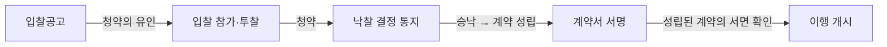

# 계약의 성립

## 개요

계약은 당사자 간 의사표시의 합치, 즉 **청약(Offer)**과 **승낙(Acceptance)**이 결합함으로써 성립한다(「민법」 제527조~제535조). 서면 작성은 성립요건이 아니며, 의사 합치의 사실이 있으면 된다. 공공조달에서는 입찰공고가 청약의 유인(誘引)에 해당하고, 입찰참가자의 투찰이 청약, 발주기관의 낙찰통지가 승낙에 해당한다.

> [!note] 왜 입찰공고는 청약이 아닌 청약의 유인인가?
> 청약은 그 자체로 상대방이 승낙하면 계약이 바로 성립하는 확정적 의사표시여야 한다. 입찰공고는 불특정 다수를 대상으로 하고 발주기관이 최종 낙찰자를 선택할 재량을 유보하므로, 법적으로 **청약의 유인**에 그친다. 그 결과 입찰자(청약)가 있어도 발주기관이 낙찰선고(승낙)를 하기 전까지는 계약이 성립하지 않는다. 대법원도 "입찰공고는 청약의 유인이며 입찰은 청약이고, 낙찰선고는 계약의 승낙에 해당하므로 낙찰선고로 인하여 적법하게 계약이 성립된다"고 판시한 바 있다(대법원 1978. 78다317).

## 현행 규정

### 청약·승낙의 기본 원칙

| 구분 | 내용 |
|------|------|
| 청약의 구속력 | 청약은 상대방에게 **도달한 후**에는 철회할 수 없다 |
| 승낙기간 미정 | 승낙기간을 정하지 않은 청약은 상당한 기간 내 승낙이 없으면 효력을 잃는다 |
| 연착된 승낙 | 청약자가 새로운 청약으로 볼 수 있다 |

### 특수한 성립 방식

| 유형 | 내용 | 근거 |
|------|------|------|
| 격지자(隔地者) 간 계약 | 승낙 통지를 **발송한 때** 성립 | 제531조 |
| 의사실현(意思實現) | 승낙 통지 없이 행위로 승낙이 인정되면 성립 | 제532조 |
| 교차청약(交叉請約) | 동일 내용의 청약이 교차된 경우 양 청약이 상대방에게 도달한 때 성립 | 제533조 |

### 청약의 유인(誘引)

청약의 유인은 청약을 유도하는 의사표시다. 
유인에 응한 상대방의 청약에 대해 유인자가 다시 **승낙**해야 비로소 계약이 성립한다.

## 적용 조건

- 모든 계약 유형(물품·용역·공사·MAS)에 공통 적용
- 청약 도달 전에는 철회 가능, 도달 후에는 철회 불가
- 의사 합치의 내용은 당사자 내심(內心)이 아닌 표시의 해석으로 확정

## 실무 적용

공공조달 계약 체결 흐름에서 각 단계의 법적 성격:

> [!note] 낙찰 이후 계약서 서명의 법적 의미
> 「국가를 당사자로 하는 계약에 관한 법률」은 계약서 서명을 요구하지만, 이는 **이미 성립한 계약의 서면 확인** 절차다. 낙찰선고로 이미 계약이 성립하므로, 발주기관이 낙찰자 결정 후 계약서 체결을 정당한 이유 없이 거부하면 계약 예약상 채무불이행으로 손해배상 책임이 발생한다. 이 때문에 조달 실무에서는 낙찰통지서 발송 시점 관리가 중요하다.

격지자 규정은 우편·팩스·전자문서로 승낙 의사를 통지하는 상황에 적용된다. 나라장터(G2B) 전자입찰에서는 낙찰 결정 통지가 전자적으로 전달되는 시점이 승낙 도달 시점이 된다.

> [!example] 가상 시나리오: 낙찰통지 후 계약서 미체결 분쟁
> *(이 시나리오는 특정 실제 사건을 인용한 것이 아니라, 확립된 판례 법리를 바탕으로 구성한 교육용 가상 사례입니다. 낙찰선고 후 계약 거부 시 이행이익 배상 법리는 대법원 2011다41659, 대법원 2009다24842 등에서 확립되어 있습니다.)*
>
> 발주기관이 입찰을 진행해 낙찰자를 결정하고 통지했으나, 이후 예산 사정을 이유로 계약서 체결을 거부한 사안에서 법원은 낙찰선고로 계약(또는 본계약 체결 의무 있는 예약)이 성립했음을 인정하고, 낙찰자가 계약 이행으로 얻을 수 있었던 이익 상실이 통상손해에 해당한다고 보아 발주기관의 배상책임을 인정했다. 이는 "입찰공고 내용을 그대로 계약내용이라 주장할 수는 없으나, 낙찰선고 자체가 계약의 효력을 발생시킨다"는 법리를 실무에서 재확인한 사례다.

> [!warning] 시험 출제 포인트
> - 입찰공고 = **청약의 유인** (청약 아님)
> - 투찰 = **청약**, 낙찰통지 = **승낙**
> - 격지자 간 계약 성립 시점: 승낙 **발송** 시 (도달 시 아님)
> - 계약서 서명은 성립요건이 아닌 확인 절차
> - 연착된 승낙은 **새로운 청약**으로 간주 가능

## 이 분류가 바꾸는 것 (So What)

계약이 낙찰통지 시점에 성립한다는 원칙은 다음 실무 결과를 낳는다:

1. **[[동시이행의-항변권]] 발생 시점**: 쌍무계약으로서의 의무가 낙찰통지 시점부터 발생하므로, 이후 이행 거절 시 항변권 충족 여부 판단의 기준일이 된다.
2. **[[계약의-해제와-해지]] 가능 시점**: 계약 해제·해지는 계약이 성립한 이후에만 의미가 있으므로, 낙찰통지 이전의 입찰 취소는 해제가 아닌 청약 철회(도달 전)의 문제다.
3. **입찰보증금 귀속**: 낙찰자가 계약서 체결을 거부하면 계약 예약 위반으로 입찰보증금이 국고에 귀속된다(「국가계약법 시행령」 제38조).

## 관련 카드

- [[동시이행의-항변권]] — 성립한 쌍무계약에서 이행 거절권
- [[계약의-해제와-해지]] — 성립한 계약을 소급 또는 장래적으로 종료하는 제도
- [[도급과-위임의-구별]] — 성립한 계약의 유형 구별 — 도급(일의 완성)과 위임(사무처리)
- [[화해]] — 분쟁 발생 시 성립한 계약을 당사자 합의로 종결하는 수단
