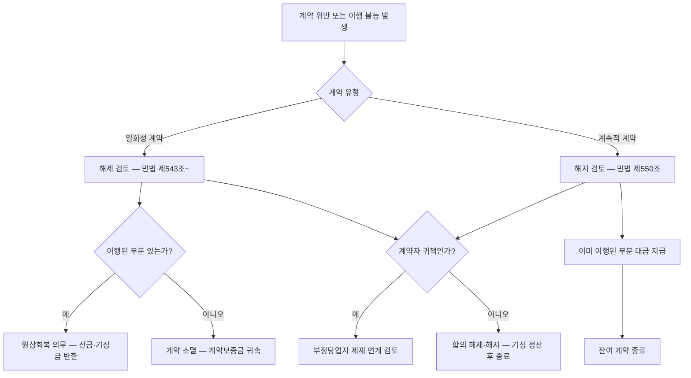

# 계약의 해제(解除)와 해지(解止)

## 개요

계약을 종료하는 방법은 두 가지다. **해제(解除)**는 계약의 효력을 성립 시점으로 소급해 소멸시키는 제도이고, **해지(解止)**는 계속적 계약에서 장래를 향해서만 계약 관계를 종료하는 제도다(「민법」 제543조~제553조, 제550조). 공공조달 계약에서는 이행 중 부도·부실 이행·계약 위반 발생 시 발주기관이 어느 제도를 적용할지 판단해야 한다.

> [!note] 왜 두 제도를 구별하는가?
> 이행이 완료된 부분의 처리 방식이 달라지기 때문이다. **해제**는 계약이 처음부터 없었던 것으로 되돌리므로 이미 제공된 급부를 원상회복해야 한다 — 선금·기성금을 반환해야 한다. **해지**는 이미 이행된 부분은 유효하게 존속시키므로 완성된 부분의 대금은 그대로 지급된다. 계속적 계약(장기 용역, 임대차)에 해제를 적용하면 이미 소비된 용역을 원상회복할 수 없어 사실상 불가능하기 때문에 해지라는 별도 제도가 필요하다. 물품은 반환하면 되지만, 용역은 소비됨과 동시에 소멸한다 — 6개월 경비 용역 계약을 소급 해제하려면 경비원이 서 있었던 시간과 그 기간 동안 발주기관이 누린 보안 혜택을 현물로 되돌려야 하는데, 흘러간 시간은 되감을 수 없고 이미 누린 혜택을 반납할 방법도 없다. 임대차도 마찬가지다: 사무공간을 6개월 사용한 사실을 없었던 것으로 만들 수는 없다. 시간 흐름에 따라 급부가 소비·소멸하는 계약에서는 처음부터 없었던 상태로 되돌리는 해제 대신, 이미 이행된 부분을 유효로 인정하고 앞으로만 종료하는 해지가 유일하게 실현 가능한 선택지다.

## 현행 규정

### 핵심 비교

| 구분 | 해제(解除) | 해지(解止) |
|------|-----------|-----------|
| 효력 발생 방향 | 소급(遡及) — 계약 성립 시점으로 거슬러 올라감 | 장래(將來)효만 발생 |
| 이미 이행된 부분 | 원상회복(原狀回復) 의무 발생 | 유효하게 존속 |
| 적용 계약 유형 | 일회성 계약(물품 납품, 단기 용역 등) | 계속적 계약(임대차, 장기 용역 등) |
| 근거 조문 | 제543조~제549조 | 제550조 |

### 해제의 발생 원인

| 종류 | 내용 |
|------|------|
| 법정(法定) 해제 | 채무불이행(이행 지체·이행 불능·불완전 이행)을 이유로 법률에 따라 해제 |
| 약정(約定) 해제 | 당사자가 계약서에 해제 사유와 절차를 미리 약정 |

### 해지의 발생 원인

| 종류 | 내용 |
|------|------|
| 법정 해지 | 계약 내용에 중대한 위반이 발생하거나 법률이 해지를 인정하는 경우 |
| 약정 해지 | 당사자가 일정 조건에서 해지를 가능하게 약정한 경우 |

## 적용 조건

- **해제** 적용: 물품 구매 계약, 단기 공사, 일회성 용역 계약에서 계약 위반 발생 시
- **해지** 적용: 장기 계속 용역·공사 계약(계속비계약, 장기계속계약), [[도급과-위임의-구별|MAS 계약]]에서 계약 위반 발생 시
- 해제·해지 모두 권리자(발주기관 또는 계약자)의 **일방적 의사표시**로 행사

## 실무 적용

공공조달 실무에서 자주 발생하는 상황:

| 상황 | 적용 제도 | 결과 |
|------|----------|------|
| 물품 납품 계약에서 계약자 부도 | 해제 | 기 지급 선금 반환 + 계약보증금 귀속 |
| 장기 용역 계약 중도 이행 불량 | 해지 | 이미 이행된 부분 대금 지급, 잔여분 계약 종료 |
| MAS 계약 거래정지 | 해지 | 기 체결 계약은 유효, 신규 주문만 불가 |
| 계약자 귀책 없는 불가항력 | 합의 해지 | 기성 부분 정산 후 계약 종료 ([[위험부담]] 규정과 연계) |

> [!note] 계약보증금 귀속 메커니즘
> 국가계약법 시행령 제51조에 따라, 계약자가 정당한 이유 없이 계약상 의무를 이행하지 않아 계약이 해제·해지된 경우 계약보증금은 국고에 귀속된다. 단, 성질상 분할 가능한 계약에서 기성 부분을 검사·인수한 경우 해당 기성 부분의 계약보증금은 제외하고 귀속시킨다.

> [!example] 물품 납품 계약 해제 사례 (국가계약법 시행령 제51조 적용)
> 공공기관이 IT 장비 납품 계약을 체결한 후 계약자가 납기를 반복적으로 위반하고 부도 처리된 경우, 발주기관은 계약을 해제하고 계약보증금을 국고 귀속시켰다. 이때 [[부정당업자-제재와-불공정조달행위-구별|부정당업자 입찰참가자격 제한]] 절차가 동시에 진행되었다. 계약자는 이미 납품된 일부 물품에 대한 대금을 별도로 청구했으나, 법원은 해제의 소급 효력에 따라 원상회복 의무가 발생한다고 보았다.

> [!example] 장기 용역 계약 해지 사례
> 정부부처가 3년 장기 IT 운영 용역 계약 도중 계약자의 이행 불량(응답 시간 기준 반복 미달, 보안사고)을 이유로 해지를 통보한 사례. 발주기관은 이미 이행된 1년분에 대해서는 대금을 정산하고, 잔여 2년분만 종료했다. [[공공계약-변경-분쟁해결-절차]]를 거치지 않고 분쟁이 장기화되었고, 이후 [[화해]]를 통해 위약금 일부 감액으로 합의하였다.

> [!warning] 시험 함정: 해제와 해지 혼동
> - 해제는 **소급** 효력 — 이미 이행된 부분도 원상회복. 해지는 **장래** 효력만.
> - 임대차·장기 용역에 "해제"를 적용한다는 서술은 틀림 — 해지가 맞음.
> - 해제·해지 후 [[부정당업자-제재와-불공정조달행위-구별|부정당업자 제재]]가 **자동으로** 따라오지 않는다 — 별도 절차가 필요하다.
> - 귀책 없는 불가항력 해제는 [[위험부담]] 규정과 연계되며, 이 경우 계약보증금이 자동 귀속되지 않는다.

## 시험 출제 포인트

- **해제** 키워드: 소급, 원상회복, 제543조~제549조, 일회성 계약
- **해지** 키워드: 장래효, 계속적 계약, 제550조
- 법정 해제 원인 = 채무불이행(이행 지체·불능·불완전 이행)
- 공공조달 추가 연계: 계약보증금 귀속(국가계약법 시행령 제51조) + 부정당업자 제재(국가계약법 제27조)

## 관련 카드

- [[동시이행의-항변권]] — 해제·해지 전 단계에서 이행 거절 수단
- [[계약의-성립]] — 해제는 성립 시점으로 소급하여 성립을 없앰
- [[도급과-위임의-구별]] — 계약 유형에 따라 해제·해지 조건이 달라짐
- [[위험부담]] — 귀책 없는 이행 불능 시 해제·해지 전 적용 규정
- [[부정당업자-제재와-불공정조달행위-구별]] — 계약자 귀책 해제·해지 후 후속 제재
- [[계약보증금-납부면제]] — 계약보증금 귀속의 전제 조건
- [[공공계약-변경-분쟁해결-절차]] — 해제·해지 분쟁 시 절차 경로
- [[화해]] — 분쟁 심화 전 합의로 종결하는 대안
