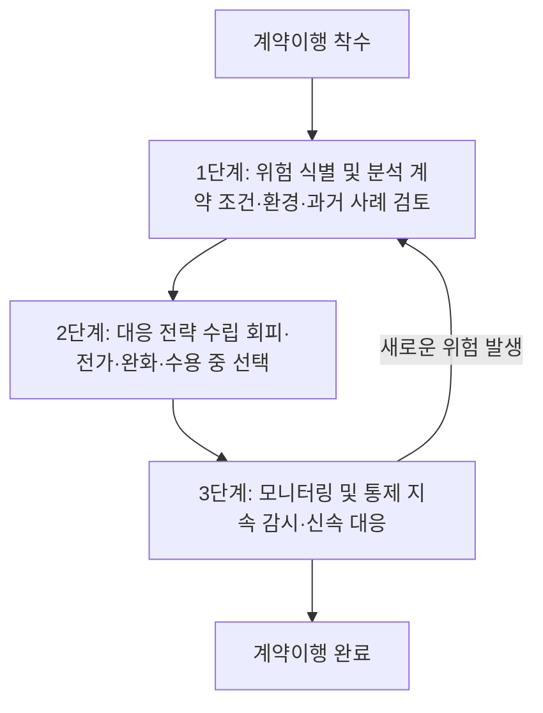

# 계약이행 위험관리 프로세스 — 식별·대응·모니터링 3단계

## 개요

계약이행 과정에서 예상되는 위험관리는 계약 이행 중 발생할 수 있는 다양한 위험을 사전에 식별·분석하고, 적절한 대응 전략을 수립해 손실을 최소화하는 활동이다. 위험의 유형은 신용위험, 법적·운영위험, 시장·평판위험으로 구분된다.

> [!note] 왜 이 프로세스가 존재하는가?
> 공공계약은 계약 기간이 길고 금액이 크며, 계약 이행 중 예상치 못한 상황(계약상대자 부도, 시장 가격 급변, 법적 분쟁 등)이 발생하면 국가 예산 낭비와 사업 지연이 현실화된다. 위험을 이행 착수 전부터 체계적으로 식별하고 대응 전략을 사전에 수립함으로써, 사후 수습 비용을 줄이고 계약 이행의 연속성을 확보하는 것이 이 프로세스의 목적이다. 법적 근거는 없으나 ISO 31000 위험관리 표준에 기반한 실무 원칙으로, 공공조달관리사 시험에서 이론 문항으로 출제된다.

## 현행 규정

### 위험 유형과 관리 방법

| 위험 유형 | 주요 내용 | 관리 방법 |
|-----------|----------|-----------|
| 신용위험 | 거래 상대방의 채무 불이행 | 계약 전 신용조사, 보증·담보 설정 |
| 법적·운영위험 | 계약서상 책임 불명확, 법적 분쟁, 내부 절차 미흡 | 명확한 계약서 작성, 내부 통제 강화 |
| 시장·평판위험 | 시장 가격 변동, 평판 악화 | 위험관리 계획 수립, 재무 건전성 확보 |

> [!note] 위험 유형별 공공조달 맥락
> - **신용위험**: 계약상대자가 이행 도중 폐업·부도 시 계약보증금 몰수 및 재발주 절차 개시. 계약 전 보증보험 증권 또는 이행보증서 징구가 예방 수단.
> - **법적·운영위험**: 계약서상 책임개시일·범위가 불명확하면 법적 분쟁으로 이어진다. [[공공계약-변경-분쟁해결-절차]]에 따른 조정·중재가 주요 대응 경로.
> - **시장·평판위험**: 계약 이행 기간 중 원자재 가격이 급등하는 경우 [[물가변동-계약금액조정-조건]]에 따른 계약금액 조정이 시장위험 완화 수단으로 기능한다.

### 위험관리 프로세스 3단계 (순서)

| 단계 | 주요 활동 |
|------|-----------|
| ① 위험 식별 및 분석 | 계약 조건, 환경 변화, 과거 사례 등을 바탕으로 위험 요소 체계적으로 파악 |
| ② 대응 전략 수립 | 회피(Risk Avoidance), 전가(Risk Transfer), 완화(Risk Mitigation), 수용(Risk Acceptance) 중 상황에 맞는 전략 선택·실행 |
| ③ 모니터링 및 통제 | 위험 발생 시 신속 대응, 지속적 감시·관리 |

> [!note] 4가지 대응 전략의 의미
> - **회피(Avoidance)**: 위험 자체를 없애는 결정. 예: 특정 공종을 계약에서 제외하거나 위험이 큰 계약상대자와 계약하지 않음.
> - **전가(Transfer)**: 위험 부담을 제3자에게 이전. 예: 이행보증보험 가입, 하도급 계약 시 하수급자에게 특정 위험 귀속.
> - **완화(Mitigation)**: 위험의 발생 가능성이나 충격을 줄이는 조치. 예: 감독 강화, 이행 중간 점검 주기 단축, 계약서 조항 명확화.
> - **수용(Acceptance)**: 위험을 인지하되 별도 조치 없이 감수. 주로 발생 가능성이 낮거나 대응 비용이 위험보다 큰 경우에 선택.

## 적용 조건

- 계약이행 전 과정에서 적용 (착수~종결)
- 모든 계약 유형(물품, 용역, 공사)에 적용
- 대응 전략 선택은 위험의 크기, 발생 가능성, 계약 특성을 고려

> [!example] 가상 시나리오: 납품 지연 위험 관리
> *(이 시나리오는 특정 실제 사건을 인용한 것이 아니라, 위험관리 프로세스를 설명하기 위해 구성한 교육용 가상 사례입니다.)*
>
> 계약상대자가 원자재 수급 차질로 납품 지연 가능성을 사전 통보한 경우, 발주기관은 ①위험 식별(납품지연 신호 포착) → ②대응 전략 수립(완화: 납품 일정 재협의, 분할 납품 허용 / 전가: 지체상금 조항 엄격 적용) → ③모니터링(납품 진행 상황 주간 보고 요청)의 순서로 대응한다. 불가항력(천재지변 등)이 인정되면 계약기간 연장 신청 가능. 정당한 사유 없이 납품이 지연되면 지체상금 부과 및 입찰 제한 제재로 연결된다.

> [!example] 하도급 불공정 거래 위험 관리
> 원도급자가 하수급자에게 과도하게 낮은 금액으로 하도급을 강요하는 경우, 발주기관은 하도급 계획서 심사 단계에서 하도급금액 비율의 적정성을 확인하는 것이 위험 완화(Mitigation) 전략에 해당한다. 위반 시 감점 부여 및 불공정 행위 적발 시 부당이득 환수 조치로 이어진다.

## 시험 출제 포인트

- 출제 패턴: "위험관리 프로세스의 올바른 단계 순서는?" — **식별·분석 → 대응전략 수립 → 모니터링·통제** 순서 암기
- 오답 유인: '모니터링'을 2단계로, '대응전략'을 3단계로 배치하는 선택지; '수용'을 4가지 대응전략에 포함하지 않는 선택지
- 4가지 대응전략(회피·전가·완화·수용)을 모두 암기할 것 — 하나라도 빠진 선택지는 오답

> [!warning] 빈출 오답 패턴 3가지
> 1. **순서 역전**: 모니터링(3단계) → 대응전략 수립(2단계) 순서로 제시하는 선택지
> 2. **수용 누락**: "위험 대응 전략은 회피·전가·완화 3가지" → 오답. 수용(Acceptance)이 반드시 포함.
> 3. **식별·분석 분리**: "식별"과 "분석"을 별도 단계(4단계)로 제시하는 선택지 → 오답. 두 활동은 1단계에 묶여 있음.

## 관련 카드
- [[계약이행납품-주요내용]] — 위험관리가 포함된 계약이행관리 전체 구성
- [[공공조달-위험분석]] — 계약 체결 전 사전 단계에서 수행하는 위험 식별·유형별 관리 방안 (사전-사후 위험관리 체계 연결)
- [[공공계약-변경-분쟁해결-절차]] — 법적·운영위험이 현실화된 경우의 분쟁해결 경로
