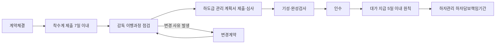

# 계약이행 및 납품 — 계약이행관리 주요 구성 요소

## 개요

공공조달 계약이행관리는 계약체결 이후 납품(또는 시공·용역 제공) 완료까지 계약상대자가 의무를 다하도록 관리하는 체계이다. 단순 납품 확인에 그치지 않고 착수부터 하자관리까지 계약 전반에 걸친 점검을 포함한다.

> [!note] 왜 이 관리 체계가 필요한가?
> 공공계약은 국가가 사인(私人)의 지위에서 체결하는 쌍무계약이지만, 공공복리 추구 의무가 있다. 계약이행관리 체계가 없으면 계약상대자의 의무 불이행(납품 지연, 품질 미달, 하도급 위반 등)을 발주기관이 인지하지 못하거나 뒤늦게 대응하게 된다. 이 체계는 공공 예산의 적정 집행을 보장하고, 계약상대자의 책임 이행을 실시간으로 확보하는 구조적 안전망이다.

## 현행 규정

계약이행관리의 주요 구성 요소:

| 구성 요소 | 내용 |
|-----------|------|
| 용역·공사 착수 | 착수계 제출, 착수협의 (계약체결 후 7일 이내 원칙) |
| 감독 | 계약담당공무원 또는 지정 감독관이 이행 과정 점검 |
| 하도급 관리 | 하도급 계획서 제출·심사, 하도급금액 비율 관리 |
| 대가 지급 | 검사·검수 완료 후 청구; 5일 이내 지급 원칙 |
| 기성 및 완성검사 | 단계별 기성검사 또는 완료 시 완성검사 실시 |
| 인수 | 검사 합격 후 수요기관의 물품·시설 인수 |
| 하자관리 | 하자담보책임기간 중 하자신고·조치·원인조사 체계 |
| 변경계약 | 과업·인력·설계 변경 등으로 인한 계약 조건 변경 |

> [!note] 각 구성 요소의 연결 관계
> - **착수계 → 착수협의**: 계약체결 후 7일 이내 제출이 원칙. 착수계에는 사업자등록증·이행보증보험증권 등 첨부.
> - **하도급 관리**: 하도급 계획서에 하수급인 정보·공종·금액·하도급 비율 기재. 건설공사의 경우 하도급금액 5억 원 이상이면 계획서 제출 의무.
> - **대가 지급 → [[사후원가검토-유보금]]**: 사후원가검토 조건부 계약의 경우 계약금액의 10%를 유보할 수 있음. 검토 완료 전까지 이자 미지급.
> - **변경계약 → [[설계변경-계약금액-조정기준]]**: 설계변경에 따른 계약금액 조정은 별도의 단가 적용 원칙이 있음.

## 적용 조건

- 물품·용역·공사 모든 계약 유형에 적용
- 계약이행각서를 작성하여 계약건명, 계약금액, 기간 등 명시
- 납품 지연 시 지체상금 청구 가능; 입찰 제한 등 제재 부과

> [!warning] 납품 지연과 지체상금 산정 기준
> 납품기한 내 검사요청을 해야 하며, 납품기한 경과 후 검수완료 시 지체일수 산정 기준이 달라질 수 있다. 지체상금 부과 대상액은 **감가액을 반영하지 않은 원 계약금액**을 기준으로 산정하므로, 감가 처리된 납품건도 지체상금 기준액은 원래 계약금액임에 주의.

## 실무 적용

계약담당공무원은 계약문서(입찰안내서, 평가서, 시방서 등)를 기준으로 이행 여부를 점검한다. 계약이행실적은 MAS 업체 등에 대해 연 2회(최근 3년 실적 기준) 평가되며, 최우수·우수·보통·미흡 4단계로 등급화된다.

> [!example] 직접생산 위반 환수 사례
> 2021~2025년 조달청 적발 통계에 따르면, 계약상 직접 생산해야 할 품목을 외주 구매한 **직접생산위반** 환수금액이 140억 8,700만 원(37.3%), 허위서류제출 위반 환수금액이 166억 1,500만 원(44%)을 차지했다. 납품 의무 이행점검에서 이러한 위반이 적발되면 부당이득 환수와 입찰 제한 등 행정조치가 부과된다. 납품 감독 구성 요소가 실질적 제재로 연결되는 전형적 사례다.

> [!example] 계약이행 미흡과 MAS 등급 하락
> 다수공급자계약(MAS) 업체가 납기·품질·수요기관만족도 항목에서 지속적으로 미흡 등급을 받으면 조달청 종합쇼핑몰 퇴출 요건에 해당할 수 있다. 이행관리 단계의 각 항목(감독·검사·하자관리)이 SLA 성과지표와 직접 연결된다.

## 시험 출제 포인트

- 출제 패턴: "계약이행납품의 주요 내용에 해당하지 않는 것은?" — 구성 요소 목록에서 출제되지 않은 항목 고르기
- 오답 유인: '입찰' 단계 항목(낙찰하한율, 입찰공고)을 계약이행 단계에 포함시킨 선택지 주의
- 연계 개념: 계약이행각서, 지체상금, 하자보수, 사후원가검토 유보금

> [!warning] 구성 요소 포함 여부 출제 함정
> 다음 항목들은 **계약이행 단계가 아니므로** 오답으로 고르는 문제에서 정답이 된다:
> - 낙찰하한율 설정 (입찰 단계)
> - 입찰공고 (입찰 단계)
> - 예산편성 (계획 단계)
> - 계약보증금 산정 (계약체결 단계)
>
> 반면 다음은 **계약이행 구성 요소가 맞으므로** 오답으로 고르는 문제에서 정답이 아니다:
> 착수계, 감독, 하도급 관리, 대가 지급, 기성검사, 인수, 하자관리, 변경계약

## 관련 카드
- [[공공계약-변경-분쟁해결-절차]] — 이행 과정에서 발생한 분쟁의 해결 절차
- [[사후원가검토-유보금]] — 대가지급 유보 제도의 구체적 운영 규칙
- [[계약이행-위험관리-프로세스]] — 계약이행 중 위험 식별·대응·모니터링 3단계
- [[물가변동-계약금액조정-조건]] — 계약이행 중 물가 변동 시 발동되는 계약금액 조정 요건 및 절차
- [[설계변경-계약금액-조정기준]] — 변경계약 구성 요소 중 설계변경 금액 조정의 구체적 단가 원칙
