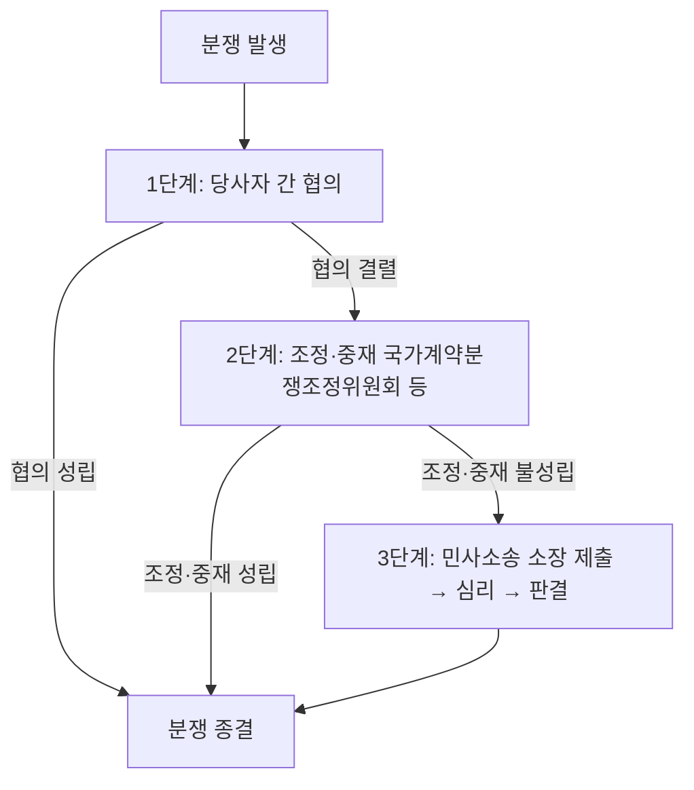

# 공공계약 변경 분쟁해결 절차 — 협의·조정·중재·소송 우선순위

## 개요

공공계약 변경에 따른 분쟁은 계약 당사자 간 협의를 최우선으로 시도하고, 협의가 결렬되면 국가계약분쟁조정위원회 등 공식 기관을 통한 조정·중재, 그래도 해결되지 않으면 민사소송 순으로 진행한다. 최근 개정된 국가계약법에서 조정·중재의 법적 근거가 강화되어 소송보다 신속한 해결이 가능해졌다.

> [!note] 왜 이 순서인가?
> 공공계약은 사법상 계약이므로 민법상 **신의성실의 원칙**이 적용된다. 분쟁 발생 시 당사자 간 자율적 해결(협의)을 먼저 시도함으로써 국가 예산(소송 비용)을 절감하고 계약 이행 연속성을 유지하는 것이 공공복리에 부합한다. 소송은 계약 이행을 사실상 정지시키는 경우가 많기 때문에 공공사업에서는 특히 최후 수단으로 미룬다.

## 현행 규정

| 단계 | 수단 | 주요 특징 |
|------|------|-----------|
| 1단계 | 당사자 간 협의 | 계약 당사자 직접 이견 조율 |
| 2단계 | 조정·중재 | 국가계약분쟁조정위원회 등 공식 기관 활용; 법원 판결보다 우선 적용 가능 |
| 3단계 | 민사소송 | 소장 제출 → 법원 심리 → 판결 |

- 소송 평균 소요기간: **2.7년**
- 중재 평균 소요기간: **1.4년**

> [!note] 손해배상 분쟁과의 연계
> 계약 변경에 따른 손해배상 청구도 동일한 3단계 구조를 따른다. 1단계에서 합의가 이뤄지면 합의서를 작성하고 종결하며, 합의 실패 시에만 조정·중재 → 소송으로 진행한다. 손해배상액은 재산적 손해(금전)와 비재산적 손해(정신적 고통)를 구분하여 청구할 수 있다.

## 적용 조건

- 공공계약 변경(과업내용, 금액, 기간 등)으로 계약 당사자 간 이견이 발생한 경우
- 모든 계약 유형(물품, 용역, 공사)에 적용
- 계약체결 시 분쟁해결 방식을 사전에 계약서에 명시하면 절차 간소화 가능

> [!warning] 시험 함정: 분쟁 "예방" vs. 분쟁 "해결"
> 계약 내용을 명확히 작성해 분쟁 소지를 없애는 것은 **예방** 단계이며, 분쟁해결 절차(협의→조정→소송)와 혼동하지 않도록 주의. 시험에서 "분쟁해결 절차"를 물으면 예방 조치(계약서 명확화 등)는 정답이 아니다.

> [!example] 설계변경 금액 조정 분쟁 사례 유형
> [[설계변경-계약금액-조정기준]]에 따라 정부가 설계변경을 요구했으나 단가 협의가 불성립된 경우, 법령상 산정단가 50% 기준이 자동 적용된다. 계약상대자가 이 기준에 불복하면 1단계(협의 재시도) → 2단계(국가계약분쟁조정위원회 조정 신청) 순으로 진행하게 된다. 이처럼 분쟁해결 절차는 [[설계변경-계약금액-조정기준]]의 협의 불성립 조항과 직접 연결된다.

## 시험 출제 포인트

- 핵심 출제 패턴: "다음 중 공공계약 변경 분쟁 해결 절차의 올바른 순서는?" — 협의 → 조정·중재 → 소송 순서 암기 필수
- 오답 유인: 소송을 1단계로 제시하거나 조정·중재를 소송 이후로 배치하는 선택지 주의
- 연계 개념: 조정·중재의 법적 근거 강화 사실 (개정 국가계약법), 소요기간 수치 (소송 2.7년, 중재 1.4년)
- 시간·비용 절감 논거를 묻는 문항에서도 조정·중재 우선 원칙이 답

> [!warning] 오답 유인 패턴 정리
> - "소송 → 조정 → 협의" 순서 제시: 오답
> - "조정·중재는 소송 후에 가능": 오답
> - "분쟁 발생 즉시 법원에 소장 제출 가능": 원칙상 오답 (협의 우선)
> - 소요기간 수치 뒤바꾸기(소송 1.4년, 중재 2.7년): 오답

## 관련 카드
- [[계약의-해제와-해지]] — 분쟁 이전 단계인 계약 해제·해지 요건과 절차
- [[화해]] — 분쟁해결의 또 다른 수단인 화해 제도
- [[하자보수보증금-납부비율]] — 하자 관련 분쟁의 물적 담보 제도(하자보수보증금)
- [[설계변경-계약금액-조정기준]] — 협의 불성립 시 50% 기준이 적용되는 설계변경 단가 조정; 분쟁의 주요 발생원
- [[계약이행납품-주요내용]] — 이행 과정 전반에서 분쟁이 발생하는 맥락
