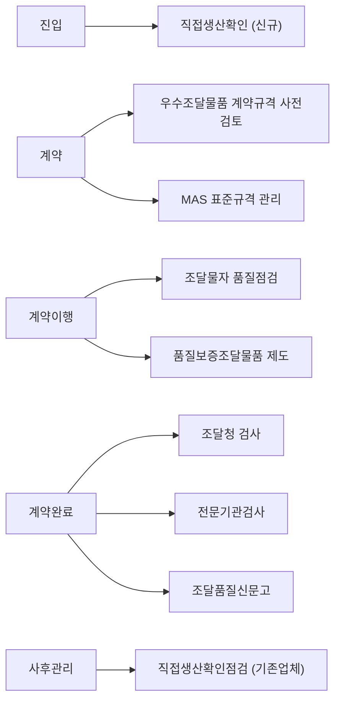

# 공공조달 단계별 품질관리 제도 — 계약 단계 해당 제도

## 개요

조달청 조달품질원이 운영하는 공공조달 품질관리는 조달 전 과정에 걸쳐 단계별로 특화된 제도를 적용한다. 조달 단계에 따라 적용 제도가 달라지므로 각 단계의 대응 제도를 정확히 매핑해야 한다.

> [!note] 왜 단계별로 제도가 분리되어 있는가?
> 공공조달 품질 문제는 특정 시점에만 발생하지 않는다. 부실 제조업체가 **진입 단계**에서 걸러지지 않으면 이후 아무리 점검해도 한계가 있다. 반대로 처음엔 적격이었어도 **계약이행 중** 품질이 저하될 수 있다. 단계별 제도 분리는 각 리스크 발생 시점에 맞는 통제 수단을 배치하는 구조다. 특히 **계약 단계(입찰·낙찰)** 에 집중된 제도는 계약 체결 이전에 규격을 정비해 납품 후 분쟁을 최소화하는 사전 예방 기능을 한다.

## 현행 규정 — 단계별 품질관리 제도

| 단계 | 품질관리 제도 | 내용 |
|------|------------|------|
| **진입** | 제조업체 직접생산 확인 | 물품 제조등록 신청업체의 공장·생산설비·공정·고용인력 확인으로 부실 업체 진입 차단 |
| **계약 (입찰·낙찰)** | **우수조달물품 계약규격 사전검토** | 우수조달물품 심사 시 평가받은 신기술·품질인증 등이 계약규격에 반영되었는지 검토 |
| **계약 (입찰·낙찰)** | **MAS 표준규격 관리** | 표준규격 없는 물품의 표준규격 제정 및 기술발전에 따른 규격 현행화 |
| **계약이행 (제조)** | 조달물자 품질점검 | MAS 물품·조달우수제품의 생산현장 및 납품현장 실사 점검 |
| **계약이행 (제조)** | 품질보증조달물품 제도 운영 | 품질관리능력 평가 후 우수업체에 납품검사 면제 등 인센티브 부여 |
| **계약완료 (납품검사)** | 조달청 검사 | 가구류·섬유류 등 이화학 시험 및 검사 |
| **계약완료 (납품검사)** | 전문기관검사 | 국민생활·안전 관련 주요 물품 국가공인시험기관 위탁 검사 |
| **계약완료 (납품검사)** | 조달품질신문고 운영 | 하자신고·품질제안 접수·처리 |
| **사후관리** | 직접생산확인점검 | 기 등록업체의 생산설비·공정·인력 사후 확인으로 자격 유지 관리 |

## 단계별 제도 매핑 (시험용 요약)

## 적용 조건

- 계약 단계에서의 제도: **우수조달물품 계약규격 사전검토** + **MAS 표준규격 관리** (2가지)
- 계약이행 단계: 품질점검, 품질보증조달물품 제도 (생산 단계)
- 계약완료 단계: 검사 3가지 (조달청검사, 전문기관검사, 품질신문고)

> [!note] 진입 vs 사후관리 — 같은 이름, 다른 대상
> "직접생산확인"은 진입 단계와 사후관리 단계에 각각 등장한다.
> - **진입 단계**: 신규·갱신 신청업체 대상 (공장·설비·공정 사전 확인)
> - **사후관리 단계**: 기 등록업체 대상 (자격 유지 여부 사후 점검)
>
> 시험에서 "직접생산확인은 진입 단계에만 있다"는 선택지가 오답이 될 수 있다. 사후관리 단계에도 있다.

> [!warning] 계약 단계 제도 혼동 주의
> 시험에서 "계약이행 단계 제도"로 **품질보증조달물품**을 묻는 경우와 "계약 단계 제도"를 묻는 경우를 혼동하면 안 된다.
> - **계약 단계**: 우수조달물품 계약규격 사전검토, MAS 표준규격 관리
> - **계약이행 단계**: 조달물자 품질점검, 품질보증조달물품 제도
>
> "납품검사 면제"는 품질보증조달물품의 혜택 → 계약이행 단계 제도임을 기억.

> [!note] 품질보증조달물품 등급별 납품검사 면제 기간
> 품질보증조달물품으로 지정되면 납품검사가 면제되는 기간은 등급별로 다르다:
> - S등급: 5년, A등급: 4년, B등급: 3년, 예비물품: 1년(최초 1회 한정)
>
> 또한 2단계 경쟁 시 신인도 가점 1.0점, A등급 이상 기술·품질 가점 2점, MAS 시험성적 제출 면제 등 인센티브가 있다.

> [!example] MAS 표준규격 관리의 실제 역할
> 표준규격이 없는 신제품이 MAS에 등록되면, 품질기준 없이 납품되는 문제가 생긴다. 조달청 조달품질원은 이런 물품에 표준규격을 제정하고 기술 발전에 따라 현행화한다. 예를 들어 스마트 IoT 기기처럼 기존 KS 규격이 없는 신규 물품 카테고리가 MAS에 진입할 때 표준규격 제정이 필요하다. 이 절차가 없으면 같은 품목이라도 납품 기준이 제각각이 된다.

## 시험 출제 포인트

- **Q29 핵심:** "공공조달 품질관리 단계별 제도 — 계약 단계 해당 제도"
  - **계약 단계**: 우수조달물품 계약규격 사전검토, MAS 표준규격 관리
  - **계약이행 단계**: 품질점검, 품질보증조달물품 (혼동 주의)
  - **납품검사 단계**: 조달청 검사, 전문기관 검사, 조달품질신문고

## 관련 카드
- [[품질점검-규격미달-조치기간]] — 규격미달 횟수별 조치 내용
- [[적격심사-물품-추정가격-배점]] — 물품 적격심사에서의 품질 관련 배점
