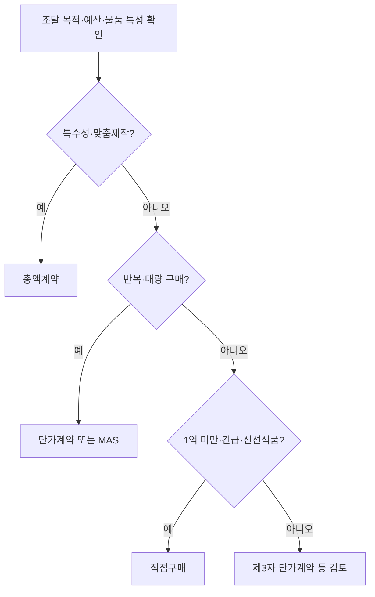

# 공공조달방법 적정성 분석 — 고려 요인

## 개요

공공기관의 조달이 효율적이고 공정하게 이루어지는지, 조달 목적에 부합하는 최적의 방법을 선택했는지 평가하는 과정이다. 경쟁성·투명성·정보 비대칭 해소·정책 목표 균형 등 다양한 요소를 종합적으로 고려해야 한다. [[수요정보-평가-및-활용|수요정보 평가]] 결과를 토대로 조달방법을 결정한 뒤, [[사전규격공개-기간기준|사전규격공개]] 단계로 이어진다.

> [!note] 왜 적정성 분석이 필요한가
> 공공기관은 공급업체보다 품질·비용 정보에서 구조적으로 불리한 위치에 있다(정보 비대칭). 조달방법을 잘못 선택하면 담합 유발·예산 낭비·품질 저하로 이어진다. 수의계약 남용은 경쟁 배제, 최저가낙찰 남용은 부실 시공·덤핑을 유발한다. 적정성 분석은 이 두 극단 사이의 균형점을 찾는 작업이다.

## 현행 규정

### 적정성 분석 주요 고려 요인

| 요인 | 내용 |
|------|------|
| **경쟁성 및 투명성** | 입찰담합 방지, 다양한 업체 참여 보장. 최저가·종합심사 등 낙찰 방식 포함 |
| **정보 비대칭 해소** | 공공기관이 공급업체보다 정보력이 약하므로, 품질·비용 정보를 충분히 확보하는 제도적 장치 필요 |
| **정책 목표의 균형** | 품질·예산 효율성·공정성 등 정책 목표가 상충할 수 있으므로 신중한 접근 필요 |
| **예비타당성조사** | 대규모 사업은 경제적 타당성·투자시기를 사전 검증 |

> [!warning] 시험 함정: '선호 공급업체 목록 작성'은 고려 요인이 아님
> 적정성 분석의 핵심 3요인은 **경쟁성·투명성 / 정보 비대칭 해소 / 정책 목표 균형**이다. '선호 공급업체 목록 작성'은 이 분석의 고려 요인이 아니다. 특정 업체를 사전 선호하는 행위 자체가 공정경쟁 훼손에 해당한다.

### 조달방법 선택 흐름

### 주요 공급방법별 특성과 적합 상황

| 공급방법 | 적합한 상황 |
|----------|-------------|
| 총액계약 | 특수성·맞춤제작이 필요한 경우 |
| 단가계약 | 반복·대량 구매 |
| 제3자 단가계약 | 신속 구매, 관리 책임이 수요기관에 있음 |
| 다수공급자계약(MAS) | 품질·가격 경쟁 유도, 수요기관 선택권 확대 |
| 직접구매 | 1억 원 미만 소규모, 긴급구매, 식료품·농수산물 |

### 직접구매의 정의 및 적합 대상 (Q4)

**직접구매:** 수요기관이 조달청을 거치지 않고 공급업체에서 직접 구매하는 방식

**적합 대상:**
- 1억 원 미만 소규모 물품
- 긴급구매가 필요한 경우
- 식료품·농수산물 등 신선식품

## 실제 사례

> [!example] 환경부 수의계약 남용 — 경쟁성 훼손 (2021~2024년)
> 감사원은 환경부가 퇴직 간부가 재직하는 협회 2곳에 1,604억 원 규모 민간위탁사업을 전량 수의계약으로 발주한 사실을 적발하였다. 조달방법 적정성 분석 없이 경쟁입찰을 생략한 결과, 계약금액이 75억 원 가량 부풀려졌다. **경쟁성·투명성** 요인을 무시한 조달방법 선택의 전형적 실패 사례이다.

> [!example] 유기응집제 입찰 담합 (2017~2023년)
> 8개 업체가 지자체·물관리 기관이 발주한 유기응집제 구매 입찰 294건에서 사전에 낙찰 예정 업체와 투찰 가격을 합의하였다. 공정위는 시정명령과 함께 과징금 43억 원을 부과하였다. 조달방법 선택 시 **경쟁 제한 행위 방지 장치**가 형식에 그쳤을 때 담합이 장기간 유지된다는 것을 보여준다.

> [!info] 최저가낙찰제의 구조적 문제
> 최저가낙찰제로 진행된 공사의 실행률은 평균 104.8%, 최대 141.9%에 달한다는 분석이 있다. 100억 원에 낙찰받은 공사에 실제로 142억 원이 투입된다는 의미다. **정책 목표의 균형** 요인이 무시되면 덤핑 낙찰 → 부실 시공 → 사회적 비용 증가로 이어진다.

## 적용 조건

- 조달방법은 조달 목적·예산·물품 특성에 따라 선택
- 경쟁제한적 제도라도 폐해가 현저히 크지 않다면 신중하게 접근
- [[공공조달-위험분석|위험분석]] 결과를 조달방법 선택에 반드시 반영

## 시험 출제 포인트

- **출제 패턴 (조달방법 적정성 분석의 고려 요인):**
  - 핵심 3요인: **경쟁성·투명성 / 정보 비대칭 해소 / 정책 목표 균형**
  - '선호 공급업체 목록 작성'은 고려 요인이 아님
- **출제 패턴 (직접구매의 정의 및 적합 대상):**
  - 직접구매 = 1억 원 미만 소규모·긴급·식료품·농수산물
  - 총액계약 = 특수성·맞춤제작 필요한 경우

## 관련 카드

- [[수요정보-평가-및-활용]] — 조달방법 결정 전 수요정보 단계
- [[적정공급대가-산정원칙]] — 조달대가 산정
- [[공공조달-위험분석]] — 조달 단계별 위험 요인
- [[사전규격공개-기간기준]] — 조달방법 확정 후 사전규격공개 의무 기간
- [[공공조달-범위-분류]] — 적정성 분석의 대상인 물품·용역·시설 3범주 분류
- [[수요기관-유형-및-지정]] — 수요기관 유형별(국가기관·지자체·공공기관)로 다른 조달방법 기준 전제 개념
- [[조달청-구매-수요기관-구매-대상]] — 조달청 중앙집중 구매와 수요기관 직접구매의 구체적 기준
