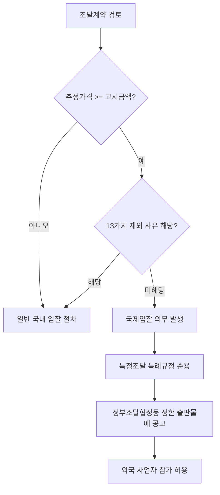

# 공기업·준정부기관 국제입찰 범위 및 제외 사유

## 개요

「공기업·준정부기관 계약사무규칙」제4조는 공기업·준정부기관이 **정부조달협정등**에서 정한 금액 이상의 물품·용역·공사 계약을 체결할 때 국제입찰의 방법으로 해야 한다고 규정한다. 다만 13가지 사유에 해당하면 국제입찰 의무를 면제받는다. 이 가운데 **국제기구의 절차·조건에 따르거나 국제 차관을 재원으로 하는 경우** 예외 사유가 1회 시험에 출제된 바 있다.

> [!note] 왜 공기업·준정부기관에 별도 규정이 있는가?
> 국가기관·지방자치단체는 「특정조달을 위한 국가를 당사자로 하는 계약에 관한 법률 시행령 특례규정」(특정조달 특례규정)이 직접 적용된다. 반면 공기업·준정부기관은 「공공기관의 운영에 관한 법률」에 따른 별도 계약사무규칙을 적용받기 때문에, 국제입찰 기준 적용 근거가 다르다. 다만 국제입찰 계약의 실제 방법·절차는 특정조달 특례규정 및 특례규칙을 **준용**하여 일관성을 유지한다(규칙 제4조 제3항).

## 현행 규정

### 국제입찰 의무 발생 요건

정부조달협정등에 따라 재정경제부장관이 고시하는 금액 이상의 물품·용역·공사 조달계약 → 국제입찰 실시 의무.

> [!info] "정부조달협정등"의 의미
> "정부조달협정등"은 정부가 가입하거나 체결한 정부조달에 관한 협정 및 이에 근거한 국제규범을 통칭한다. 대표적으로 WTO 정부조달협정(GPA)이 해당된다. 금액 기준은 협정별·품목별로 다르며, 재정경제부장관 고시로 주기적으로 갱신된다.

### 국제입찰 제외 사유 (13가지)

| 번호 | 제외 사유 |
|------|----------|
| 1 | 판매·재판매 또는 판매용 생산에 필요한 물품·용역 조달 |
| 2 | 중소기업제품 구매촉진법에 따라 중소기업제품을 제조·구매하는 경우 |
| 3 | 양곡관리법·농수산물유통법·축산법에 따라 농·수·축산물을 구매하는 경우 |
| 4 | 한국전력공사가 중전기 품목(관세율표 제8504호, 제8535호, 제8537호, 제8544호)을 구매하는 경우 |
| 5 | 국가안보 또는 국방 목적 수행과 관련된 조달로서 중대한 안보상의 이익 보호에 필요한 경우 |
| 6 | 공공의 질서·안정 유지 또는 인간·동식물의 생명·건강 및 지적소유권 보호에 필요한 경우 |
| 7 | 자선단체, 장애인이나 재소자가 생산한 물품·용역 조달 |
| 8 | 급식 프로그램의 증진을 위한 조달 |
| 9 | 부동산의 취득·임차나 비계약적 합의 또는 지원을 위한 조달 |
| 10 | 재무대리·예탁, 금융기관의 청산·관리나 공적부채 관련 서비스 조달 |
| 11 | 개발원조 등 국제원조를 위한 조달 |
| 12 | 합작 프로젝트 체결국의 공동 이행과 관련된 국제협약의 절차·조건에 따른 조달 |
| 13 | **국제기구의 절차·조건에 따르거나 국제적 공여·차관 등을 재원으로 조달하는 경우로서 그 절차·조건이 정부조달협정등과 불합치하는 경우** |

> [!warning] 13번 예외의 핵심 조건 — 시험 오답 유인
> "국제기구 조달이면 무조건 예외"가 **아니다**. 국제기구의 절차·조건이 **정부조달협정등과 불합치하는 경우**에만 예외가 된다. 조건이 충족되지 않으면 국제입찰 의무가 그대로 적용된다.

### 국제입찰 이행 및 공표

국제입찰 계약을 체결하려는 경우, 규칙에서 정한 것 외의 계약 방법·절차는 특정조달 특례규정 및 특례규칙을 준용한다. 이행에 따른 공표사항은 **정부조달협정등에서 정한 출판물**에 공고해야 한다.

### 임의적 국제입찰

기관장 또는 계약담당자는 국제입찰 대상이 아닌 경우에도 계약의 목적과 성질 등을 고려하여 필요하다고 인정되면 국제입찰의 방법으로 조달할 수 있다.

## 적용 조건

「공공기관의 운영에 관한 법률」에 따라 지정된 공기업 및 준정부기관에 적용된다. 국가기관·지방자치단체에는 별도의 국제입찰 특례규정이 적용된다.

## 다운스트림 효과 — 국제입찰 의무 발생 시 달라지는 것

> [!note] 국제입찰이 선택되면 바뀌는 실무 사항
> - 입찰공고: 국내 나라장터 외에 정부조달협정에서 정한 국제 출판물에도 공고해야 한다
> - 낙찰자 결정: 외국 업체의 참가를 허용하고, 국산품 우선구매 등 내국민 우대 조항을 적용할 수 없다
> - 계약 절차: 특정조달 특례규정·특례규칙의 방법과 절차를 준용한다

## 시험 출제 포인트

1회 과목1 Q27이 "국제기구 조달 조건"을 예외 사유로 다루었다. 출제 패턴 분석:
- **핵심 구별 지점**: 예외 사유 13번은 단순히 "국제기구 조달이면 예외"가 아니라, 국제기구의 절차·조건이 **정부조달협정등과 불합치하는 경우**에만 예외가 된다는 조건이 붙는다.
- **오답 유인**: "국제기구 조달은 금액에 상관없이 국제입찰 의무가 면제된다" → 조건 충족 여부가 관건이므로 틀림
- **오답 유인**: "중소기업제품 구매는 예외에 해당하지 않는다" → 제외 사유 2번에 해당하므로 틀림
- **함께 출제되는 개념**: 국가계약법 특례규정(특정조달), 정부조달협정 기준금액 고시

## 관련 카드
- [[중기간경쟁제품-직접구매예외]] — 같은 규칙(공기업·준정부기관 계약사무규칙) 내의 또 다른 예외 규정
- [[공공조달-기본원칙-구성요소]] — 공개경쟁 원칙과 국제입찰 의무의 관계
- 국가계약분쟁조정위원회 — 국제입찰 관련 사항도 이의신청 대상에 포함(국가계약법 제28조)

:::tip[실무에서 이 규정 적용하기]
고객 계약별로 이 기준을 자동 적용하고 싶다면 → [공공조달관리사 워크플로우 플랫폼](https://kr-public-procurement-demo.up.railway.app)

조달관리사 실무 워크플로우 플랫폼 — 규제 변경 알림, 클라이언트별 적격심사 점수 자동 계산, 계약 이행 이력 관리.
:::
