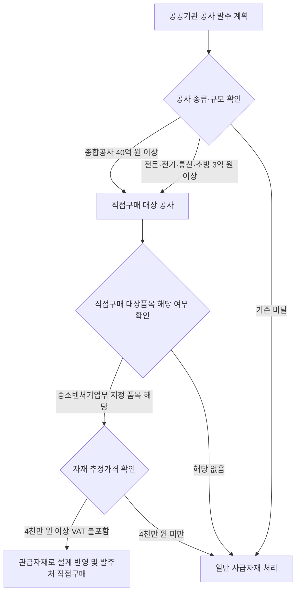

# 공사용자재 직접구매제도 — 적용 기준과 기대효과

## 개요

공공기관이 발주하는 공사에 소요되는 자재 중 '공사용자재 직접구매 대상품목'에 대해서는 **관급자재**로 설계에 반영하고 발주처가 직접 구매하는 제도이다. 중소기업이 대형 건설사의 하청업체로 전락하는 것을 방지하고, 중소기업 경영 안정을 지원한다.

> [!note] 왜 이 제도가 필요한가?
> 대형 건설사가 공사를 수주하면, 자재 구매를 하청업체에 일임하는 구조에서 중소기업 자재 공급업체는 협상력이 매우 약해진다. 원도급사가 단가를 지속적으로 낮추거나 납품 지연을 구실로 대금을 삭감하는 관행이 반복되었다. 이 제도는 발주처가 자재를 직접 구매함으로써 **중소기업 자재업체가 대형건설사의 하청 종속 구조에서 벗어나** 공공기관과 직접 계약 관계를 맺도록 한다.
> 또한 발주처가 직접 구매하면 중간 마진이 제거되고 품질 기준도 설계 단계부터 명확히 반영되어 **공사 품질 향상** 효과도 있다.

## 현행 규정

### 적용 대상 공사 규모

| 공사 종류 | 추정가격 기준 |
|-----------|-------------|
| 종합공사 | 40억 원 이상 |
| 전문공사·전기·정보통신·소방시설공사 | 3억 원 이상 |

### 자재 직접구매 기준

중소벤처기업부 장관이 지정·고시한 직접구매 대상품이 당해 공사 설계내역서 기준 추정가격(VAT 불포함)이 **4천만 원 이상**인 경우 관급자재로 발주처가 직접 구매한다.

> [!warning] 금액 기준 함정
> 자재 기준 금액은 **4천만 원**이다. 시험에서 **5천만 원**으로 출제되는 경우 틀린다. 공사 규모 기준(종합공사 40억 원, 전문공사 3억 원)과 자재 금액 기준(4천만 원)은 서로 다른 적용 층위임에 주의한다.

### 기대효과 (장점)

1. **품질관리** 효율화 — 발주처가 직접 자재 품질을 관리할 수 있음
2. 중간 마진 절감으로 **원가절감** 가능
3. 구매 소요시간 단축
4. 장기적 파트너십 구축을 통한 할인·우선공급 기회 창출

> [!info] 제도의 실제 운영상 한계
> 관련 연구(대한건설정책연구원, 2016)에 따르면, 관급자재는 공사 일정과 독립적으로 조달되는 경우가 많아 **적기 반입 지연**이 공정 전체에 차질을 주는 사례가 수시로 발생하였다. 분리 발주된 공종이 늦어지면 이미 완료된 인접 공종이 파손되거나 공종 간 분쟁이 발생한다. 이러한 운영상 한계는 제도의 장점(중소기업 보호)과 함께 현실적인 설계 단계 조정 필요성을 보여준다.

## 적용 조건

- 적용 대상 품목: 중소벤처기업부 장관이 지정·고시한 직접구매 대상품
- 자재 추정가격(VAT 불포함) 4천만 원 이상

## 다운스트림 영향 — 이 제도가 적용되면 무엇이 달라지는가

| 단계 | 변화 내용 |
|------|-----------|
| 설계 단계 | 해당 자재를 관급자재로 설계내역서에 반영해야 함 |
| 입찰 단계 | 원도급 건설사가 해당 자재를 입찰 내역에서 제외하고 발주처가 별도 조달 |
| 계약 단계 | 발주처-자재 공급 중소기업 간 직접 계약 체결 |
| 준공 단계 | 발주처가 자재 품질 확인 의무 부담 |

> [!example] 직접생산 확인 위반 — 유사 제도 적발 사례
> [[중소기업자간경쟁제도]]의 직접생산 확인 제도에서는 중소기업이 직접생산 확인증명서를 발급받고도 하도급 생산 제품을 납품하다 감사원 공공기관 감사에서 적발된 사례가 있다. 적발된 기업은 직접생산 확인증명서 전체가 취소되고 6개월~1년간 재신청이 제한되었다. 공사용자재 직접구매 제도도 동일한 취지의 위반 위험이 존재한다.

## 시험 출제 포인트

- **Q17(기대효과 — 품질관리 관련):** 품질관리를 더 효과적으로 할 수 있음이 직접구매 장점 중 하나
- 자재 기준 금액 오답: **4천만 원** 이상 (5천만 원으로 출제 시 틀림)
- 제도 목적: 중소기업이 대형건설사 하청업체로 전락하는 것 **방지**

## 관련 카드

- [[중소기업자간경쟁제도]] — 지정 요건과 비교; 직접생산확인 위반 제재 참조
- [[공공구매제도-우선구매비율]] — 중소기업 우선구매 전반
- [[사회적가치-지원조달-대상범위]] — 공사용 자재 직접구매와 사회적 가치 지원 조달의 관계
