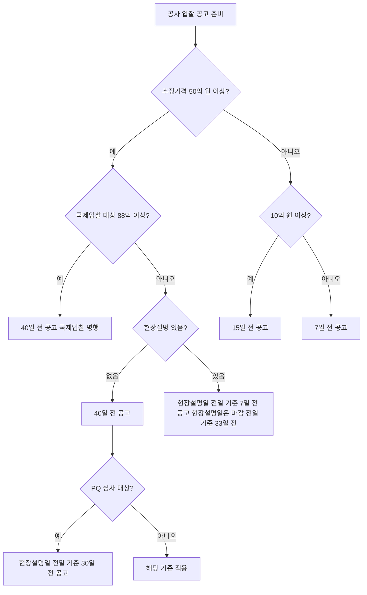

# 공사 입찰 공고기간 — 추정가격별 공고 일수 기준

## 개요

공사 입찰 공고는 입찰에 부치는 사항과 계약 조건을 불특정 다수에게 알리는 절차다. 추정가격 규모에 따라 공고 의무 일수가 다르게 적용된다.

> [!note] 왜 금액이 클수록 공고기간이 길어지는가?
> 대규모 공사일수록 잠재 입찰자가 시공 실적 서류 준비, [[PQ-2차심사-심사분야별-평점|PQ 사전심사]] 신청, 현장 답사, 견적 산정에 더 많은 시간이 필요하다. 공고기간을 규모에 비례시키는 것은 경쟁의 실질적 기회를 보장하고, 입찰자의 정보 비대칭을 줄이기 위한 투명성 원칙의 실현이다. [[WTO-GPA-옵셋금지-원칙|WTO-GPA]] 역시 투명성 확보를 기본 원칙으로 요구하며, 이 공고기간 규정이 그 국내 이행 수단 중 하나다.

## 현행 규정 — 공고기간 (현장설명 없을 때 기준)

| 추정가격 구분 | 입찰 공고 기준일 |
|------------|--------------|
| **50억 원 이상** | 입찰서 제출 마감일 전일부터 **40일 전** |
| 10억 원 이상 ~ 50억 원 미만 | 입찰서 제출 마감일 전일부터 **15일 전** |
| 10억 원 미만 | 입찰서 제출 마감일 전일부터 **7일 전** |

> [!note] 왜 50억 원을 기준으로 40일인가?
> 50억 원 이상 공사는 적격심사 평가항목 중 "자재 및 인력조달 가격의 적정성(10점)"과 "하도급 관리계획의 적정성(10점)"이 추가되어 입찰자가 준비해야 할 서류량이 크게 늘어난다. 또한 50억 원 이상 구간부터는 [[하도급-적정성심사-기준하도급율|하도급 적정성 심사]] 비중이 높아지므로 하도급업체 선정·견적까지 포함한 준비 시간이 필요하다. 40일은 이 준비 일정을 현실적으로 보장하는 최소치다.

### 현장설명 있을 때

| 모든 금액 구분 | 입찰 공고 기준일 |
|------------|--------------|
| 전 구간 공통 | 현장설명일 전일부터 **7일 전** |
| 50억 이상 시 현장설명일 | 입찰서 제출마감일 전일부터 **33일 전** |

> [!note] 현장설명이 있을 때 50억 이상이 33일인 이유
> 현장설명이 있는 경우 "공고 → 현장설명(공고일+7일 이후) → 입찰서 마감" 3단계로 진행된다. 50억 이상 기준으로 보면: 현장설명일 = 입찰 마감일 전일부터 33일 전, 공고일 = 현장설명일 전일부터 7일 전. 즉 공고일은 입찰마감일 전 최소 40일(33+7)이 확보되어 현장설명 없는 경우와 총 준비 기간이 동일하게 유지된다.

### 특수 대상

| 구분 | 공고 기준 |
|------|---------|
| [[PQ-2차심사-심사분야별-평점\|PQ 심사]] 대상 공사 | 현장설명일 전일부터 **30일 전** |
| 국제입찰 대상 공사 (88억 이상) | 입찰서 제출 마감일 전일로부터 **40일 전** |

> [!note] 왜 PQ 공고는 "현장설명일 기준 30일 전"인가?
> [[PQ-2차심사-심사분야별-평점|PQ 심사]] 대상 공사(추정가격 300억 원 이상 일반공사 또는 200억 원 이상 난이도 공사)에서는 PQ 신청 마감 → 심사 → 이의신청(3일 이내) → 입찰 참가 자격 부여라는 사전 절차가 추가된다. 현장설명 전에 이 PQ 절차가 완료되어야 하므로, 현장설명 전일 기준 30일의 사전 공고가 필요하다.

### 지방계약법 (50억 이상)

| 구분 | 공고 기준 |
|------|---------|
| 고시금액 미만 50억 이상 | **30일** 전 |
| 고시금액 이상 | **40일** 전 |

> [!note] 지방계약법의 "고시금액"이란?
> 지방계약법에서 고시금액은 [[WTO-GPA-옵셋금지-원칙|WTO-GPA]] 적용 기준이 되는 국제입찰 대상 금액을 말한다. 공사의 경우 중앙행정기관 기준 88억 원(2025~2026년 고시). 고시금액 이상이면 국제입찰 의무가 발생하므로 공고기간도 40일로 늘린다. 고시금액 미만(50억 이상) 구간은 30일로 국가계약법(40일)보다 짧다는 점이 시험 함정이다.

## 적용 조건

- 공고내용 착오·오류 시: 경미한 경우 정정공고(잔여 공고기간 + **5일** 가산), 중대한 경우 기존 공고 취소 후 재공고
- 국제입찰: 물품·용역 88억 원(공공기관 265억 원) 이상
- [[건설공사-범위-제외공종|건산법 제외 공종]](전기·정보통신·소방·국가유산)에도 동일한 공고기간 기준이 적용됨

## 공고기간 결정 흐름

> [!warning] 시험 함정 — 국가계약법 vs 지방계약법 50억 이상 구간
> 국가계약법에서 50억 이상은 **40일**이지만, 지방계약법에서 고시금액(88억) 미만 50억 이상은 **30일**이다. 두 법령을 혼동하면 오답이 된다.

## 시험 출제 포인트

- **핵심:** "공사 입찰 공고일 기준 — 추정가격 50억 이상 시 공고 일수" → **40일 전** (현장설명 없을 때)
- 10~50억: 15일, 10억 미만: 7일
- 지방계약법에서 고시금액 미만은 30일, 고시금액 이상은 40일 (국가계약법과 동일)

> [!example] 공고 오류 정정 사례
> 발주기관이 50억 원 공사 공고를 게시한 후 10일이 지나 입찰 조건 중 경미한 오류를 발견했다. 남은 공고 기간은 30일(40-10). 이 경우 정정공고를 내고 잔여 30일에 5일을 가산하여 35일의 공고기간이 다시 시작된다. 중대한 오류(예: 입찰 방식 자체 변경)라면 기존 공고를 취소하고 40일 전부터 재공고해야 한다.

## 관련 카드
- [[건설공사-범위-제외공종]] — 건산법상 건설공사 범위와 제외 공종
- [[PQ-2차심사-심사분야별-평점]] — PQ 심사 기준
- [[종합심사낙찰제-동가입찰-낙찰자결정]] — 공고 대상 공사의 낙찰자 결정 방식
- [[WTO-GPA-옵셋금지-원칙]] — 국제입찰 대상 공사(88억 이상) 공고기간 기준
- [[하도급-적정성심사-기준하도급율]] — 낙찰 후 하도급 적정성 심사 연계
