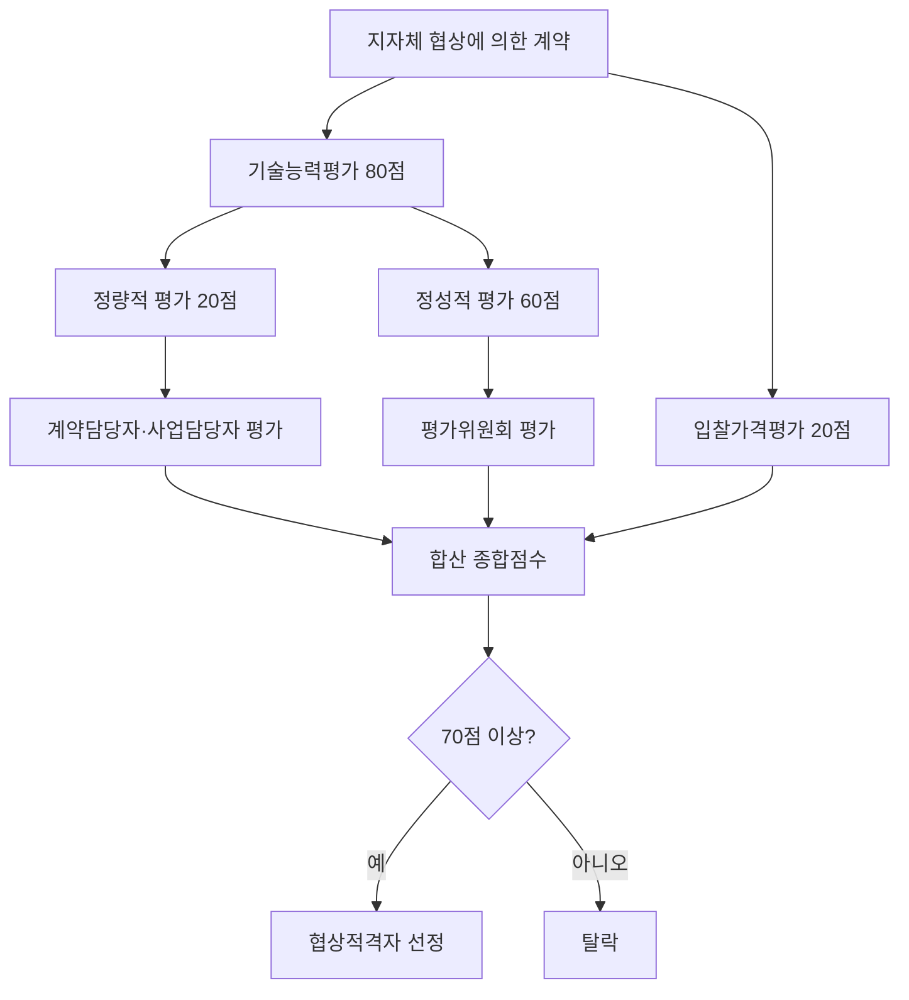

# 기술능력평가 정성·정량 구별 — 지자체 협상에 의한 계약

## 개요

[[협상에의한계약-배점기준|협상에 의한 계약]]에서 기술능력평가(80점)를 수행하는 방식은 발주기관 유형에 따라 다르다. **지자체만** 기술능력평가를 정량적(20점)과 정성적(60점)으로 분리 운용한다.

> [!note] 왜 정량과 정성을 나누는가?
> 정량적 평가 항목(수행실적·경영상태·기술인력 보유 등)은 제출 서류만으로 객관적으로 확인할 수 있다. 반면 정성적 항목(사업수행계획·기술·지식능력·상호협력 등)은 전문가의 종합적 판단이 필요하다. 지자체는 이 두 성격을 분리하여 **정량은 계약담당자(공무원)가, 정성은 외부 평가위원이** 별도로 평가하게 함으로써 평가의 객관성과 전문성을 동시에 확보한다. 국가기관은 항목별 배점한도(30점)로 쏠림을 방지하는 방식을 택해 이 구분을 명시하지 않는다.

## 현행 규정

### 기술능력평가 구성 비교

과목2-3장 기준 (출제 기준 원본):

| 발주기관 | 정량적 평가 | 정성적 평가 | 합계 |
|---|---|---|---|
| **지방자치단체** | **20점** | **60점** | 80점 |
| **국가기관** | 구분 없음 (단일 기술능력평가) | — | 80점 |

> 주의: 과목3-2장 표3-18에서는 정량(20점)/정성(60점) 구분을 국가기관 표로 제시함 — 출처 간 표현 차이 존재. 과목2-3장 Q6 해설 및 과목3 Q14 출제 기준으로는 **자치단체**가 정량·정성 구분 적용.

> 가격평가 20점은 국가기관·지자체 동일

### 정량적 기술능력평가 (20점)

- 수행경험(실적), 경영상태, 기술인력 보유 현황, 신인도 등
- **평가 주체: 계약담당자 또는 사업담당자**
- 객관적 서류(실적증명서·재무제표·보유인력 명부 등)로 확인 가능한 항목

### 정성적 기술능력평가 (60점)

- 기술·지식능력, 사업수행계획, 지원기술·사후관리, 상호협력 등
- **평가 주체: 평가위원** (외부 전문가 포함)
- [[평가위원회-구성-및-회피|평가위원회]]가 제안서 내용을 종합적으로 판단

> [!warning] 정량·정성 제안서는 별도 파일로 제출
> 정량평가용 제안서와 정성평가용 제안서는 **별도 파일(인쇄물의 경우 별권)**으로 편철·제출해야 한다. 조달청이 정성평가를 대행한 경우, 평가 종료 후 정성평가 제안서를 수요기관의 장에게 인계한다. 파일을 통합 제출하면 절차 위반이 된다.

### 협상적격자 기준

| 발주기관 | 협상적격 기준 |
|---|---|
| 국가기관 | 기술점수 **85%** 이상 |
| 지방자치단체 | 합산점수 **70점** 이상 |

> 협상적격자 선정 후 협상순위 및 계약체결 절차는 [[협상에의한계약-협상적격자-선정]] 참조.

## 평가 경로 흐름도

## 적용 조건

- 협상에 의한 계약 (물품·용역)
- 지자체: 청소·경비 등 단순 노무 용역은 협상에 의한 계약 적용 불가

## 실무 사례

> [!example] 실제 사례 — 서울시 정성평가 합산 방식 분쟁 (2019)
> *(실제 분쟁 사례입니다. 법원 가처분 절차에서 다루어진 사건으로, 공개된 최종 판결문이나 사건 번호는 없습니다. 출처: 법무법인(유한) 대륙아주 수행 사례 공개 게시물, 2019-07-16.)*
>
> 서울특별시가 협상에 의한 계약 방식으로 진행한 ΟΟ관리시스템 개선사업에서, 정성적 기술능력평가 점수 합산 시 **평가위원별 최고·최저 제외** 방식 대신 **평가항목별 최고·최저 제외** 방식을 적용했다. 입찰공고나 제안요청서에 이를 명시하지 않고 "관례"라고 주장했으나, 법원 가처분 절차에서 이 합산 방식이 「지방자치단체 입찰시 낙찰자 결정기준」(행정안전부 예규)에 위반되며 입찰의 공정성과 공공성을 훼손하는 것이어서 효력이 없다는 결론이 도출되었다. 합산 방식을 달리 적용한 결과 우선협상대상자 순위가 바뀌었다는 점이 핵심 쟁점이었다. **교훈:** 정성평가는 주관적 점수 합산 과정에서도 기준이 사전에 공개되어야 하며, 합산 방법의 차이가 낙찰 결과를 바꿀 수 있다.

> [!info] 실무적 함의 — 제안서 전략 설계 시 함의
> 지자체 발주 협상 계약에서는 정량(20점)과 정성(60점)이 서로 다른 심사자에게 평가된다. 따라서 입찰 업체는 두 분야 제안서를 별도로 전략화해야 한다. 정량 부분은 서류 완비·실적 입증에 집중하고, 정성 부분은 평가위원 관점의 설득력 있는 기술 제안서 작성이 핵심이다. 두 파일이 분리 제출되므로, 정성평가용 제안서에 정량 항목 내용을 중복 기재하는 것은 평가 규정상 인정되지 않을 수 있다.

## 시험 출제 포인트

**출제 패턴:** 협상에 의한 계약 기술능력평가에서 정성적 vs. 정량적 평가 분야를 구별 — 어느 기관이 어떤 구분을 하는지, 배점은 얼마인지.

**핵심 암기 (과목2-3장 Q6 기준):**
- 정량(20점) + 정성(60점) 구분 = **자치단체** 적용
- 정량은 계약담당자가 평가, 정성은 평가위원이 평가
- 국가기관 기술능력 항목별 배점한도 = **30점** (20점 아님)
- 지자체 협상적격 기준 = 합산 **70점** / 국가기관 = **85%**

**오답 유인:**
- "지자체 정량 60점, 정성 20점" — 오답 (정량이 20, 정성이 60)
- "국가기관 기술능력 항목별 배점한도 20점" — 오답 (30점)
- "국가기관도 정성·정량을 구분한다" — 과목3-2장 표3-18 해석에 따라 논쟁 소지 있음; 시험에서는 과목2 Q6 해설 기준 적용

## 관련 카드
- [[협상에의한계약-배점기준]] — 배점 전체 구조 (기술 80 : 가격 20)
- [[협상에의한계약-협상적격자-선정]] — 협상적격자 70점·85점 기준
- [[평가위원회-구성-및-회피]] — 정성평가 담당 평가위원회 구성 인원 및 회피 규정
