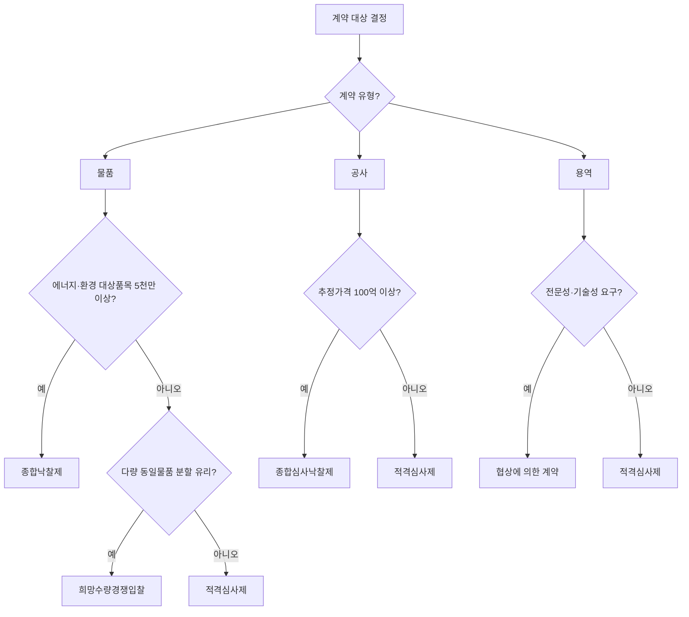

# 낙찰자 선정 방식 비교 — 최저가·적격심사·협상·종합심사

## 개요

공공조달에서 낙찰자를 선정하는 방식은 계약 유형, 금액, 물품·공사·용역 구분에 따라 달라진다. 각 방식의 특징과 한계를 비교하여 시험에서 구별할 수 있어야 한다.

> [!note] 제도 변천의 흐름 — 왜 방식이 이렇게 복잡해졌나?
> 공공조달 낙찰 방식은 **최저가낙찰제 → 적격심사제 → 종합심사낙찰제** 순으로 진화해 왔다. 최저가낙찰제는 가격 경쟁력만 평가하여 덤핑낙찰, 부실시공, 저가 하도급, 산업재해 증가 등 폐단이 누적되었다. 이를 보완하기 위해 이행능력을 함께 심사하는 적격심사제가 도입되었고, 대형 공사에서 비가격 요소의 변별력이 여전히 낮다는 지적에 따라 2016년 종합심사낙찰제가 300억 이상 공사에 본격 적용되었다. 물품 영역에서는 에너지절약·환경우수 제품 개발 유도를 위해 별도로 종합낙찰제가 운용된다.

## 현행 규정

### 방식 선택 흐름도

### 주요 낙찰자 선정 방식 비교

| 방식 | 적용 대상 | 핵심 특징 | 주요 한계 |
|---|---|---|---|
| **최저가낙찰제** | 소규모·단순 물품 (사실상 단독 적용 폐지) | 예정가격 이하 최저가 제시자 낙찰 | 비가격 요소 미반영; 역량 부족 업체 낙찰 위험 |
| **[[적격심사-물품-추정가격-배점\|적격심사제]]** | 공사 1억~100억; 물품·용역 고시금액 이상 | 가격+이행능력 종합 심사; 95점 이상 합격 | 비가격 요소 평가 실효성 낮음 |
| **[[협상에의한계약-협상적격자-선정\|협상에 의한 계약]]** | 전문성·기술성·긴급성 요구 용역·물품 | 기술80:가격20 평가 + 협상절차 | 최근 가격평가 비중 증가로 취지 훼손 지적 |
| **[[종합심사낙찰제-대상\|종합심사낙찰제]]** | 공사 100억 이상; 건설사업관리 50억 이상 등 | 가격+공사수행능력+사회적 책임 종합 | 비가격 요소 변별력 낮아 실효성 강화 필요 |
| **[[종합낙찰제-대상품목\|종합낙찰제]]** | 물품 5천만 원 이상 (에너지·환경 대상품목) | 에너지소모비+입찰가 합산 또는 종합평가점수 | 물품 한정; 15종 대상품목 외 적용 불가 |
| **[[희망수량경쟁입찰]]** | 다량 동일물품 (분할 계약 유리한 경우) | 최저가 순 수요물량 도달까지 복수 낙찰 | 덤핑 위험; 품질 저하 우려 |

### 비가격 요소 평가 실효성

- [[종합심사낙찰제-대상|종합심사낙찰제]]와 [[적격심사-물품-추정가격-배점|적격심사제]] 모두 비가격 요소의 **변별력이 낮다**는 지적 존재
- 최저가낙찰제는 최근 단독으로 적용하는 경우 **없음** (사실상 폐지)

> [!example] 실제 사례 — 최저가낙찰제 폐단
> 지방자치단체는 2.1억 원 미만 물품구매에서 최저가낙찰제를 운용해왔으나, 덤핑 투찰로 인한 납품 품질 저하 문제가 반복되었다. 이에 따라 행정안전부는 지자체 물품구매 입찰에서 최저가낙찰제를 폐지하고 적격심사낙찰제로 전환하는 조치를 시행하였다.

> [!warning] 시험 함정 — "최저가낙찰제가 현재도 단독으로 사용된다"
> 최저가낙찰제가 원칙적으로 법령에서 삭제된 것은 아니나, 현행 공공조달에서 단독으로 적용되는 사례는 사실상 없다. "원가절감에 크게 기여한다"는 서술도 오답 유인이다.

## 시험 출제 포인트

**출제 패턴:** 낙찰자 선정 방식별 기준 — 최저가·가격협상·종합심사의 특징 구별 또는 특정 방식이 적용되는 금액 기준.

**핵심 구별:**
- 공사 100억 이상 = 종합심사낙찰제
- 공사 1억~100억 = 적격심사제
- 전문 용역 = 협상에 의한 계약
- 물품 에너지·환경 대상품목 5천만 이상 = 종합낙찰제
- 다량 동일물품 분할 = 희망수량경쟁입찰

**오답 유인:**
- "최저가낙찰제가 원가절감에 크게 기여한다" — 오답 (역량 부족 업체 낙찰 문제로 단독 사용 폐지)
- 종합심사낙찰제가 물품에도 적용된다 — 오답 (물품은 종합낙찰제)
- 협상에 의한 계약은 청소·경비 용역에도 적용 가능 — 오답 (단순 노무 적용 불가)

## 관련 카드
- [[협상에의한계약-협상적격자-선정]] — 협상 방식 세부
- [[종합심사낙찰제-대상]] — 종합심사 적용 금액 기준
- [[종합낙찰제-대상품목]] — 물품 종합낙찰제 15종
- 적격심사-scoring-tables — 적격심사 배점 테이블
- [[희망수량경쟁입찰]] — 다수공급자 분할 낙찰 방식
- [[적격심사-물품-추정가격-배점]] — 조달청 물품 적격심사 추정가격 구간별 배점
- [[개찰-낙찰-절차]] — 낙찰 결정 전 개찰 단계부터 낙찰 선언까지의 6단계 절차
- [[일반경쟁입찰-장단점-절차]] — 일반경쟁 방식에서 적용되는 낙찰자 선정 방식의 종류
- [[예정가격-결정방법]] — 대부분 낙찰 방식의 기준이 되는 예정가격의 결정 방법; 협상계약은 예정가격 결정 불가
