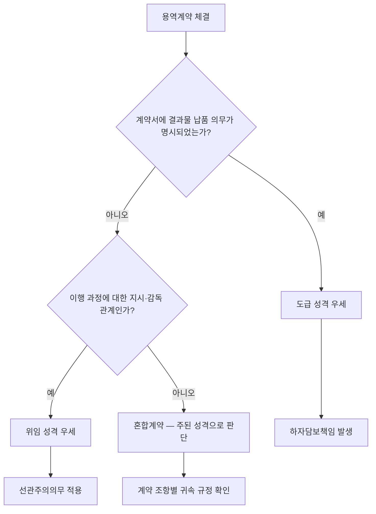

# 도급(都給)과 위임(委任)의 구별

## 개요

공공조달 계약은 민법상 크게 **도급**과 **위임** 두 가지 기본 계약 유형을 근거로 한다. **도급(都給)**은 어떤 일의 **완성**을 목적으로 하고(「민법」 제664조), **위임(委任)**은 **사무의 처리**를 위탁하는 것을 목적으로 한다(「민법」 제680조). 공사·물품 제조 계약은 도급 성격, 용역 계약은 위임 성격이 강하다.

> [!note] 왜 이 구별이 중요한가?
> *계약서 명칭이 아니라 **실질적 내용**에 따라 도급인지 위임인지가 결정된다 ("Substance over form)*. 
> 대법원은 "용역계약서는 그 명칭에 불구하고 구체적인 내용에 따라 민법상 도급계약이나 위임계약, 또는 근로계약의 성격을 가질 수 있다"고 판시했다. 즉 '컨설팅 용역'이라는 계약서 제목이 붙어 있어도 결과물 납품 의무가 명시되어 있으면 도급으로 해석될 수 있고, 그 순간 수임인의 **하자담보책임**이 발생한다.

## 현행 규정

### 핵심 비교

| 구분 | 도급(都給) | 위임(委任) |
|------|-----------|-----------|
| 목적 | 일의 **완성** (결과물) | 사무의 **처리** (행위 자체) |
| 보수 발생 | 일이 완성된 때 | 사무 처리에 대해 지급 |
| 결과 책임 | 수급인(受給人)이 결과물에 책임 | 수임인(受任人)은 결과에 책임 없음 |
| 계약 관계 | 쌍무계약·유상계약 | 무상이 원칙 (특약으로 유상 가능) |
| 근거 조문 | 제664조 | 제680조 |

> [!info] 용어 해설: 쌍무계약 · 유상계약 · 무상계약
> - **쌍무계약(雙務契約)**: 계약 양 당사자가 서로 **대가적(對價的) 채무**를 부담하는 계약. 도급에서는 수급인의 '일 완성 의무'와 도급인의 '보수 지급 의무'가 서로 대가를 이루므로 쌍무계약이다. [[동시이행의-항변권]]은 쌍무계약에서만 발생한다.
> - **유상계약(有償契約)**: 계약 당사자 쌍방이 재산상 **출연(出捐)**을 하는 계약. 보수·대금 등 반대급부가 있으면 유상계약이다. 도급은 쌍무계약이자 유상계약이다.
> - **무상계약(無償契約)**: 한 당사자만 출연하고 상대방에게 반대급부가 없는 계약. 위임은 원칙적으로 **무상**이나, 특약이 있으면 유상으로 할 수 있다(「민법」 제686조 제1항).
>
> → 세 용어의 상세 정의와 분류 체계: 쌍무계약-유상계약-무상계약

### 도급의 주요 규정 (제664조~)

- 수급인은 일을 완성해야 보수를 청구할 수 있다.
- 일이 완성되기 전에는 도급인은 언제든지 계약을 해제할 수 있다(단, 손해배상 요).
- 수급인은 완성된 목적물에 **하자(瑕疵)**가 있는 경우 하자담보책임을 진다.

### 위임의 주요 규정 (제680조~)

- 위임은 당사자 일방이 상대방에 대하여 사무의 처리를 위탁하고 상대방이 이를 **승낙**함으로써 효력이 생긴다.
- 수임인은 위임의 본지(本旨)에 따라 선량한 관리자의 주의로 사무를 처리해야 한다(선관주의의무; 제681조).
- 위임은 각 당사자가 언제든지 해지할 수 있다(단, 불리한 시기의 해지는 손해배상 요).

## 판단 흐름도

## 적용 조건

| 계약 유형 | 민법상 성격 | 특징 |
|----------|-----------|------|
| 공사 계약 | 도급 | 준공(일의 완성)이 보수 지급 조건 |
| 물품 제조 계약 | 도급 | 규격에 맞는 물품 완성이 기준 |
| 물품 구매 계약 | 매매 (도급 유사) | 물품 인도·검수 후 대금 지급 |
| 일반 용역 계약 | 위임(혼합) | 행위의 제공이 목적, 결과 보장 없음 |
| 전문 컨설팅·법무 용역 | 위임 | 선관주의의무 중심 |

> [!info] 혼합계약의 처리
> 기술용역계약은 흔히 일부 업무는 도급 성격(보고서 납품), 일부는 위임 성격(현장 자문)인 혼합형으로 구성된다. 대법원(2023다289174)은 혼합형 기술용역계약에서 업무 구분에 따라 각각의 법리를 적용했다. 공공조달 실무에서는 **계약서 작성 단계에서 결과물 중심 조항과 행위 중심 조항을 명확히 분리하지 않으면, 이행 완료 후 분쟁 시 계약 성격 자체가 다투어진다.**

## 실무 적용

공공조달관리사 실무에서 이 구별이 중요한 이유:

1. **하자담보책임 범위**: 도급(공사·제조)에서는 수급인이 목적물 하자에 대한 담보책임을 지지만(「국가계약법 시행령」 제60조: 1~10년), 순수 위임 성격의 용역에서는 결과 미달에 대한 책임 구조가 다르다.
2. **계약 해지 시 정산**: 도급은 기성(旣成) 부분에 대해 비율 지급하고 [[계약의-해제와-해지|해제]]가 소급 효력을 가지며, 위임은 처리된 사무 범위 내 보수 정산 후 해지로 장래만 종료된다.
3. **계약서 조항 해석**: "일의 완성"을 명시한 용역계약은 위임보다 도급에 가까운 해석이 적용될 수 있어 수임인의 결과 책임이 강화된다.

> [!example] 가상 시나리오: 용역계약의 성격 분쟁
> *(이 시나리오는 특정 실제 사건을 인용한 것이 아니라, 도급·위임 구별 원칙을 설명하기 위해 구성한 교육용 가상 사례입니다. 계약서 명칭과 실질 내용의 불일치에 관한 유사 분쟁은 실무에 다수 존재합니다.)*
>
> A 지방자치단체가 정비사업 관련 전문관리업자와 체결한 용역계약에서, 계약서는 '위임'을 표방했으나 계약 내용에 '관리계획서 납품' 의무가 포함되어 있었다. 이후 도중 해지 시 정산 방식을 놓고 분쟁이 발생했다. 법원은 "계약 내용상 결과물 납품 의무가 있으므로 해당 부분은 도급 법리를 적용해야 한다"고 판단, 단순 사무처리 위임과 다른 기성 비율 정산 방식을 적용했다. **계약서 명칭만으로 위임·도급을 판단하지 않는다**는 점이 핵심이다.

> [!warning] 시험 출제 포인트
> - 도급: **일의 완성** → 결과 책임 O, 하자담보책임 O
> - 위임: **사무의 처리** → 결과 책임 X, 선관주의의무
> - 위임은 무상이 **원칙** (특약으로 유상 가능)
> - 도급인은 일 완성 **전**에는 언제든지 해제 가능(손해배상 요)
> - 위임은 각 당사자가 **언제든지** 해지 가능(불리한 시기면 손해배상 요)
> - 계약서 명칭이 아닌 **실질적 내용**으로 판단

## 이 분류가 바꾸는 것 (So What)

**도급으로 분류되면:**
- 준공·납품 전 [[동시이행의-항변권]]을 근거로 대금 지급을 거절할 수 있다. 발주기관이 기성금을 지급하지 않으면 수급인은 공사를 멈출 수 있고, 수급인이 일을 완성하지 않으면 발주기관은 잔금 지급을 거절할 수 있다.
- 하자 발생 시 수급인이 담보책임을 지고, 담보책임 기간이 법정된다. 「국가계약법 시행령」 제60조에 따라 공종별로 1~10년의 하자보수 의무가 발생하며, 특약으로도 이 기간을 단축하기 어렵다.
- 도급인의 일방 해제 시 기성 비율 정산 + 손해배상 의무가 발생한다. 도급인이 사업을 중도에 포기하더라도 이미 완성된 부분에 대한 보수는 지급해야 하고, 수급인이 입은 기대이익 손실도 배상해야 한다(「민법」 제673조).

**위임으로 분류되면:**
- 결과물이 불만족스러워도 선관주의의무 위반이 없는 한 계약 위반이 아니다. 예를 들어 법무 자문 용역을 위임으로 체결하면 변호사가 소송에서 패소하더라도, 선량한 관리자의 주의로 사무를 처리했다면 채무불이행 책임을 묻기 어렵다.
- 수임인은 언제든지 해지할 수 있어 계약 지속을 강제하기 어렵다. 다만 수임인이 **위임인에게 불리한 시기**에 해지하면 손해배상 의무가 생긴다(「민법」 제689조 제2항).

> [!example] 분류가 결과를 바꾼 가상 시나리오: 정보화 사업 중도 해지
> *(이 시나리오는 실제 판례를 직접 인용한 것이 아니라, 도급·위임 분류 쟁점을 설명하기 위해 구성한 교육용 가상 사례입니다. 실제 유사 분쟁은 다수 존재하나, 특정 사건과의 일치를 주장하지 않습니다.)*
>
> 중앙부처 B가 IT 솔루션 개발 업체와 '정보화 컨설팅 및 시스템 구축 용역' 계약을 체결했다. 계약서 제목에는 '위임'이라고 되어 있었다. 사업 도중 예산 삭감으로 발주기관이 해지를 통보했을 때, 업체는 **완성된 모듈 40%에 대한 기성 정산**과 **잔여 기간 이익 손실 배상**을 청구했다. 발주기관은 위임이므로 언제든 해지할 수 있고 배상 의무가 없다고 맞섰다. 법원은 계약 내용에 '시스템 납품 및 검수' 조항이 있음을 들어 **도급 법리를 적용**, 기성 비율 40%에 해당하는 보수와 업체의 준비 비용을 배상하도록 판단했다. 계약서 명칭 한 줄이 정산 방식과 배상 범위 전체를 뒤집은 사례다.

## 관련 카드

- [[계약의-해제와-해지]] — 도급은 해제(기성 비율 정산), 위임은 해지(장래 종료) 적용
- [[계약의-성립]] — 도급·위임 모두 청약·승낙으로 성립
- [[동시이행의-항변권]] — 도급(쌍무계약)에서 준공 전 대금 지급 거절의 근거
- [[화해]] — 도급·위임 계약에서 분쟁 발생 시 상호 양보로 종결하는 수단
- 쌍무계약-유상계약-무상계약 — 도급이 쌍무·유상, 위임이 편무·무상인 민법적 근거의 상세 정의
