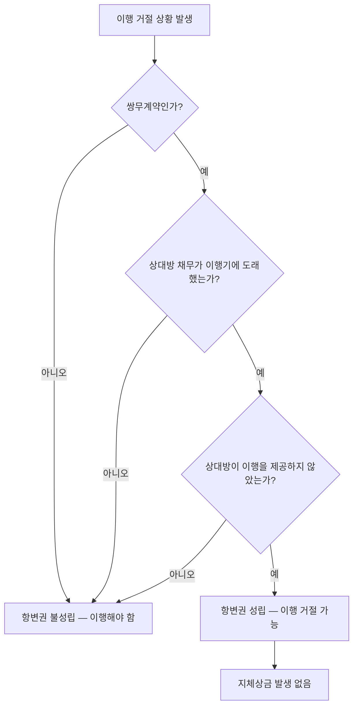

# 동시이행의 항변권(同時履行의 抗辯權)

## 개요

쌍무계약(雙務契約)에서 당사자 일방은 상대방이 자신의 채무를 이행하지 않는 한 자신의 채무 이행을 거절할 수 있다(「민법」 제536조). 이를 **동시이행의 항변권**이라 한다. 공공조달에서는 수요기관의 대금지급 의무와 계약자의 납품·이행 의무가 서로 대응하는 쌍무계약이므로, 이 규정이 이행 분쟁 시 직접 적용된다.

> [!note] 왜 이 권리가 존재하는가?
> 쌍무계약에서 일방만 먼저 이행을 강제당하면, 상대방이 이행하지 않을 경우 채권 회수가 불확실해진다. 동시이행의 항변권은 이 불균형을 방지해 **공평의 원칙**을 실현하는 제도다. 공공조달에서 납품업체 입장에서는 대금 미지급 시 추가 납품을 거절하는 근거가 되고, 수요기관 입장에서는 미완성 납품에 대한 대금 지급을 거절하는 근거가 된다. 항변권이 적법하게 행사되는 동안에는 **이행지체(지체상금 발생)가 성립하지 않는다**는 점이 실무상 가장 중요하다.

## 현행 규정

### 성립 요건

| 요건 | 내용 |
|------|------|
| 쌍무계약일 것 | 당사자 모두 서로에 대한 채무를 부담 |
| 상대방 채무가 이행기에 있을 것 | 상대방의 채무 이행기가 도래해야 항변 가능 |
| 상대방이 이행하지 않았을 것 | 상대방이 이행을 제공하지 않은 상태 |

### 핵심 원칙

- 항변권 행사 시 자신의 이행 지체책임이 발생하지 않는다.
- 상대방의 채무가 **아직 이행기가 아닌 경우**에는 항변권을 행사할 수 없다.

## 항변권 성립 판단 흐름

## 적용 조건

- 물품·용역·공사 계약 모두 해당(MAS 포함)
- 계약자가 납품 전 선금 지급을 요구하는 경우 또는 수요기관이 인수 전 대금지급을 거절하는 경우에 적용
- 일방이 이행 제공 의사를 명백히 거절한 경우에는 항변권이 소멸할 수 있음

## 실무 적용

| 상황 | 동시이행 항변권 적용 |
|------|---------------------|
| 수요기관이 대금을 지급하지 않음 | 계약자는 물품 인도·용역 제공을 거절할 수 있다 |
| 계약자가 납품을 완료하지 않음 | 수요기관은 대금 지급을 거절할 수 있다 |
| 공사 계약에서 준공검사 전 잔금 청구 | 수요기관은 준공검사 완료 전까지 잔금 지급 거절 가능 |

실무 주의사항: 동시이행 항변권 행사를 이유로 이행을 지체한 기간에는 지체상금(遲滯賞金)이 발생하지 않는다. 그러나 항변권 행사 요건을 충족하지 못한 채 이행을 거절하면 계약 위반이 된다.

> [!warning] 핵심 예외: 지체상금 채권과의 관계
> 공사도급계약에서 도급인의 **지체상금 채권**과 수급인의 **공사대금 채권**은 특별한 사정이 없는 한 **동시이행 관계에 있지 않다**(대법원 2015. 8. 27. 선고 2013다81224,81231). 즉, 수급인이 공사를 완료했다면 도급인이 "지체상금이 있다"는 이유만으로 공사대금 지급 자체를 동시이행 항변권으로 거절할 수 없다. 지체상금은 별도 채권으로 상계 처리해야 한다. 이는 시험에서 자주 출제되는 구별 포인트다.

> [!example] 가상 시나리오: 준공검사 전 잔금 지급 분쟁
> *(이 시나리오는 특정 실제 사건을 인용한 것이 아니라, 대법원 2015. 8. 27. 선고 2013다81224,81231 판결의 법리를 바탕으로 구성한 교육용 가상 사례입니다.)*
>
> 공공 건설공사에서 수급인이 준공 기한을 초과해 공사를 완료하고 잔금을 청구했다. 발주기관은 지체상금 채권을 이유로 잔금 전액 지급을 거절했다. 법원은 준공검사가 완료된 이상 잔금 지급의무는 이행기가 도래했으므로 지체상금을 이유로 한 동시이행 항변은 인정되지 않고, 지체상금은 공사대금과 별도로 정산해야 한다고 판단했다. 발주기관은 잔금을 지급한 뒤 지체상금을 별도 청구하거나 상계를 주장해야 했다.

> [!example] 가상 시나리오: 하도급 직접지급과 항변권
> *(이 시나리오는 특정 실제 사건을 인용한 것이 아니라, 하도급법 제14조의 적용 원리를 설명하기 위해 구성한 교육용 가상 사례입니다.)*
>
> 하도급법 제14조에 따라 발주자가 하수급인에게 하도급대금을 직접 지급하는 경우, 원사업자의 발주자에 대한 공사대금 채권이 하수급인에게 이전된다. 이때 발주자가 원사업자에게 동시이행 항변권을 주장하며 하도급대금 직접 지급을 거부하면, 하수급인은 원사업자를 거치지 않고 발주자에게 직접 청구할 수 있다. 공공조달에서 다단계 하도급 구조가 있을 때 이 법리가 적용된다.

> [!warning] 시험 출제 포인트
> - 항변권 행사 요건: ①쌍무계약 ②상대방 채무 이행기 도래 ③상대방 미이행
> - 항변권 행사 중에는 **지체상금 발생 없음**
> - 지체상금 채권 ↔ 공사대금 채권은 **동시이행 관계 아님** (대법원 판례)
> - 상대방 채무가 아직 이행기 미도래 → 항변권 **행사 불가**
> - 동시이행 항변권의 대항을 받는 채권을 자동채권으로 한 **상계는 허용되지 않음** (상대방의 항변권 행사 기회 박탈 방지)

## 이 분류가 바꾸는 것 (So What)

동시이행 항변권이 성립하면:
1. **지체상금 차단**: 이행 거절 기간이 계약자의 귀책 지체로 집계되지 않아 지체상금이 발생하지 않는다.
2. **[[계약의-해제와-해지]] 지연**: 항변권이 행사되는 동안에는 상대방이 채무불이행을 이유로 계약을 해제하기 어렵다.
3. **[[위험부담]] 구분**: 항변권과 위험부담은 별개 개념이다. 위험부담은 쌍방 귀책 없이 이행 불능이 된 경우이고, 항변권은 일방이 이행을 **거절**하는 경우다.

## 관련 카드

- [[위험부담]] — 이행 불능 시 손실 귀속 (항변권과 구별되는 개념)
- [[계약의-해제와-해지]] — 동시이행 항변이 해소되지 않을 때 계약 종료 수단
- [[도급과-위임의-구별]] — 도급(쌍무계약)에서만 항변권 성립; 위임은 무상이 원칙이어서 적용 조건 다름
- [[계약의-성립]] — 쌍무계약의 성립 시점이 항변권 발생의 전제

> **참고 (미카드 개념):** 제3자를 위한 계약(민법 §539) — 계약 당사자 일방이 제3자에게 이행할 것을 약정하면 제3자가 채무자에게 직접 이행을 청구할 수 있다. 수험 관련성은 있으나 조달 실무 관련성이 낮아 별도 카드 미생성.

:::tip[실무에서 이 규정 적용하기]
고객 계약별로 이 기준을 자동 적용하고 싶다면 → [공공조달관리사 워크플로우 플랫폼](https://kr-public-procurement-demo.up.railway.app)

조달관리사 실무 워크플로우 플랫폼 — 규제 변경 알림, 클라이언트별 적격심사 점수 자동 계산, 계약 이행 이력 관리.
:::
