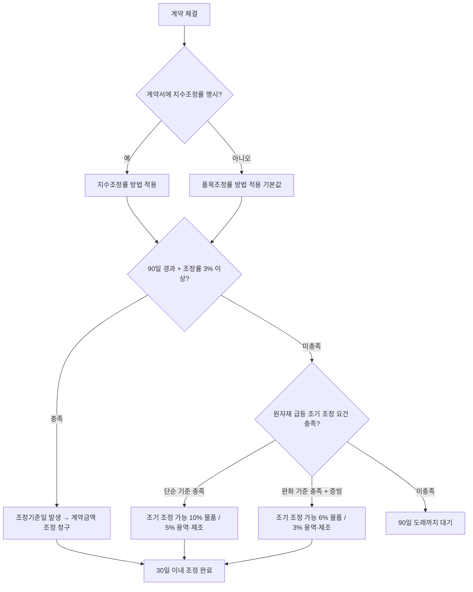

# 물가변동으로 인한 계약금액 조정 — 조정 요건과 조정률 기준

## 개요

계약 체결 후 물가 변동으로 계약금액을 구성하는 품목·비목의 가격이 급격히 상승 또는 하락한 경우, 계약금액을 증감 조정하는 제도. 국가기관 계약에서 의무사항이며, 당사자 간 배제 특약은 법령 위반.

> [!note] 왜 이 제도가 존재하는가?
> 공공계약은 다수공급자계약·장기계속계약처럼 수개월~수년에 걸쳐 이행되는 경우가 많다. 계약 체결 시점의 가격이 이행 완료 시점까지 그대로 유지된다는 보장이 없다. 만약 물가 급등 시에도 계약금액 조정이 없다면, 계약상대자는 손실을 피하기 위해 납품 거부·계약 포기·부실 납품을 선택할 유인이 생긴다. 반대로 물가 하락 시 국가가 비싼 가격을 계속 지급하면 예산 낭비다. 물가변동 조정제도는 **계약 쌍방이 예측 불가능한 외부 가격 충격을 공평하게 분담**하여 계약이행을 원활히 유지하는 장치다. 이 때문에 국가계약법 제19조는 이를 **의무사항**으로 규정하고, 배제 특약 자체를 법령 위반으로 본다.

## 현행 규정 — 일반 조정 요건

**다음 두 요건을 동시에 충족해야 조정기준일 발생:**

| 요건 | 기준 |
|------|------|
| 경과 기간 | 계약 체결일로부터 **90일 이상** 경과 |
| 조정률 | 품목조정률 또는 지수조정률이 **3/100 이상** 증감 |

- 재조정 시에도 동일하게 "직전 조정기준일로부터 90일 이상 + 3/100 이상" 충족 필요

> [!note] 왜 90일인가?
> 90일(약 3개월)은 계절적 물가 변동을 1회 주기로 포함하면서도 조정 행정 처리에 필요한 최소 여유 기간을 확보하기 위한 기준이다. 이보다 짧으면 사소한 단기 변동마다 조정 절차가 발생해 행정 비효율이 심화되고, 이보다 길면 계약상대자가 급격한 물가 상승 피해를 장기간 흡수해야 한다. 한편 조정기준일 "이후에 이행되어야 할 부분"만 적용대가로 삼는 것은, 이미 이행 완료된 부분은 가격 충격이 실제로 반영되었다고 보기 때문이다.

> [!note] 왜 3%인가?
> 3/100(3%)는 계약 집행의 안정성과 물가 충격 흡수 간 균형점이다. 이보다 낮게 설정하면 미세한 물가 변동에도 조정이 빈발해 계약 관리 비용이 급증하고, 이보다 높게 설정하면 물가 급등 시 계약상대자가 과도한 위험을 부담한다. 3%는 계약금액 변동이 계약 이행에 실질적 영향을 줄 수 있는 임계값으로 설정된 것이다.

## 현행 규정 — 원자재 가격 급등 시 조기 조정 기준

조정기간(90일) 내에도 계약금액 조정 가능한 경우 (국가계약법 시행령 제64조 제5항, 정부입찰·계약 집행기준 제70조의4):

| 계약 유형 | 조기 조정 발동 기준 |
|----------|-----------------|
| **물품구매계약** | 품목조정률 또는 지수조정률 **10% 이상** 상승 |
| 용역·물품제조계약 | 품목조정률 또는 지수조정률 **5% 이상** 상승 |
| 물품구매계약 (완화 기준) | 지수조정률 **6% 이상** 상승 + 객관적 이행 곤란 사유 |
| 용역·물품제조계약 (완화 기준) | 지수조정률 **3% 이상** 상승 + 객관적 이행 곤란 사유 |

> [!note] 왜 물품구매계약 기준이 더 높은가 (10% vs 5%)?
> 물품구매계약은 원자재를 직접 가공하지 않고 완제품을 구매하는 계약이다. 완제품 가격은 단일 원자재 가격보다 변동이 완만하게 반영된다(여러 원자재 혼합, 제조 마진 버퍼 존재). 반면 용역·물품제조계약은 원자재를 직접 투입하므로 원자재 가격 급등이 계약이행 원가에 즉각적으로 전가된다. 이 차이 때문에 물품구매의 조기 조정 기준이 더 높게(10%) 설정된 것이다.

> [!note] 완화 기준(6%/3%) — 왜 별도 기준이 존재하는가?
> 단순 가격 기준(10%/5%)이 충족되지 않더라도, **계약담당공무원이 객관적 이행 곤란을 인정하는 경우** 더 낮은 기준(물품 6%, 용역·제조 3%)으로 조기 조정이 가능하다. 이는 원자재 급등 외에 환율 급등, 하도급자 파업, 조달 불가 상황 등 복합적 사정이 겹칠 때를 위한 안전망이다. 다만 이 경우 계약상대자는 이행 곤란의 객관적 사유를 증빙서류(계약가격·시중가격 현저한 차이, 환율·파업 등 예상 불가 사유, 납품포기가 비용상 더 유리한 상황 등)로 소명해야 한다.

> [!warning] 시험 트랩 — 물품구매 완화 기준: 6%
> 시험에서 "물품구매계약에서 지수조정률 기준"을 물을 때, 단순 기준(10%)과 완화 기준(6%)을 혼동하거나, 물품구매 완화(6%)와 용역·제조 완화(3%)를 혼동하는 오답이 자주 출제된다. 완화 기준은 **추가 요건(객관적 이행 곤란 + 증빙서류)이 필요**하다는 점도 함께 암기할 것.

## 적용 조건

- 조정방법은 **품목조정률** 또는 **지수조정률** 중 하나만 적용 (동일 계약에 혼용 불가)
- 계약서에 명시 없으면 **품목조정률**이 기본
- 계약금액 증액 시 청구받은 날로부터 **30일 이내** 조정 완료
- 선금 지급 시 계약금액 증가액에서 선금 비율만큼 공제

> [!note] 품목조정률 vs. 지수조정률 — 언제 어느 것을 선택하는가?
> 품목조정률은 계약을 구성하는 개별 품목·비목의 실제 가격 등락을 직접 산출하므로 **정확하지만 산출이 복잡**하다. 지수조정률은 한국은행 생산자물가지수 등 공표 지수를 사용하므로 **산출이 간편하지만 개별 계약 특성 반영이 어렵다**. 계약상대자가 지수조정률을 원하면 계약 체결 시 계약서에 명시해야 하며, 명시가 없으면 품목조정률이 기본값으로 적용된다. 두 방법은 동일 계약에 혼용할 수 없다 — 조정 기준을 중간에 바꾸면 산출 기준이 달라져 이전 조정과의 비교가 불가능해지기 때문이다.

## 결정 흐름

## 시험 출제 포인트

- **Q11 핵심:** "물품구매계약 계약금액 조정 요건 — 지수조정률 기준 (6% vs 5%)"
  - 물품구매계약에서 원자재 급등 조기 조정 발동(완화 기준): **6% 이상**
  - 용역·물품제조계약에서 완화 기준: **3% 이상**
  - 물품구매계약 단순 기준: **10% 이상** (별도의 객관적 사유 불요)
- 일반 조정 기준: 90일 + **3%** (품목·지수 불문)

> [!warning] 오답 패턴
> - 물품구매 완화 기준을 **5%**로 쓰는 오답 (5%는 용역·물품제조 단순 기준)
> - 용역·제조 완화 기준을 **5%**로 쓰는 오답 (완화 기준은 3%)
> - "완화 기준은 증빙서류 없이 적용 가능하다" → **오답** (객관적 이행 곤란 사유 증빙 필수)
> - "조정방법은 동일 계약에 두 가지 혼용 가능하다" → **오답** (1가지만 적용)

> [!example] 실사례 — 철강 원자재 급등과 계약금액 조정 (2021~2022)
> 2021년 하반기~2022년 코로나19 공급망 위기와 러·우 전쟁으로 철강·비철금속 가격이 급등했다. 조달청은 다수의 물품제조계약에서 원자재 급등 조기 조정 규정(당시 정부입찰·계약집행기준 제70조의4)을 적용해 90일 대기 없이 계약금액 조정을 허용했다. 이 시기 계약상대자들은 환율 급등(원/달러 1,100원대 → 1,400원대), 원자재 조달 불가 상황을 증빙서류로 제출하여 완화 기준(물품구매 6%, 용역·제조 3%) 요건을 충족했다.

## 관련 카드
- [[설계변경-계약금액-조정기준]] — 설계변경·규격물량변동으로 인한 조정 (물가변동과 함께 계약금액 조정의 3대 사유)
- [[Incoterms-2020-인도조건]] — 국제 물품 계약에서 인도조건과 물가변동 조정의 연계
- [[계약이행납품-주요내용]] — 물가변동 조정이 발생하는 [[계약이행납품-주요내용|계약이행관리]]의 전체 구성 요소
- 납품지체일수 산정기준 — 물가 급등으로 납품 지연 발생 시 지체일수 산정과의 관계
- [[계약이행-위험관리-프로세스]] — 물가 급등을 계약이행 리스크로 사전 식별하는 프로세스

:::tip[실무에서 이 규정 적용하기]
고객 계약별로 이 기준을 자동 적용하고 싶다면 → [공공조달관리사 워크플로우 플랫폼](https://kr-public-procurement-demo.up.railway.app)

조달관리사 실무 워크플로우 플랫폼 — 규제 변경 알림, 클라이언트별 적격심사 점수 자동 계산, 계약 이행 이력 관리.
:::
