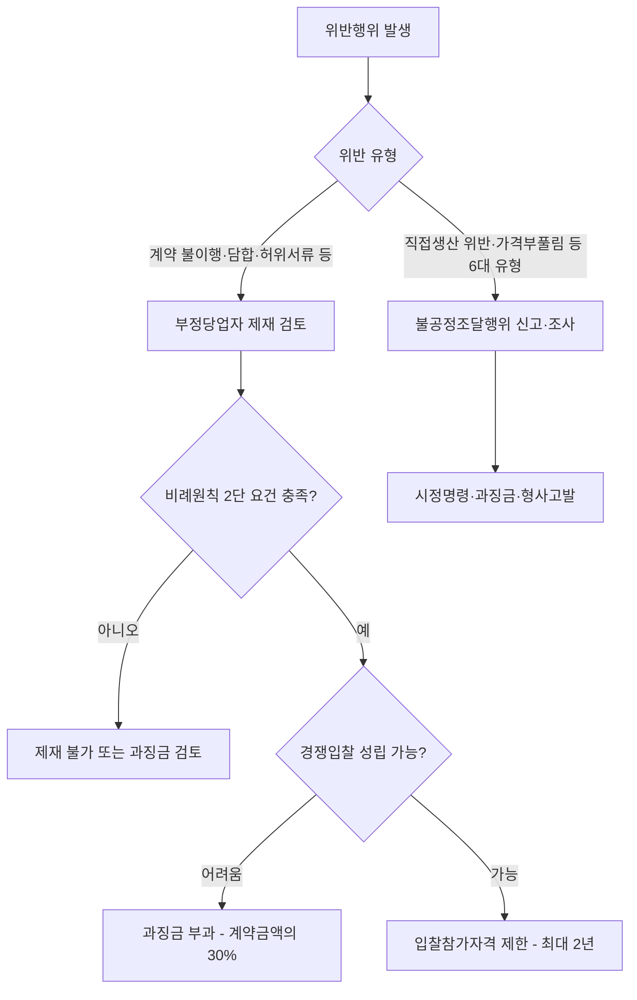

# 부정당업자 제재 vs 불공정조달행위 — 제도 구별

## 개요

공공조달 위반행위에 대한 제재는 크게 두 유형이 있다: (1) **부정당업자 제재** — 계약법령에 근거한 입찰참가자격 제한 행정처분, (2) **불공정조달행위 제재** — 수요기관·계약상대자의 금지 및 이행사항 위반에 대한 별도 제재.

> [!note] 왜 두 제도를 구별하는가?
> 부정당업자 제재(국가계약법 제27조)는 "계약질서를 어지럽히는 자를 장래 계약에서 배제"하는 사전 예방 기능이 핵심이다. 반면 불공정조달행위 제재는 이미 체결·이행 중인 계약에서 발생하는 특정 유형의 위법행위(직접생산 위반, 가격부풀림 등)를 사후적으로 시정·처벌한다. 두 제도는 적용 주체·대상·절차·수단이 모두 다르다.

## 현행 규정

### 부정당업자 제재 (국가계약법 제27조)

**정의:** 입찰·계약 체결·이행 과정에서 공정한 입찰 집행 또는 계약의 적정한 이행을 해칠 염려가 있거나 입찰 참가에 부적합한 자에 대한 **입찰참가자격 제한** 처분

**주요 제재 사유:**

| 사유 | 제재기간 |
|------|----------|
| 담합 주도 + 낙찰 | 2년 |
| 담합 주도 | 1년 |
| 단순 담합 | 6개월 |
| 허위서류 제출·낙찰 | 1년 |
| 허위서류 제출(낙찰 없음) | 6개월 |
| 계약 불이행(부실·조잡·부당) | 3개월 ~ 2년 |
| 계약 주요조건 위반 | 3개월 |
| 뇌물 2억 원 이상 | 2년 |
| 뇌물 1천만 원~1억 원 | 6개월 |
| 산업안전보건법 위반으로 동시 2인 이상 사망 재해 발생 | 1년 ~ 2년 |

**최대 제재기간:** 2년

**제재결정 절차:** 이행최고(2회 이상) → 계약 해제·해지 + 보증금 국고귀속 → 청문(행정절차법) → 계약심사협의회 심사 → 제재결정

> [!warning] 비례원칙 적용 — 단순 착오는 제재 요건 불충족
> 법원(대법원 계열)은 "모든 위반행위에 무조건 입찰참가자격을 제한하는 것은 비례원칙에 위반될 소지가 크다"고 판시했다. 제재가 적법하려면 ① 위반행위에 **정당한 이유가 없고**, ② **경쟁의 공정한 집행 또는 계약의 적정한 이행을 해할 염려**가 있어야 한다는 **2단 요건**을 충족해야 한다. 단순 착오·업무상 실수만으로는 이 요건을 충족하지 않을 수 있다.

> [!example] 실제 판례 — 방위사업청 vs. A업체 (2011년)
> A업체의 신입 원가담당자가 장갑차 정비계약 원가계산자료 작성 시 관급품 구입비용 3,110만 원(계약금액의 0.77%)을 실수로 포함했다. 방위사업청이 국가계약법 제27조를 근거로 3개월 입찰참가자격 제한처분을 했으나, 법원은 취소 판결을 내렸다. 판결 이유: 신입사원의 단순 착오였고, 1995~2011년 17건 계약에서 오류가 없었으며, 처분청도 첨부 서류 대조로 쉽게 발견 가능했다는 점에서 비례원칙 위반. 이 판례는 현행 국가계약법 제27조 제1항 제9호 가목 적용의 기준 사례로 남아 있다.

**과징금 대체:** [[계약보증금-납부면제|책임이 경미하거나]] 경쟁입찰 성립이 어려운 경우 입찰참가자격 제한 대신 과징금 부과 가능(국가계약법 제27조의2)

**과징금 부과율:**

| 과징금 부과 사유 | 부과율 |
|----------------|-------|
| 부정당업자의 책임이 경미한 경우 | 계약금액의 10% |
| 입찰참가자격 제한으로 유효경쟁 불성립이 명백한 경우 | 계약금액의 30% |

### 불공정조달행위 제재

**정의:** 수요기관 및 계약상대자가 물품·용역·공사 계약업무 수행과정에서 법령으로 정한 금지·이행사항을 지키지 않는 행위

**주요 유형 (6대 유형):**
- 직접생산 위반
- 가격부풀림
- 허위서류 제출
- 입찰방해
- 담합 등

**감시 체계:** 2024년 1월 '공공조달 계약이행 확인시스템' 본격 운영 — 직접생산 위반·가격부풀림 등 실시간 감시

**포상금:** 신고 시 2025년 기준 최대 **2,000만 원** (신고: 조달청 누리집 또는 나라장터 '불공정조달 신고센터')

**형사처벌 병행:** 위계에 의한 공무집행방해(5년 이하 징역 또는 1,000만 원 이하 벌금), 사기(10년 이하 징역 또는 2,000만 원 이하 벌금), 사문서 위조 등이 별도 적용 가능

### 두 제도의 핵심 구별

| 구분 | 부정당업자 제재 | 불공정조달행위 제재 |
|------|---------------|-------------------|
| 법적 근거 | 국가계약법 제27조 | 별도 제도 |
| 제재 수단 | 입찰참가자격 제한 (최대 2년) + 과징금 | 시정명령·과징금·형사고발 등 |
| 적용 대상 | 계약상대자 | 수요기관 + 계약상대자 |
| 처분 전 절차 | 이행최고 + 청문 의무 (행정절차법) | 신고·조사 절차 |
| 신고 포상 | 없음 | 최대 2,000만 원 |
| 제재 이후 효과 | [[계약보증금-납부면제]] 1년 제한 | — |

## 제재 결정 흐름

## 적용 조건

- 부정당업자 제재: 비례원칙에 따라 위반행위의 정당한 이유, 저해 가능성 종합 판단
- 단순 착오나 업무상 실수는 부정당업자 제재 사유에 해당하지 않을 수 있음 (법원 판례)

## 시험 출제 포인트

- **Q30(불공정조달행위 vs 부정당업자 제재 사유 구별):**
  - 부정당업자: 국가계약법 제27조 기반, 입찰참가자격 제한, 청문 의무
  - 불공정조달행위: 수요기관도 포함, 별도 신고·포상 제도 운영
- 제재기간 최대: **2년** (가중 시도 2년 한도)
- 단순 착오·업무상 실수는 부정당업자 제재 요건을 충족하지 않을 수 있음
- 과징금 대체: 책임 경미(10%) 또는 경쟁 불성립(30%)

## 관련 카드

- [[이의신청-최소금액기준]] — 제재에 대한 이의신청
- [[계약보증금-납부면제]] — 제재 전력자의 면제 제외
- [[하자보수보증금-부정당업자-추가납부]] — 부정당업자 제재기간에 따른 하자보수보증금 추가 납부 제도
- [[계약의-해제와-해지]] — 계약 해제·해지와 부정당업자 제재의 연결

:::tip[실무에서 이 규정 적용하기]
고객 계약별로 이 기준을 자동 적용하고 싶다면 → [공공조달관리사 워크플로우 플랫폼](https://kr-public-procurement-demo.up.railway.app)

조달관리사 실무 워크플로우 플랫폼 — 규제 변경 알림, 클라이언트별 적격심사 점수 자동 계산, 계약 이행 이력 관리.
:::
