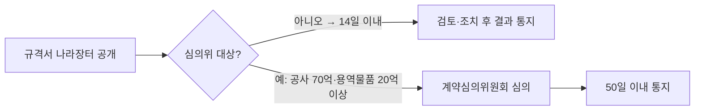

# 사전규격공개 — 공개 기간 기준 (일반·긴급·SW)

## 개요

물품 및 용역을 경쟁입찰에 부치고자 할 때 입찰공고 전에 규격서·과업지시서·제안요청서 등을 전자조달시스템(나라장터)에 미리 공개하여 이해관계자의 의견을 수렴하는 법정 의무제도이다. 공정성·투명성 제고를 목적으로 한다. [[수요정보-평가-및-활용|수요정보 평가]] 단계 이후, [[전자적공고-우선순위|입찰공고]] 이전 단계에 위치하는 절차이다.

> [!note] 왜 사전규격공개가 필요한가
> 발주기관이 특정 업체 제품에만 맞게 규격을 설계하면 다른 업체는 입찰 자체가 불가능해진다. 사전규격공개는 이러한 맞춤형 규격 설계를 업계가 검토할 수 있도록 공개하여, 특정 업체 특혜·담합의 온상이 되는 규격 왜곡을 조기에 차단하는 역할을 한다. [[공공조달-위험분석|법적·제도적 위험]] 중 입찰 공정성 훼손 위험을 예방하는 핵심 제도이다.

## 현행 규정

### 공개 기간 기준

| 구분 | 공개 기간 |
|------|-----------|
| **일반** | **5일간** |
| **긴급을 요하는 경우** | **3일간** |
| **소프트웨어(SW) 진흥법에 따른 SW사업** | **10일 이상** |

> [!warning] 시험 함정: SW사업 기간 방향
> 일반(5일) → SW(10일 이상)로 **더 길어진다**. 긴급(3일)은 단축이다. SW사업의 공개 기간이 더 긴 이유는 소프트웨어의 기술 복잡성으로 인해 업계 검토 시간이 더 필요하기 때문이다. "SW는 5일", "긴급은 10일"로 바꾼 선택지는 오답이다.

### 적용 대상

- **의무 대상**: 추정가격 5천만 원 이상 물품·용역
  - 단, 계약 신규사업은 5천만 원 미만도 공개 대상
  - 일반화된 기성품·창작물 등 규격이 확정되지 않은 용역도 포함

### 예외 (사전공개 생략 가능)

- 해당 연도에 1회 이상 규격을 사전에 공개한 물품·용역
- 긴급 수요물자 또는 비밀로 해야 하는 물품·용역
- 추정가격 5천만 원 미만 물품·용역 (지자체)
- 수의계약 대상, 음식물·농·축·수산물 등
- 나라장터에서 제3자단가계약·다수공급자계약 시

### 의견 처리 절차

- 업계 의견 접수 시 **14일 이내** 검토·조치 후 결과 통지
- 계약심의위원회 심의 대상 (공사 70억 원, 용역·물품 20억 원 이상): 심의 후 **50일 이내** 통지

### 공개 내용

- **물품**: 규격서·사양서·시방서 등 성능·재원·재질 기재 서류
- **용역**: 과업지시서·제안요청서 등 구체적 과업 서류

## 실제 사례

> [!example] 경기 남양주시 사전규격 왜곡 (감사원 적발)
> 남양주시는 대수선 공사 설계용역에서 규격 선정 절차를 생략하고 특정 신기술·특허공법을 처음부터 지정하여 수의계약 상대자로 특혜 선정하였다. 감사원은 이를 부당 개입으로 적발하였다. 사전규격공개 제도가 제대로 작동했다면 규격 왜곡을 업계가 조기에 이의 제기할 수 있었다.

> [!example] 해양플랜트 SW 입찰 담합 (2016~2018년)
> 5개 소프트웨어 개발사가 조달청 발주 해양플랜트 엔지니어링 솔루션 구매 입찰에서 사전에 낙찰 예정자를 정하고 들러리 입찰을 반복하였다. SW사업의 사전규격공개 기간(10일)은 이처럼 기술 복잡성이 높은 분야에서 규격의 공정성을 검토할 시간을 충분히 보장하기 위해 일반(5일)보다 길게 설정된 것이다.

## 적용 조건

- 공사 계약은 사전규격공개 의무 대상에서 제외될 수 있음
- 의견은 나라장터 온라인 시스템 또는 이메일로 접수
- 사전규격공개의 목적은 **의견 수렴·공정성·투명성 강화**이며, 납기단축은 목적이 아님

## 시험 출제 포인트

- **출제 패턴 (사전규격공개 기간 — 일반 및 긴급 시 공개 일수):**
  - 일반: **5일**
  - 긴급: **3일**
  - SW사업: **10일 이상** (나머지보다 길다)
- 사전규격공개의 목적: 의견 수렴·공정성·투명성 강화 (**납기단축은 목적이 아님**)
- 의견 제출 후 답변: 수요목적 범위 내에서 적극 검토, 답변 제시가 원칙

## 관련 카드

- [[전자적공고-우선순위]] — 입찰공고 방법과 우선순위
- [[수요정보-평가-및-활용]] — 사전규격공개 전 단계인 수요정보 평가
- [[적정공급대가-산정원칙]] — 규격공개 대상 품목의 적정 대가 산정 원칙
- [[공공조달-위험분석]] — 규격공개 시 반영되는 위험 요소 분석
- [[입찰설명회-목적-기대효과]] — 사전규격공개 완료 후 다음 순서인 입찰공고 전 설명회 절차
