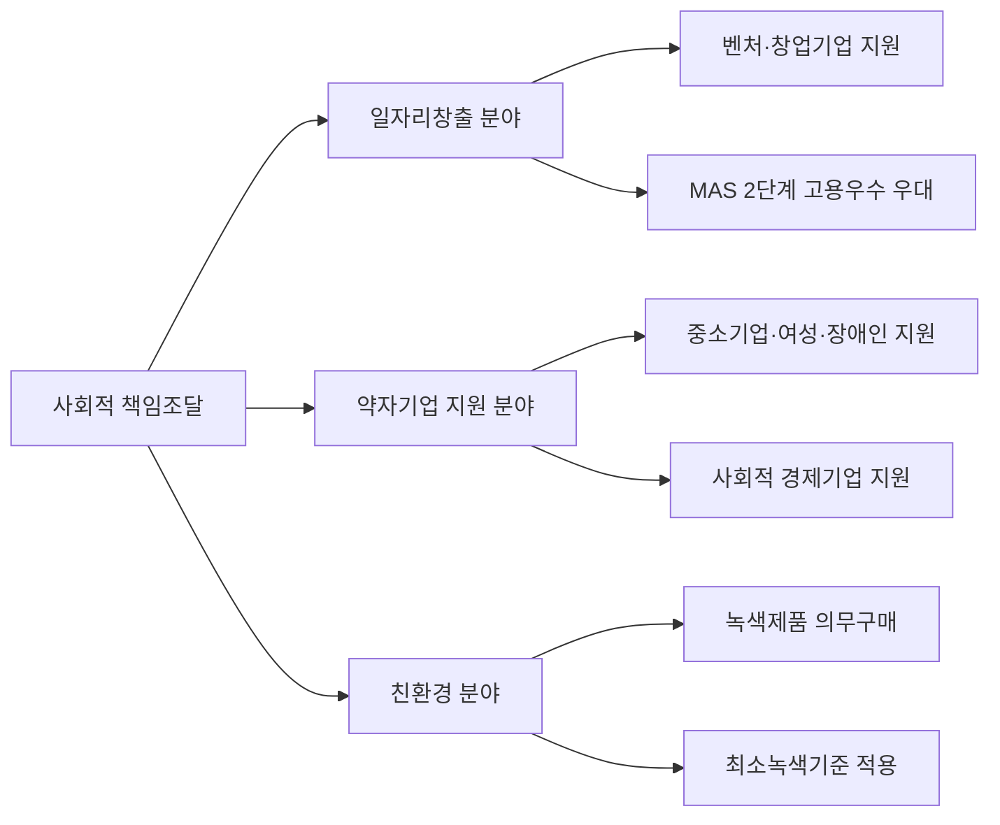

# 사회적 가치 지원 조달 — 대상 제도 범위

## 개요

정부가 재화·서비스 구매·조달 과정에서 일자리 창출·사회통합·환경 등 다양한 **사회적 가치**를 고려하는 사회적 책임조달(「조달사업법」 제6조)의 일환으로, 취약계층 기업과 사회적 경제조직의 제품을 우선구매하도록 하는 제도군이다.

> [!note] 왜 '사회적 가치 지원 조달'로 별도 분류하는가?
> **중소기업지원 조달**과 **사회적 가치 지원 조달**은 목적 층위가 다르다. 중소기업지원 조달은 경쟁력 격차 해소와 산업 기반 유지를 목표로 하는 산업정책이다. 반면, 사회적 가치 지원 조달은 장애인·여성 등 사회적 취약계층의 고용 기반을 확충하고 안정적 소득을 보장하는 **사회통합 정책**이다. 같은 공공구매 틀 안에 있지만 법적 근거·주관기관·성과 지표가 각각 다르기 때문에 시험에서 범주 혼동이 자주 출제된다.

## 현행 규정

### 사회적 가치 지원 조달 대상 4대 제도

| 제도 | 주요 내용 |
|------|-----------|
| **장애인기업 우선구매제도** | 총 구매액의 1% 이상 의무구매; 1억 원 이하 소액수의계약 가능 (5천만~1억 원은 2인 이상 견적 필요) |
| **중증장애인생산품 우선구매제도** | 총 구매액(공사 제외)의 1% 이상 의무구매 |
| **여성기업 우선구매제도** | 물품·용역 총 구매액의 5% 이상, 공사 3% 이상 |
| **사회적 기업제품 우선구매제도** | 법정 의무비율 없음; 실적이 기관평가에 반영 |

> [!warning] 범주 경계 — 시험 핵심 함정
> **중소기업지원조달**은 사회적 가치 지원 조달에 해당하지 않는다 — 별도의 중소기업지원 조달로 분류됨. 또한 [[공사용자재직접구매제도]]와 [[중소기업자간경쟁제도]]도 중소기업지원 조달에 속하며, 사회적 가치 지원 조달의 4대 제도에 포함되지 않는다.

### 장애인기업 정의

- 장애인이 소유하거나 경영하는 기업
- 상시근로자 총수 중 장애인을 **30% 이상** 고용(소기업은 제외)

### 사회적 책임조달 3대 분야

> [!info] 사회적 기업에 법정 의무비율이 없는 이유
> 사회적 기업은 인증 연도·업종·공급 역량이 유동적이어서 전체 공공기관에 일률적 수치를 강제하기 어렵다는 정책 판단이 반영되었다. 대신 구매 실적이 기관 경영평가에 반영되는 방식으로 실질적 구매 유인을 제공한다. [[공공구매제도-우선구매비율]]의 비율 표에서 사회적 기업·사회적 협동조합만 "법정의무비율 없음"으로 표시되는 이유가 여기에 있다.

## 적용 조건

- 대상 기관: 국가기관·지자체·공기업·준정부기관·지방공기업·지방의료원 등 860여개 기관
- 구매방법: 직접구매·간접구매 모두 실적으로 인정 (출연금·기부금·보조금은 제외)

## 다운스트림 영향 — 이 분류가 적용되면 무엇이 달라지는가

장애인기업·중증장애인생산품·여성기업 우선구매 실적은 별도 주관기관(중소벤처기업부·보건복지부·고용노동부)이 각각 집계하고 기관 경영평가에 반영한다. 조달담당자 입장에서는 단순히 의무비율을 맞추는 것을 넘어, 해당 제도별 실적 보고 체계가 다름을 인지하고 발주 계획 수립 시 분리하여 관리해야 한다.

> [!example] 장애인기업 소액수의계약 활용 사례
> 장애인기업 우선구매제도에서는 1억 원 이하 소액수의계약이 허용된다. 다만 5천만 원 초과~1억 원 이하 구간에서는 2인 이상의 견적을 받아야 한다. 공공기관 구매 담당자가 이 기준을 잘못 적용하여 1인 견적만으로 1억 원 이하 수의계약을 체결했다가 감사 지적을 받은 사례가 있다.

## 시험 출제 포인트

- **Q21(사회적 가치 지원 조달 대상 제도 범위):**
  - 포함: 장애인기업 우선구매, 중증장애인생산품 우선구매, 여성기업 우선구매, 사회적 기업제품 우선구매
  - **미포함**: 중소기업지원조달 (이는 별도 카테고리)
- 장애인기업 소액수의계약 한도: **1억 원** 이하 (2천만·3천만·5천만 혼동 주의)
- 장애인 고용 비율 기준: **30% 이상** (소기업 제외)

## 관련 카드

- [[공공구매제도-우선구매비율]] — 각종 의무구매비율 수치 전체
- [[중소기업자간경쟁제도]] — 사회적 가치 지원 조달과 중소기업자간 경쟁제도의 범주 구별
- [[공사용자재직접구매제도]] — 공사 분야에서의 중소기업 지원 수단 비교
