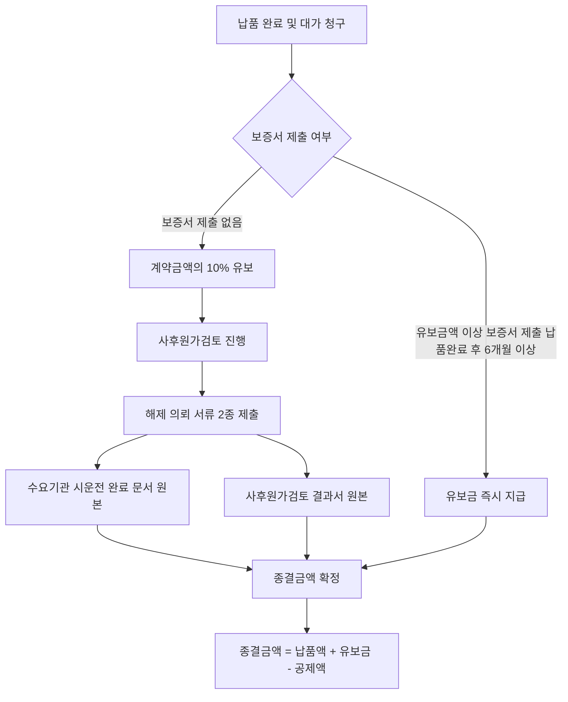

# 사후원가검토 유보금 — 계약금액 10% 유보 제도

## 개요

사후원가 검토조건부 계약이란 계약 단가를 사전 확정하기 어려운 경우 일단 계약을 체결한 뒤 이행 완료 후 실제 원가를 검토하여 금액을 확정하는 방식이다. 이 과정에서 계약담당공무원은 검토 완료 전까지 계약금액의 **100분의 10(10%)**에 해당하는 금액을 유보할 수 있다 (국가계약법 시행령 제73조).

> [!note] 왜 이 제도가 존재하는가?
> 신기술·신제품·연구개발(R&D) 관련 물품처럼 계약 시점에 단가를 확정할 수 없는 경우, 무조건 확정금액으로 계약하면 발주기관은 과다지급, 계약상대자는 손실 위험에 처한다. 사후원가검토 조건부 계약은 이 딜레마를 해소하기 위해 "일단 이행하고, 실제 투입원가를 사후에 검증한 뒤 금액을 확정"하는 방식이다. 유보금(10%)은 원가검토 완료 전에 계약금액 전액이 지급되면 발주기관이 회수 수단을 잃는 문제를 방지하는 **재정적 레버리지** 기능을 한다. 계약서에 검토 범위·유보율·금액확정기준을 구체적으로 명시하도록 의무화한 이유도 같은 맥락이다 (국가계약법 시행령 제73조; 과목3-1장 1절 ③㉢).

## 현행 규정

### 유보금 주요 규칙

| 항목 | 내용 |
|------|------|
| 유보 비율 | 계약금액의 **10%** |
| 이자 | 지급하지 않음 |
| 대체 방법 | 계약상대자가 유보금액 이상의 보증서(보증기간 납품완료 후 **6개월 이상**)를 제출하면 유보금 지급 가능 |
| 청구서 처리 | 대금청구서 작성 시 유보금액을 포함하여 청구서 제출; 유보금액은 추가 서류 없이 당초 종결서류에 포함 |

> [!note] 왜 이자를 지급하지 않는가?
> 유보금은 계약상대자에게 귀속된 금액이 아니라 원가 확정 시까지 지급이 보류된 금액이다. 계약담당공무원이 사후원가 검토를 지연할 유인을 방지하는 동시에, 계약상대자가 보증서로 대체하여 조기 수령하는 경로를 열어둠으로써 균형을 잡는다.

### 유보금 해제 의뢰 시 필요 서류

1. **수요기관의 시운전 완료 문서 원본**
2. **사후원가검토 계약조건에 따른 사후원가검토 결과서 원본**

> [!warning] 시험 함정 — 일반 종결서류와 혼동 주의
> 유보금 해제 의뢰 서류는 세금계산서·납세증명서·4대보험 완납증명서 등 **일반 종결서류와 별개**이다. "시운전 완료 문서 원본"과 "사후원가검토 결과서 원본" 이 두 가지만이 유보금 해제 의뢰에 필요한 추가 서류다. 일반 종결서류와 세트로 혼합한 선택지가 오답 유인으로 자주 등장한다.

### 종결금액 확정 산식

```
종결금액 = 금회 납품액 + 유보금 - 공제액(선금정산 + 지체상금 + 감가액)
```

- 금회 납품액 = 계약단가 × 금회 납품수량 (원 단위 미만 절사; 「국고금관리법」제47조)

### 의사결정 흐름 — 유보금 처리 경로



## 적용 조건

- [[계약이행납품-주요내용|사후원가 검토조건부 계약]]에만 적용
- 계약 체결 시 검토 범위, 대상금액, 유보율, 검토기준, 금액확정기준을 계약서에 구체적으로 명시해야 함
- 계약상대자는 납품 완료 후 대가 청구 시까지 사후원가계산서 및 투입 수량·단가·비용 증빙자료를 제출해야 함

> [!example] 가상 시나리오 — 유보금 없이 전액 지급 후 정산 거부
> *(이 시나리오는 특정 실제 사건을 인용한 것이 아니라, 유보금 미설정의 위험을 설명하기 위해 구성한 교육용 가상 사례입니다.)*
>
> 신기술 물품 구매계약에서 담당공무원이 계약서에 유보율을 명기하지 않고 납품 직후 전액 지급했다. 이후 사후원가검토 결과 계약금액이 실제 원가보다 30% 과다 책정된 것이 확인됐으나, 이미 지급된 금액이어서 환수에 어려움이 발생했다. 이 시나리오는 계약 단계에서 유보율·검토기준을 계약서에 명백히 기재해야 한다는 원칙(과목3-1장 1절 ③㉢)의 실천적 의의를 보여준다.

> [!info] 개산계약과의 비교
> 개산계약도 사전 확정이 어려운 경우 사용하지만, **개산계약은 이행 완료 후 전면 정산**하는 방식이고, **사후원가검토 조건부 계약은 계약 단가는 존재하되 실제 원가를 사후 검증해 차액을 조정**하는 방식이다. 유보금 제도는 후자에만 적용된다.

## 시험 출제 포인트

- 출제 패턴: "유보금 해제 의뢰 시 필요한 서류로 옳은 것은?" — 두 서류(시운전 완료 문서, 사후원가검토 결과서)를 세트로 암기
- 오답 유인: '세금계산서', '4대보험 완납증명서'처럼 일반 종결서류를 유보금 해제 서류로 혼동시키는 선택지 주의
- 숫자 포인트: 유보 비율 10%, 보증서 보증기간 납품완료 후 6개월 이상
- 연계 개념: 종결금액 확정 산식, 감가액(최저 65만 원, 검사대상금액의 25% 초과 불가)

## 관련 카드
- [[계약이행납품-주요내용]] — 유보금이 속한 계약이행관리 전체 구성
- [[하자보수보증금-납부비율]] — 계약 종결 시 별도로 납부하는 하자 담보 보증금
- [[계약보증금-납부면제]] — 계약 체결 단계 보증금(10%)과 유보금의 역할 구분

:::tip[실무에서 이 규정 적용하기]
고객 계약별로 이 기준을 자동 적용하고 싶다면 → [공공조달관리사 워크플로우 플랫폼](https://kr-public-procurement-demo.up.railway.app)

조달관리사 실무 워크플로우 플랫폼 — 규제 변경 알림, 클라이언트별 적격심사 점수 자동 계산, 계약 이행 이력 관리.
:::
