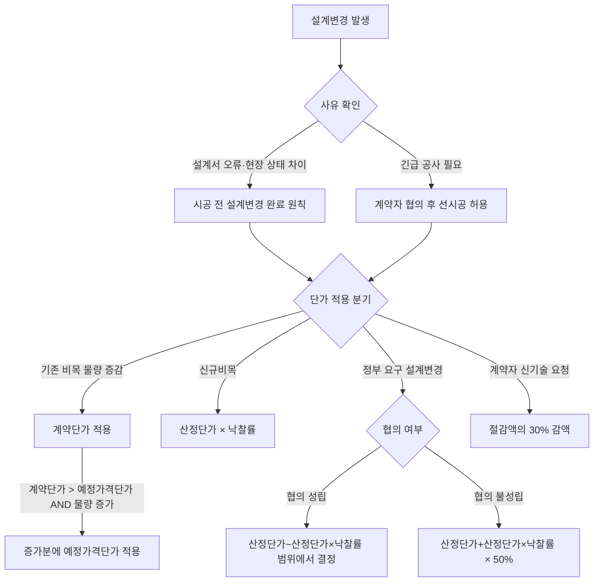

# 설계변경으로 인한 계약금액 조정기준 — 단가 적용 원칙

## 개요

공사계약에서 설계변경으로 공사량 증감이 발생하면 계약금액을 조정한다. 조정 신청을 받은 날부터 **30일 이내**에 계약금액을 조정해야 하며, 설계변경 사유·시기·단가 적용 원칙·조정 제한 사항이 법정화되어 있다 (국가계약법 시행령 제65조).

> [!note] 왜 이 규정이 존재하는가?
> 공사계약은 입찰 시점과 시공 시점 사이에 현장 조건·설계 오류·신기술 도입 등으로 당초 설계 내용과 실제 공사 내용이 달라지는 경우가 빈번하다. 이때 계약금액 조정 없이 계약상대자에게 추가 공사를 강요하면 신의성실 원칙 위반이자 부당 이익 박탈이 된다. 반대로 조정 기준이 없으면 계약상대자가 과도하게 증액을 요구하거나, 정부가 임의로 감액할 수 있다. 이 규정은 양측 간 단가 산정 기준을 명확히 하여 분쟁을 예방하고 예산 집행의 투명성을 보장한다.

## 현행 규정

### 설계변경 사유

- 설계서의 내용이 불분명하거나 누락·오류·모순이 있을 경우
- 공사현장 상태(지질, 용수 등)가 설계서와 다를 경우
- 새로운 기술·공법 사용으로 공사비 절감·시공기간 단축 효과가 현저할 경우
- 발주기관이 설계서 변경 필요를 인정한 경우

### 계약금액 조정 시기

- 설계변경이 필요한 부분의 **시공 전**에 완료해야 함
- 긴급 시 계약자와 협의 후 시공 후 완료 가능

> [!warning] 시공 전 조정 원칙의 함의
> 설계변경 없이 선시공을 허용하는 것은 "긴급" 상황에 한정된다. 실무에서 발주기관이 구두로 추가 공사를 지시하고 나중에 정산하는 관행은 법령 위반이며, 이 경우 계약상대자가 금액 조정을 청구하더라도 근거가 불분명해 불이익을 받을 수 있다.

### 단가 적용 기준 (핵심)

| 상황 | 적용 단가 |
|------|-----------|
| 기존 물량의 증감 | 산출내역서 상의 **계약단가** |
| 계약단가 > 예정가격단가이고 물량 증가 시 | 증가 물량에 **예정가격단가** 적용 |
| 신규비목 (계약단가 없음) | 설계변경 당시 기준 산정단가 × **낙찰률** |
| **정부가 설계변경 요구** + 협의 성립 | 당시 산정단가와 산정단가×낙찰률 범위에서 협의 |
| **정부가 설계변경 요구** + 협의 불성립 | (산정단가 + 산정단가×낙찰률) × **50/100** |
| 신기술·공법으로 절감 효과 (계약자 요청) | 절감액의 **30/100** 감액 |

> [!note] 왜 정부 요구 협의 불성립 시 50%인가?
> 정부가 설계변경을 요구한 경우, 계약상대자에게 일방적으로 불리한 낙찰률 적용(산정단가 × 낙찰률)만 강제하면 불공정하고, 반대로 산정단가 전액을 인정하면 낙찰률이 무의미해진다. 50%는 두 극단(산정단가 전액 vs. 낙찰률 적용 단가)의 **산술평균**으로, 어느 쪽도 일방적으로 유리하지 않은 타협 기준이다. 협의가 성립하면 그 범위(낙찰률 적용 단가 ~ 산정단가) 내에서 자유롭게 결정할 수 있다.

> [!note] 왜 신기술 절감액의 30%를 감액하는가?
> 계약자가 신기술·공법을 도입해 공사비를 절감하면, 그 이익 전부를 계약자가 가져가면 신기술 도입 동기는 충분하지만 국고 절감 효과가 없다. 반대로 절감액 전부를 국가가 환수하면 계약자에게 신기술 도입 유인이 사라진다. 30% 감액(= 70% 계약자 보유)은 계약자의 혁신 인센티브를 유지하면서 국고 이익도 일부 환수하는 균형점이다.

### 조정 제한

입찰 참가자가 물량내역서를 직접 작성하고 단가를 기재한 산출내역서를 제출한 경우, 해당 물량내역서의 누락·오류로 인한 설계변경 시에는 **계약금액 변경 불가**.

> [!note] 조정 제한 규정의 취지
> 물량내역서를 직접 작성한 경우, 내역 오류는 계약상대자의 귀책이다. 이 경우까지 계약금액 조정을 허용하면 낮은 단가로 낙찰받은 후 고의로 설계변경을 유도하는 도덕적 해이가 생길 수 있다. 단, 발주기관이 물량내역서를 제시한 경우에는 이 제한이 적용되지 않는다.

### 조정 심의·승인 요건

- 낙찰률 86% 미만 공사에서 설계변경으로 증액하려는 경우
- 증액조정금액이 당초 계약금액의 **10% 이상**인 경우
- → 계약심의위원회·예산집행심의회·기술자문위원회 심의 + 중앙관서의 장 승인 필요

> [!note] 왜 낙찰률 86% 미만 + 10% 이상에 심의가 필요한가?
> 낙찰률 86% 미만은 이미 상당히 저가로 낙찰된 계약이다. 이런 계약에서 10% 이상 증액하면 당초 저가 낙찰의 이점이 희석되고, 사실상 수의계약 수준의 단가로 추가 공사를 발주하는 것과 다름없다. 심의·승인 요건은 이러한 우회적 수의계약을 방지하고 예산 낭비를 차단하기 위한 안전장치이다.

> [!example] 감사원 적발 유형
> 공사 착공 이후 발주기관이 설계변경을 빈번하게 요구하여 계약금액이 당초 대비 40~50% 증가한 사례가 감사원 지적 대상이 된다. 특히 낙찰률 86% 미만 공사에서 심의·승인 없이 10% 이상 증액한 경우 담당 공무원에게 변상 책임이 부과될 수 있다. 시공 전 설계변경 완료 원칙을 어기고 구두 지시만으로 추가 공사를 진행한 뒤 사후 정산 처리한 경우도 감사에서 적발 된다.

## 적용 조건

- 공사계약에만 적용 (물품·용역 설계변경은 별도 규정)
- 계약금액 조정 청구는 **준공대가 수령 전**까지 신청해야 함
- 예산배정 지연 등 불가피한 사유 시 계약자와 협의하여 조정기한 연장 가능

> [!warning] 준공대가 수령 전 청구 기한 실무 함의
> 계약상대자가 준공 후 대가를 수령하고 나면 설계변경 금액 조정 청구권이 소멸된다. 공사 중 설계변경 사실을 인지했더라도 청구를 미루다가 준공대가를 수령하면 추후 이의 제기가 불가능하므로, 이행 과정에서 변경 사항이 발생하면 즉시 문서화하고 조정 신청을 하는 것이 중요하다.

## 시험 출제 포인트

- 핵심 수치: 조정기한 30일, 정부 요구 협의 불성립 시 **50%**, 신기술 절감액 **30%** 감액
- 오답 유인: '계약단가가 예정가격보다 낮을 때'는 물량 증가에도 계약단가 적용 (예정가격단가 적용 조건이 역전됨)
- 연계 출제: 낙찰률 86% 미만 + 10% 이상 증액 시 심의·승인 요건

> [!warning] 단가 적용 조건 역전 함정
> "계약단가 > 예정가격단가"인 경우에만 물량 증가분에 예정가격단가를 적용한다. 계약단가가 예정가격단가보다 **낮으면** 물량이 늘어도 계약단가 그대로 적용한다. 시험에서 이 방향을 바꿔 출제하는 오답 선택지가 자주 등장한다.

## 관련 카드
- [[공공계약-변경-분쟁해결-절차]] — 설계변경 금액 조정이 분쟁으로 이어질 때의 해결 절차; 협의 불성립 시 조정·중재로 연결
- [[물가변동-계약금액조정-조건]] — 설계변경이 아닌 물가 상승에 의한 별도 계약금액 조정 요건
- [[계약이행납품-주요내용]] — 변경계약이 계약이행관리의 한 구성 요소로 포함되는 맥락
