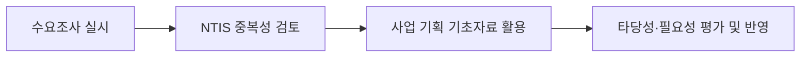

# 수요정보 평가 및 활용 — 부적절한 활용과 적정 활용 구별

## 개요

공공기관이 필요로 하는 물품·서비스·기술 등의 수요를 조사·분석하여 실제 조달·사업 기획에 반영하는 절차이다. 수요정보는 예산 집행 효율성과 사업 타당성 확보에 핵심적 역할을 하며, 활용 범위와 방식이 엄격히 제한된다. 이 평가 결과는 [[공급조달방법-적정성분석|조달방법 적정성 분석]]과 [[사전규격공개-기간기준|사전규격공개]]의 기초 입력 자료가 된다.

> [!note] 왜 수요정보 활용 범위를 엄격히 제한하는가
> 수요정보에는 구매예정수량·예산규모·규격 방향 등 민감한 내용이 포함된다. 이를 특정 조달업체에 사전에 유출하면, 해당 업체는 입찰 전에 경쟁업체보다 유리한 정보를 확보한다. 이는 입찰 공정성을 근본적으로 훼손하고 담합 구조를 만들 수 있어, [[공공조달-위험분석|부정행위 및 비리 위험]]이 현실화된다.

## 현행 규정

### 수요정보 평가 주요 절차

1. **수요조사 실시**: 기관별 필요 물품·서비스를 부서별로 취합, 예산·규격서 검토
2. **중복성 검토**: 국가 R&D사업 등 기존 지원 여부를 NTIS에서 사전 확인
   - NTIS: 국가과학기술지식정보서비스(National Science & Technology Information Service)
3. **사업 기획 기초자료 활용**: 신규사업 기획, 예산 편성, 입찰공고의 근거로 활용
4. **평가 및 반영**: 타당성·필요성·목표 달성 가능성 평가 후 예산 집행·사업계획에 반영

### 적정 활용 범위

| 활용 대상 | 내용 |
|-----------|------|
| 구매예정수량 산정 | 계약담당공무원이 수요기관 예상 수요량을 고려해 세부품명별로 정함 |
| 수요기관 수요 추정 | 과거 구매 이력·예산·사업 계획 등을 바탕으로 수요량 추정 |
| 정책 수립 지원 | 중소기업·여성기업·장애인기업 지원 정책의 기초자료 |
| 입찰 및 계약 | 수요정보를 기준으로 입찰 진행 |

### 부적절한 활용: 조달업체 사전 배포

수요정보(수요량·구매예정수량·규격 등)를 **조달업체에 사전 배포**하는 것은 부적절하다.
- 이유: 특정 업체에 사전 정보를 제공하면 입찰의 공정성과 경쟁성이 훼손됨
- 수요정보 활용 목적(예산 집행 효율화·사업 기획)과 무관한 활용임
- 원가절감 비율 산정을 위한 활용도 수요정보식별의 적정 활용 범위에서 벗어남

> [!warning] 시험 함정: 적정 활용 vs. 부적절한 활용
> 다음 두 가지는 반드시 부적절한 활용으로 구별해야 한다.
> - **조달업체 사전 배포** → 공정경쟁 훼손 (부적절)
> - **원가절감 비율 산정에 활용** → 수요정보식별의 목적 외 사용 (부적절)
>
> 반면 **예산 편성, 구매예정수량 산정, 정책 지원 기초자료**는 모두 적정 활용이다.

## 실제 사례

> [!example] 조달청 제설제 특정업체 몰아주기 의혹 사례
> 조달청 제설제 구매에서 특정 업체에 유리한 조건으로 수요정보가 설계되었다는 의혹이 언론을 통해 제기되었다. 조달청은 사실과 다르다는 해명 자료를 발표하였으나, 이 사례는 수요정보가 조달방법 선택과 규격 설계 단계에서 어떻게 특정 업체에 유리하게 작용할 수 있는지를 보여준다. 수요정보의 공정한 활용과 [[사전규격공개-기간기준|사전규격공개]] 절차의 연계가 중요한 이유다.

> [!example] 허위입찰과 무자격 업체 선정 (경기 아파트 관리, 2017년)
> 경기 지역 아파트 관리 입찰에서 수요 요구사항 분석 없이 허위 입찰이 진행되고 무자격 업체가 선정된 사례가 적발되었다. 수요정보 평가 단계에서 요구사항 분석이 제대로 이루어지지 않으면, 계약 이행 단계에서 [[공공조달-위험분석|품질 문제 위험]]이 현실화된다는 것을 보여준다.

## 적용 조건

- 나라장터 등 전자조달시스템을 통해 수요기관 등록, 입찰공고, 계약 전 과정 온라인 진행
- 수요정보 평가는 각 단계의 기초자료로만 활용
- 수요정보는 [[적정공급대가-산정원칙|적정 공급대가 산정]]의 기초가 되므로, 과대·과소 수요 추정 모두 지양

## 시험 출제 포인트

- **출제 패턴 (수요정보 평가 및 활용 절차 — 조달업체 사전 배포의 부적절성):**
  - 조달업체 사전 배포 = **부적절** (공정경쟁 훼손)
  - 적정 활용: 구매예정수량 산정·수요 추정·정책 지원·예산 편성
  - 부적절한 활용: 원가절감 비율 산정, 조달업체 선정·등록

## 관련 카드

- [[공급조달방법-적정성분석]] — 조달방법 선택의 고려요인
- [[공공조달-위험분석]] — 위험분석 요인의 범위
- [[적정공급대가-산정원칙]] — 수요정보를 바탕으로 한 적정 공급대가 산정
- [[사전규격공개-기간기준]] — 수요정보 확정 후 진행되는 사전규격공개 기간 기준
