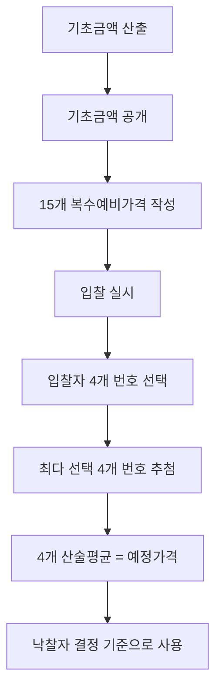

# 예정가격 결정방법 — 총액·단가·복수예비가격 및 결정기준 6단계 우선순위

## 개요

예정가격은 세 가지 방법 중 하나로 결정한다. 어떤 방법을 쓰든 기준가격은 법령이 정한 6단계 우선순위에 따라 선택한다. 「국가계약법 시행령」 제8조(결정방법)·제9조(결정기준)에 근거한다.

> [!note] 왜 3가지 방법인가 — 계약 형태별 적합성
> - **총액**: 목적물 전체가 확정된 경우 — 단일 계약의 정상적 형태
> - **단가**: 수량이 불확정이지만 계속 거래가 예정된 경우 — 수량 확정 후 총액을 산출하는 구조
> - **복수예비가격**: 물품·용역 내자 경쟁입찰에서 예정가격 사전 유출을 차단하기 위한 무작위 결정 방식 — 2005년 조달청 도입, 투명성 확보가 핵심 목적

## 현행 규정

### 결정방법 3가지

| 방법 | 적용 조건 | 주요 내용 |
|------|---------|---------|
| **총액** | 총액계약; 장기계속계약·계속비계약 | 계약 사항 총액에 대해 예정가격 결정; 장기계약은 총규모 기준 |
| **단가** | 일정 기간 계속하여 제조·공사·수리·가공·매매·공급·임차 | 단가에 대해 예정가격 결정 가능[시행령 제8조 제1항 단서]; 다량 수요물품 희망수량 경쟁입찰 시 총수량 기준 조서 작성 후 단가로 결정 |
| **복수예비가격** | 물품·일반용역·임대차 경쟁입찰 (모든 내자 경쟁입찰) | [[가격-용어-정의\|기초금액]] 기준 15개 복수예비가격 작성 → 4개 추첨 → 산술평균 = 예정가격 |

### 복수예비가격 절차 (핵심)

> [!info] 복수예비가격의 기초금액 범위
> 기초금액의 ±2%(지방계약법 적용 시 ±3%) 범위 내에서 서로 다른 15개 예비가격을 작성한다. 입찰자들은 이 15개 번호 중 4개를 선택하고, 가장 많이 선택된 4개 번호의 평균이 예정가격이 된다.

### 결정기준 우선순위 (제9조①)

시행령 제9조①은 4개 호(號)로 구성된다. 교재에서는 교육 편의상 6단계로 세분화하는 경우가 있으나, 조문 구조는 아래와 같다.

| 조문 호 | 기준가격 | 적용 조건 |
|---------|---------|---------|
| 1호 | **거래실례가격** (법령으로 가격이 결정된 경우에는 그 결정가격 범위 내 거래실례가격) | 적정한 거래가 형성된 경우 |
| 2호 | **원가계산가격** | 신규개발품·특수규격품 등 적정 거래실례가격이 없는 경우 |
| 3호 | **표준시장단가** | 공사에 한함; 중앙관서의 장이 인정한 가격 |
| 4호 | **감정가격, 유사한 거래실례가격 또는 견적가격** | 1~3호로 결정 불가 시 |

> [!warning] 교재 6단계 표현과 조문의 차이
> 일부 교재는 "법령에 의하여 결정된 가격(1순위) → 거래실례가격(2순위)"으로 구분하나, 시행령 제9조①1호는 거래실례가격이 1호이며 법령 결정가격은 그 1호의 괄호 안 특수 조건이다. 즉, 거래실례가격이 1순위이고 법령 결정가격은 별도 순위가 아니다. 시험 답안 작성 시 조문 구조(4호)를 정확히 인지할 것.

> [!note] 왜 거래실례가격이 원가계산보다 우선인가?
> 시장에서 이미 실제로 거래된 가격이 있다면, 이론적 원가 계산보다 더 정확한 시장 가치를 반영한다. 원가계산가격(2호)은 [[원가-구성-및-비율|5비목 원가 구성]]에 따라 산정하며, 시장 거래가 없는 신규 개발품·특수 규격품에 적용하는 보충적 수단이다. 4호(감정·유사거래실례·견적)는 앞선 기준으로도 결정 불가한 극단적 경우를 위한 최후 수단이다.

> 원가계산가격은 재료비·노무비·경비와 일반관리비 및 이윤으로 계산한다.

### 수입물품 예정가격 비목

수입물품의 외화표시원가 / 통관료 / 보세창고료 / 하역료 / 국내운반비 / 신용장개설수수료 / 일반관리비 / 이윤

> [!info] 수입물품 일반관리비·이윤 산출 기준
> - 일반관리비: (외화표시원가 + 통관료 + 보세창고료 + 하역료 + 국내운반비) × 별도 비율
> - 이윤: (통관료 + 보세창고료 + 하역료 + 국내운반비 + 신용장개설수수료) × 별도 비율
> 이윤 산출 기준에 외화표시원가가 제외되는 점이 국내 제조와 다르다.

## 적용 조건

- 단가 방법의 핵심 요건: "**일정한 기간 계속하여** 제조·공사·수리·가공·매매·공급·임차" — 계속성이 전제
- 복수예비가격은 협정물자를 포함한 **모든 내자 경쟁입찰**에 적용
- 협상에 의한 계약은 예정가격 결정 불가 → 개산가격 결정 (→ [[예정가격-작성예외]])

> [!warning] 협상계약은 예정가격이 아닌 개산가격
> 협상에 의한 계약[시행령 제43조]은 예정가격을 결정하는 것 자체가 불가능하다. 기술·품질 등을 협상하면서 가격이 유동적으로 변하기 때문이다. 이 경우 개산가격(概算價格)으로 대체한다. "협상계약 = 예정가격 작성 예외"가 아니라 "협상계약 = 예정가격 결정 불가 = 개산가격 대체"로 이해해야 정확하다.

## 실무 맥락

> [!example] 복수예비가격 제도 도입의 역사적 배경 (2005년)
> 도입 이전에는 예정가격을 단일 금액으로 미리 결정하고 밀봉 보관하는 방식이었다. 그러나 이 방식에서는 내부자가 예가를 유출하거나, 업체들이 사전 정보를 기반으로 예가 바로 아래 금액에 집단 투찰하는 '꼬리 붙이기' 담합이 빈번하게 발생했다. 조달청은 2005년 복수예비가격 도입을 통해 예정가격을 입찰 당일 입찰자의 번호 선택 결과로 무작위 결정되도록 구조를 바꾸었다. 이로써 사전 유출된 예가 정보가 실효성을 잃게 되어 담합 유인을 구조적으로 줄이는 효과가 있다.

> [!example] 표준시장단가 — 공사계약 기준가격의 특수 적용
> 공사계약에서는 '이미 수행한 공사의 종류별 시장거래가격 등을 토대로 산정한 표준시장단가로서 중앙관서의 장이 인정한 가격'이 제9조에 별도 규정되어 있다. 이는 공사 특성상 거래실례가격이 일반 물품과 달리 사후적으로 축적되기 때문에, 과거 시공 데이터를 정책적으로 집계해 기준가격을 제공하는 방식이다.

## 시험 출제 포인트

- **복수예비가격 숫자 혼동**: 작성 15개, 추첨 **4**개, 평균으로 예정가격 — "2개 추첨"·"10개 작성" 등 오답 선택지 주의
- **단가 방법 조건**: "일정한 기간 계속하여"가 키워드 — 단발 계약에는 단가 방법 불가
- **우선순위 순서**: 거래실례가격(1호, 법령 결정가격은 그 하위 특수 조건) → 원가계산(2호) → 표준시장단가(3호, 공사 전용) → 감정·유사거래실례·견적(4호, 병렬); 교재에 따라 6단계 표현도 있으나 조문 구조는 4호임
- **표준시장단가**: 공사의 경우 이미 수행한 공사의 종류별 시장거래가격 등을 토대로 중앙관서의 장이 인정한 가격 — 제9조에 별도 규정

## 관련 카드

- [[가격-용어-정의]] — 추정가격·기초금액·예정가격·고시금액 4가지 용어 정의
- [[예정가격-작성예외]] — 예정가격 결정 생략이 허용되는 4가지 예외 조건
- [[원가-구성-및-비율]] — 원가계산가격 산정 시 5비목 구성 및 업종별 비율
- [[낙찰자선정방식-비교]] — 예정가격이 낙찰 기준이 되는 적격심사·최저가 방식; 협상계약은 예정가격 결정 불가
