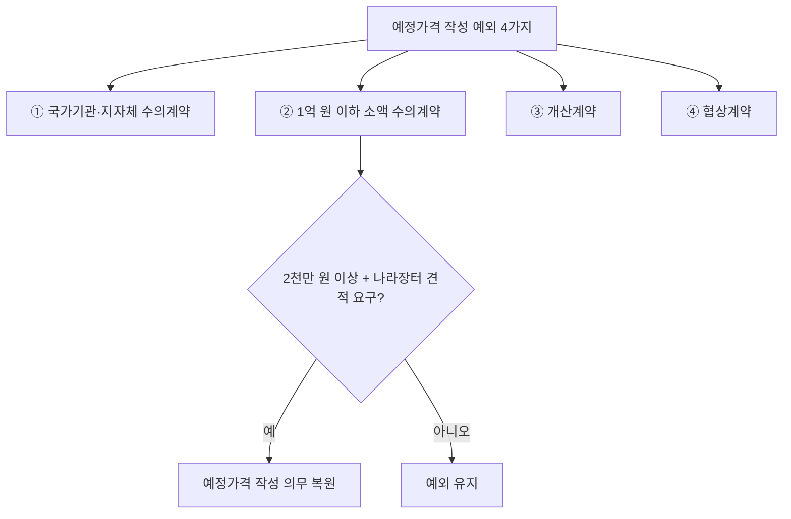

# 예정가격 작성 예외 — 결정 생략이 허용되는 4가지 경우

## 개요

원칙적으로 입찰·수의계약 전에 예정가격을 반드시 작성·비치해야 한다. 그러나 아래 4가지 경우에는 계약담당공무원이 예정가격을 결정하지 않을 수 있다. 「국가계약법 시행령」 제7조의2에 근거.

> [!note] 왜 예외를 두는가?
> 예정가격은 경쟁입찰에서 낙찰 기준으로 기능한다. 그런데 아래 네 경우는 경쟁에 의한 가격 결정이 애초에 이루어지지 않거나(수의계약·소액 수의), 가격 자체를 미리 확정할 수 없거나(개산계약·협상계약), 시장 정보가 없어 예가 작성 자체가 불가능한(특정조달) 상황이다. 이때 예정가격을 무리하게 작성하도록 요구하면 형식만 남고 실질적 기능이 없다.

## 현행 규정

### 예외 4가지

| 번호 | 예외 조건 | 근거 조문 | 비고 |
|------|---------|---------|------|
| ① | **다른 국가기관·지방자치단체와의 수의계약** | 시행령 제26조 제1항 제5호 | — |
| ② | **추정가격 1억 원 이하인 물품 제조·구매·용역** (임차·임대는 연액 또는 총액 기준) | 시행령 제26조 제1항 제5호 | 단, 추정가격 **2천만 원 이상** 수의계약 시 나라장터 견적 제출 요구하는 경우는 예정가격 작성 필요 |
| ③ | **개산계약** | 시행령 제70조 | — |
| ④ | **협상에 의한 계약** | 시행령 제43조 | 예정가격 결정 불가 → **개산가격** 결정 |

> [!info] 개산계약(概算契約)이란?
> 개산계약은 계약 체결 시점에 총계약금액을 확정할 수 없어 **개산(概算, 어림 계산)에 의한 금액**으로 계약하고, 이행 완료 후 실제 원가를 확인하여 최종 금액을 정산하는 계약이다(「국가계약법 시행령」 제70조).
>
> **왜 예정가격을 작성할 수 없는가?** 예정가격은 계약금액의 최고 상한을 미리 확정하는 가격이다. 그런데 개산계약은 이행 범위와 투입 원가 자체가 불확정이므로 총액을 사전에 산정할 방법이 없다. 예정가격을 억지로 작성하면 실제 원가와 괴리된 허구적 수치가 될 뿐이다.
>
> **주요 적용 대상:** 연구개발(R&D), 특수 제작, 이행 범위가 협의·조정되면서 변동되는 계약 등 사전에 총비용 산정이 불가능한 경우.
>
> **정산 절차:** 이행 완료 후 사후원가검토-유보금|사후원가검토 절차를 통해 실제 투입 원가를 확인하고 최종 금액을 확정한다. 이와 연동하여 계약금액의 10%를 유보금으로 보관하다 정산 완료 후 지급하는 방식이 적용된다.
>
> **④ 협상계약의 개산가격과의 차이:** 개산계약(③)의 개산금액은 이행 후 실제 원가로 **정산**된다. 협상계약(④)의 개산가격은 협상 중 유동적인 가격을 잠정 표시하는 것으로, 정산보다는 협상 기준점 역할을 한다. 이름이 비슷하여 혼동하기 쉽지만 목적과 정산 구조가 다르다.

### 예외별 근거 논리

### 특정조달계약의 추가 예외

물품 및 용역에 대한 특정조달계약에서 거래실례가격이 없어 예정가격 작성이 곤란한 경우도 예외에 해당한다.

**"거래실례가격이 없어 작성 곤란"에 해당하는 6가지 세부 사유** (용역과 일부 물품류):

1. 지역 또는 시기에 따라 가격차가 심한 경우
2. 특정 제작자만이 제작할 수 있는 경우
3. 국제 시세가 없는 경우
4. 제작자의 설계에 따라 가격차가 심한 경우
5. 공급자가 제시한 규격에 따라 물품을 구매하는 경우
6. 긴급히 구매할 필요가 있어 예정가격 작성 시간적 여유가 없는 경우

> [!info] 특정조달 예외의 적용 대상 물품류
> 용역과 기계·기재류, 철재류, 식료품류, 동물류, 화공품류(비료 제외), 약품류, 종이 및 판지류, 유제품류, 목재류 등의 물품에 한해 위 6가지 사유가 적용된다.「특정조달을 위한 국가를 당사자로 하는 계약에 관한 법률 시행특례규칙」제2조에 근거.

## 적용 조건

- ② 예외는 수의계약이 전제 — 경쟁입찰이면 예외 적용 불가
- ② 단서: 나라장터 견적 요구 시 **예정가격 작성 의무** 복원 (2천만 원 이상)
- ④ 협상계약: 예정가격 결정 자체가 불가 → 개산가격으로 대체
- 유찰된 경우 예정가격조서는 **재밀봉 후 계약담당과장 보관**

> [!warning] 개산계약 vs 협상계약 — 예외 이유가 다르다
> - **개산계약(③)**: 총액이 미확정이어서 예정가격을 산출할 수 없는 구조적 문제 — 추후 실제 원가 확정 후 정산
> - **협상계약(④)**: 기술·품질·조건을 협상하는 과정에서 가격이 변동되므로 고정 예정가격 결정 자체가 불가 — 개산가격으로 대체
> 
> 시험에서 두 계약 유형을 예외의 이유와 함께 출제한다.

## 실무 맥락

> [!example] 소액 수의계약 예외의 실무 적용
> 추정가격 1억 원 이하 수의계약은 예정가격 없이 진행할 수 있다. 그러나 2천만 원 이상이고 나라장터를 통한 견적을 받는 경우에는 예정가격을 작성해야 한다. 이는 디지털 플랫폼(나라장터)이 일정 규모 이상의 소액 계약에도 투명성을 부여하는 장치로 기능하면서, 예외의 범위를 사실상 좁히는 효과를 낸다.

> [!example] 협상계약에서 개산가격의 역할
> 협상에 의한 계약[시행령 제43조]에서 예정가격 대신 쓰는 개산가격(概算價格)은 계약 체결 시점의 잠정 금액으로, 실제 이행 내용에 따라 최종 정산된다. IT 시스템 개발, 연구용역 등 작업 범위가 협상에 따라 변하는 계약에서 활용된다. 예정가격처럼 낙찰 기준이 되지 않는다는 점이 핵심 차이다.

## 시험 출제 포인트

- **개산계약 vs 협상계약**: 둘 다 예외지만 이유가 다름 — 개산계약은 총액 미확정, 협상계약은 예정가격 결정 자체 불가(개산가격 대체)
- **1억 원 기준의 단서**: "2천만 원 이상 + 나라장터 견적" 조건이면 예정가격 작성 의무 — 오답 유인으로 단서 삭제 출제
- **국가기관 간 수의계약**: 예외 적용; 민간 업체와의 수의계약은 금액 요건(② 1억 원)이 별도 적용
- **예외는 "할 수 있다"**: 예외 조건이어도 예정가격을 작성해도 무방 — 반드시 생략해야 하는 것이 아님

## 관련 카드

- [[가격-용어-정의]] — 예정가격의 정의 및 비치 의무
- [[예정가격-결정방법]] — 예정가격 작성이 필요한 경우의 결정 방법
- 수의계약-요건 — 수의계약 허용 요건 전체 (예외 ①②의 맥락)
- 개산계약 — 개산계약의 성립 요건 및 사후원가 검토 절차
