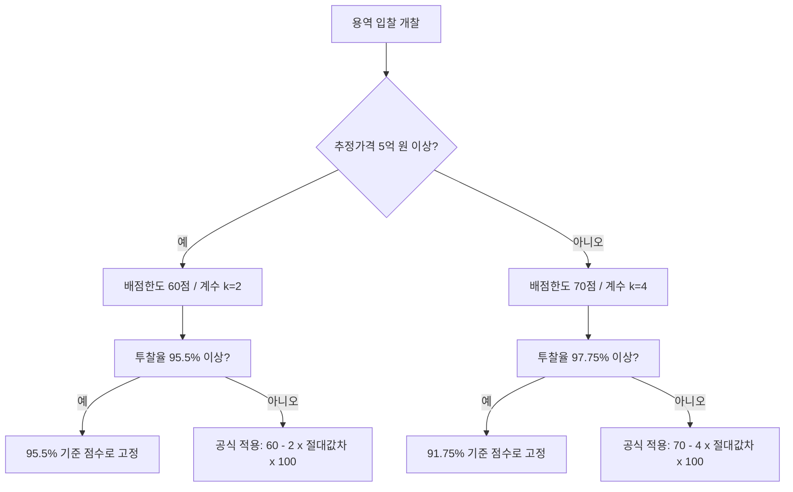

# 용역 적격심사 — 입찰가격 평가 투찰율 산출 공식

## 개요

조달청 일반용역 적격심사에서 입찰가격(투찰율) 평점은 입찰가격을 예정가격으로 나눈 비율을 88% 기준점과 비교하여 절대값 차이로 산출한다. 추정가격의 고시금액(5억 원) 이상·미만 여부에 따라 공식과 배점한도가 달라진다.

근거: 조달청 일반용역 적격심사 세부기준 [시행 2025.9.1.][조달청공고 제2025-257호] ④ 입찰가격평가 세부기준.

> [!note] 왜 88%가 기준점인가?
> 88%는 예정가격 대비 낙찰하한율(최저 입찰 허용선, 분야에 따라 80~88%)과 상한(100%) 사이에서 '적정 이윤이 보장되는 수준'으로 설정한 정책 기준점이다. 기준점보다 너무 낮거나 너무 높은 투찰율 모두 감점하여, 덤핑 방지와 예산 절감을 동시에 유도한다. 낙찰하한율 자체는 분야별로 다르지만(80.495%~87.995%), 입찰가격 평점의 중심점은 분야 무관하게 88%로 단일화되어 있다.

## 현행 규정

### 핵심 용어

| 용어 | 정의 |
|------|------|
| 투찰율 | 입찰가격 ÷ 예정가격 (소수점 다섯째 자리에서 반올림) |
| 기준점 | 88/100 = 0.88 (공통) |
| 절대값 차이 | \|0.88 − 투찰율\| × 100 |

### 공식

**고시금액 이상(추정가격 5억 원 이상)**

```
평점 = 60 − 2 × |88/100 − 입찰가격/예정가격| × 100
```

- 배점한도: 60점
- 상한 처리: 투찰율이 **95.5% 이상**이면 95.5%인 경우의 점수로 고정 평가

> [!note] 왜 5억 이상은 계수 2이고 배점한도 60점인가?
> 5억 이상 대형 용역은 복수의 참가업체가 경쟁하므로 가격 외 이행실적·기술능력·경영상태 등 비가격 요소의 비중을 높여(40점 이상) 품질 우선 선발을 유도한다. 가격 배점을 60점으로 낮추고 계수(감점 민감도)도 2로 완만하게 설정하여 합리적 가격대 내에서 폭넓게 경쟁할 수 있도록 한다.

**고시금액 미만(추정가격 5억 원 미만)**

```
평점 = 70 − 4 × |88/100 − 입찰가격/예정가격| × 100
```

- 배점한도: 70점
- 상한 처리: 투찰율이 **97.75% 이상**이면 91.75%인 경우의 점수로 고정 평가
  - 주의: 97.75% → 91.75% (※ 원문 그대로; 97.75% 초과 시 점수를 91.75% 기준값으로 고정)

> [!note] 왜 5억 미만은 계수 4이고 배점한도 70점인가?
> 소규모 용역은 참가업체 수가 적고 비가격 심사자료(실적·기술인력 등)가 부족한 경우가 많다. 가격 배점(70점)을 상대적으로 높여 가격 경쟁력으로 진입 기회를 넓히되, 계수 4로 감점을 급격하게 설정함으로써 88% 기준점 근방의 적정가 투찰을 강제한다. 결과적으로 덤핑 방지 효과가 대형 용역보다 강하다.

### 계수 비교표

| 구분 | 배점한도 | 계수(k) | 상한 투찰율 |
|------|---------|---------|-----------|
| 5억 이상 | 60점 | 2 | 95.5% |
| 5억 미만 | 70점 | 4 | 97.75% |

### 용역 분야별 낙찰하한율

입찰가격 평점과 연동된 낙찰하한율(예정가격 대비 최저입찰 허용 비율)은 용역 분야마다 다르다.

| 용역 분야 | 낙찰하한율 (고시금액 이상) |
|---------|----------------------|
| 학술연구, S/W(비중기간), 폐기물, 화물육상, 수리점검 | 80.495% |
| 시설분야, S/W(중기간), 여객육상운송 | 87.995% |
| 학술연구(5억 미만), S/W 비중기간(5억 미만) | 84.245% |
| 보험 | 47.995% |

## 적용 조건

- 일반용역 9개 분야(전시·행사대행 제외)에 적용
- [[용역-제안서-필요경우|협상에 의한 계약]], 학술연구용역 등 협상계약 발주 건은 적격심사 **적용 제외**
- 투찰율 소수점 처리: 입찰가격÷예정가격 결과에서 소수점 **다섯째 자리**에서 반올림

> [!warning] 협상계약 혼동 주의
> 학술연구용역은 일반경쟁(적격심사) 방식으로도 발주되지만, 협상에 의한 계약으로 발주되면 적격심사 자체가 적용되지 않는다. 같은 '학술연구'라도 계약 방식에 따라 이 공식 적용 여부가 달라진다.

## 의사결정 흐름



## 실무 파급 효과

> [!example] 투찰율 상한 규정의 실무 의미
> 입찰자가 예정가격과 거의 동일한 금액(예: 98%)으로 투찰하면 최고 점수를 받을 것 같지만, 5억 미만의 경우 97.75% 이상이면 91.75%로 점수가 고정된다. 즉 **예정가격 근방 투찰이 오히려 불리**해진다. 88%에 가까운 투찰이 최고 점수(70점 만점)를 받는 구조이므로, 실무에서는 88% 부근을 목표로 정밀하게 투찰율을 설계한다.

> [!note] 적격심사 전체 구조에서 투찰율의 위치
> 입찰가격 평점(A)은 전체 100점 중에서 60점(5억 이상) 또는 70점(5억 미만)을 차지한다. 나머지는 이행능력(B) — [[적격심사-scoring-tables|이행실적, 기술능력, 경영상태, 신인도]] — 으로 구성된다. 낙찰 통과점수는 분야별로 85점이며, 이를 충족한 최저가 업체가 낙찰된다. 투찰율이 너무 낮으면(덤핑) [[낙찰하한율-costing-methodology|낙찰하한율]] 미달로 입찰 자체가 무효 처리된다.

## 시험 출제 포인트

**Q16: 용역 적격심사 투찰율 산출 공식**

출제 방식: 공식 자체 또는 계수(k = 2 vs 4) 구분, 상한 처리 규칙을 묻는 형태.

오답 유인:
- 계수를 거꾸로 적용 (5억 이상→4, 5억 미만→2)
- 기준점을 88%가 아닌 다른 값(90%, 85%)으로 혼동
- 배점한도를 혼동 (5억 이상→70점, 5억 미만→60점으로 뒤집기)
- 상한 투찰율을 97.75%/95.5% 대신 다른 값으로 제시

핵심 암기: **"5억 이상 → 60점·계수 2·상한 95.5% / 5억 미만 → 70점·계수 4·상한 97.75%"**

## 관련 카드

- [[적격심사-scoring-tables]] — 공사 적격심사 배점 구조(시설공사 별표별 기준)
- [[낙찰하한율-costing-methodology]] — 낙찰하한율 산출 원리
- [[용역-제안서-필요경우]] — 용역계약 입찰제안서 필요 경우(협상에 의한 계약 비교)
- [[적격심사-물품-추정가격-배점]] — 물품 적격심사 배점(용역과 비교)

:::tip[실무에서 이 규정 적용하기]
고객 계약별로 이 기준을 자동 적용하고 싶다면 → [공공조달관리사 워크플로우 플랫폼](https://kr-public-procurement-demo.up.railway.app)

조달관리사 실무 워크플로우 플랫폼 — 규제 변경 알림, 클라이언트별 적격심사 점수 자동 계산, 계약 이행 이력 관리.
:::
