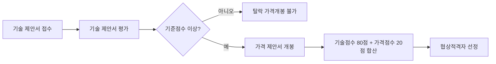

# 용역계약 제안서 — 필요한 경우: 제한경쟁 vs 협상에 의한 계약 구별

## 개요

제안서(입찰제안서)는 공공기관이 사업을 발주할 때 기업이 해당 사업을 수행할 수 있는 역량과 계획을 제시하는 문서다. 주로 **가격만으로 평가하기 어려운 사업**에 요구된다. 시험에서는 어떤 계약 방법에서 제안서가 필요한지, 특히 제한경쟁과 협상에 의한 계약의 차이를 구별하는 것이 핵심이다.

> [!note] 왜 협상에 의한 계약에서는 제안서가 필수인가?
> 학술연구·정보화사업 같이 창의적 해결이 필요한 용역은 가격만으로 최적 공급자를 가릴 수 없다. 협상에 의한 계약은 **기술 제안서를 먼저 평가하고 기준 미달자를 배제한 뒤에야 가격 제안서를 개봉**함으로써, 저가 덤핑이 아닌 기술력 경쟁을 유도한다. 이것이 이 방식에서 제안서가 구조적으로 필수인 이유다.

## 현행 규정

### 제안서가 필요한 주요 경우

| 계약 방법 | 제안서 필요 여부 | 필요한 경우 |
|---------|--------------|-----------|
| 일반경쟁입찰 | 조건부 | 복잡한 기술·창의적 해결이 필요한 경우; 기술력·수행능력·품질을 종합 평가해야 하는 경우 |
| **제한경쟁입찰** | **조건부** | 특정 자격요건을 갖춘 업체들 간 경쟁 시; 전문성이 요구되는 분야의 조달 |
| **협상에 의한 계약** | **필수** | 긴급한 상황이나 특수한 요구사항; 기존 계약의 변경·연장 |
| 수의계약 | 불필요 (원칙) | — |

### 제한경쟁 vs 협상에 의한 계약 — 핵심 구별

| 구분 | 제한경쟁입찰 | 협상에 의한 계약 |
|------|------------|--------------|
| 성격 | 자격 기준을 제한한 **경쟁** 입찰 | 가격·조건을 **협상**하여 결정 |
| 제안서 역할 | 심사 자료(필요 시) | 핵심 평가 수단 (기술제안서 + 가격제안서 분리) |
| 예정가격 작성 | 원칙 작성 | **생략 가능** |
| 주요 적용 사례 | 전문 면허·실적 보유 업체 간 경쟁 | 학술연구, 정보화사업, 창의적 해결이 필요한 용역 |
| 적격심사 적용 | 적용 | **적용 제외** |

### 협상에 의한 계약의 제안서 특징

- 기술 제안서와 가격 제안서를 **별도로 분리 제출**
- 기술 제안서를 **먼저 평가**하고, 일정 기준 이상인 경우에만 가격 제안서를 접수
- 온라인 평가: 200억 원 이상 정보화사업, 10억 원 이상 설계공모는 평가 과정을 **온라인 실시간 공개**

### 제안서 평가 절차 (협상에 의한 계약)

### 제안서 구성 요소

| 구성 항목 | 내용 |
|---------|------|
| 회사 현황 및 수행능력 | 회사 소개, 관련 유사 실적, 참여 인력 전문성 |
| 사업 이해 및 추진 전략 | 과업 분석, 추진 일정, 업무 분장 |
| 성과관리 및 기대효과 | 정량·정성적 목표, 위험요소 대응 방안 |
| 가격 제안서 (별도) | 기술 평가와 분리 제출 |

## 적용 조건

- 제안서 요구는 계약 방법(경쟁 방식)에 따라 결정되며, 단순 가격입찰(최저가)로 평가 가능한 경우에는 요구하지 않음
- 학술연구용역, 정보통신용역 등 **협상에 의한 계약**으로 발주되는 경우 → 적격심사 적용 제외 (제안서 평가 방식으로 대체)

> [!warning] 시험 함정 — 제한경쟁에서 제안서 '항상 필요'로 혼동
> 제한경쟁입찰은 **자격 제한 후 최저가 낙찰**도 가능하다. 제안서는 전문성 평가가 필요한 경우에만 요구되므로, "제한경쟁입찰 = 제안서 필수"는 **오답**이다.

> [!example] 협상에 의한 계약 실제 적용 — 정보화사업
> 200억 원 이상 정보화사업은 기술 제안서 평가 과정을 **온라인 실시간 공개**해야 한다. 이는 평가위원의 점수 부여 과정을 투명하게 공개하여 청탁·편향 평가를 차단하기 위한 제도적 장치이며, 해당 사업에서 제안서가 얼마나 핵심 평가 수단인지를 보여 준다.

## 시험 출제 포인트

**Q20: 용역계약 입찰제안서 필요 경우 — 제한경쟁 vs 협상에 의한 계약 구별**

출제 방식: 어떤 계약 방법에서 제안서가 "필수"인지, "조건부"인지 구별하는 보기 선택 문제.

오답 유인:
- 제한경쟁입찰에서 제안서가 항상 필요하다고 혼동 (제한경쟁은 자격 제한 후 최저가 낙찰도 가능)
- 협상에 의한 계약을 단순 협상(가격만)으로 오해 (실제는 기술 평가가 핵심)
- 일반경쟁입찰에서 제안서가 절대 불필요하다고 혼동 (복잡한 기술 사업이면 필요)
- 협상에 의한 계약에서 예정가격을 반드시 작성해야 한다고 혼동 (생략 가능)

핵심 암기: **"협상에 의한 계약 = 제안서 필수 + 예정가격 생략 가능 + 적격심사 제외"**

## 관련 카드

- [[mas-services-mechanics]] — 용역 MAS와 협상에 의한 계약의 구별(기술제안서 오해 교정)
- [[용역-적격심사-투찰율]] — 적격심사 적용 용역(협상에 의한 계약 제외 케이스)의 투찰율 산출 공식
- [[협상에의한계약-배점기준]] — 제안서 평가에서 기술능력(80점)과 가격(20점)의 배점 구조
- [[협상에의한계약-협상적격자-선정]] — 제안서 평가 후 협상 자격 부여 기준(국가기관 85점, 지자체 70점)

:::tip[실무에서 이 규정 적용하기]
고객 계약별로 이 기준을 자동 적용하고 싶다면 → [공공조달관리사 워크플로우 플랫폼](https://kr-public-procurement-demo.up.railway.app)

조달관리사 실무 워크플로우 플랫폼 — 규제 변경 알림, 클라이언트별 적격심사 점수 자동 계산, 계약 이행 이력 관리.
:::
