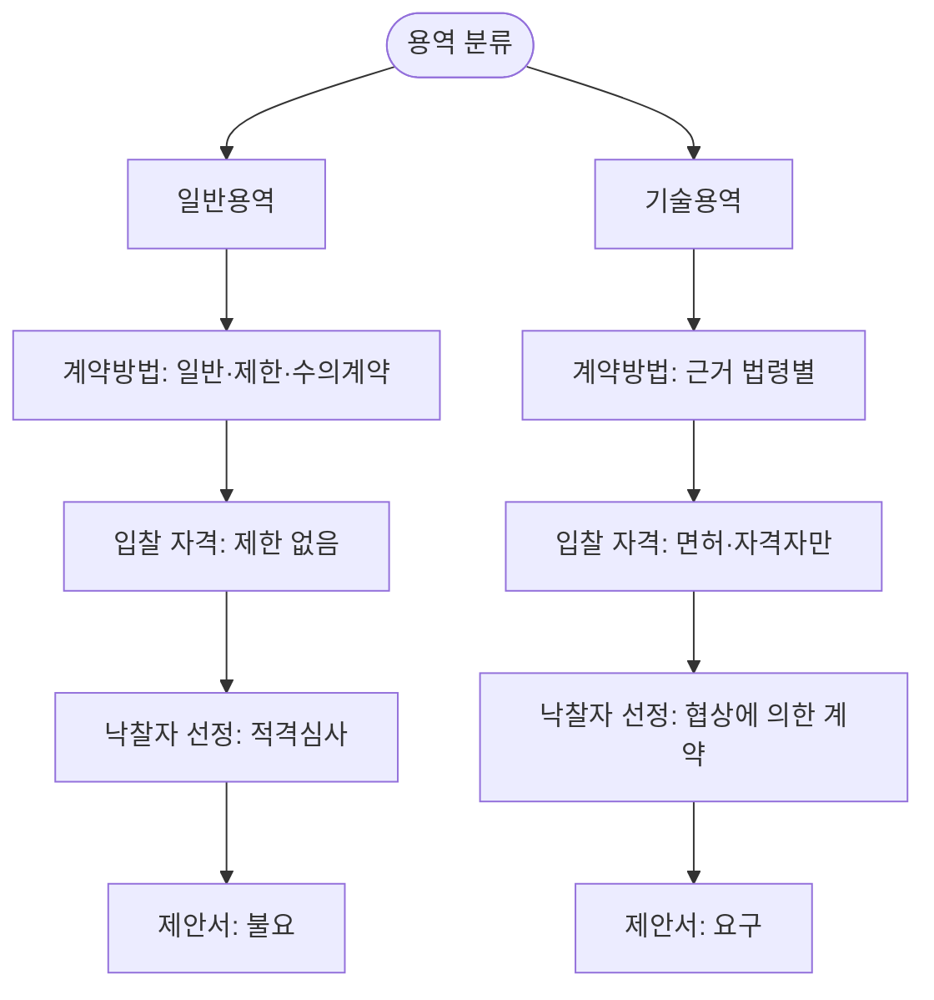

# 용역조달의 분류 — 일반용역 9개 분야·기술용역 3개 분야

## 개요

용역 조달은 사람의 노동·지식·서비스를 제공하는 계약으로, **일반용역(9개 분야)**과 **기술용역(3개 분야)**으로 구분된다.

## 현행 규정

### 일반용역 — 9개 분야

| 번호 | 분야 |
|------|------|
| 1 | 정보화사업용역 |
| 2 | 폐기물처리 용역 |
| 3 | 시설물 유지·관리 용역 (건물 관리, 청소, 경비, 조경 등) |
| 4 | 육상운송 용역 |
| 5 | 학술연구 용역 |
| 6 | 전시 및 행사대행 용역 |
| 7 | 광고 및 디자인 용역 |
| 8 | 장비 유지·보수 용역 |
| 9 | 보험 용역 |

### 기술용역 — 3개 분야

| 번호 | 근거 법령 | 주요 활동 |
|------|-----------|-----------|
| 1 | 건설기술진흥법 | 계획·조사·설계·감리·안전점검·진단 |
| 2 | 엔지니어링산업진흥법 | 엔지니어링 활동 |
| 3 | 개별법 기술용역 | 건축사법(설계·공사감리), 전력기술관리법(설계·감리), 정보통신공사업법(설계·감리), 소방시설공사업법(설계·감리), 측량·수로조사 및 지적에 관한 법률(측량) |

## 적용 조건

분류가 결정되면 네 가지가 연쇄적으로 결정된다.

**① 계약방법** — 일반용역은 [[일반경쟁입찰-장단점-절차|일반경쟁]]을 원칙으로 하되 추정가격에 따라 [[제한경쟁입찰-유형-기준|제한경쟁]] 또는 [[수의계약-사유-유형|수의계약]]을 선택한다. 기술용역은 각 근거 법령이 계약방법을 별도로 정한다.

**② 입찰 참가 자격** — 기술용역은 법령에서 정한 면허·자격 보유자만 참여 가능하다. 이 자격 요건이 곧 [[제한경쟁입찰-유형-기준|제한경쟁입찰]]의 근거가 된다.

**③ 낙찰자 선정 방식** — 일반용역은 주로 [[용역-적격심사-투찰율|적격심사]] 기반 가격경쟁이다. 기술용역은 기술 제안서를 요구하는 경우가 많아 [[협상에의한계약-협상적격자-선정|협상에 의한 계약]] 방식(기술점수 + 가격협상)이 적용되며, [[협상에의한계약-배점기준|배점 기준]]도 일반용역과 다르다. 어떤 방식이 적용되는지는 [[낙찰자선정방식-비교|낙찰자 선정 방식 비교]]를 참고.

**④ 제안서 제출 여부** — 기술용역은 [[용역-제안서-필요경우|제안서가 요구되는 경우]]가 많다. 일반용역은 원칙적으로 가격만으로 경쟁한다.

## 시험 출제 포인트

**Q2 출제 패턴:** "일반용역의 대상으로 옳지 않은 것" → **건설기술용역**은 기술용역 소속이므로 **오답**.

**핵심 구별:**
- 정보화사업용역 = 일반용역 (소프트웨어용역과 혼동 주의; 소프트웨어용역도 일반용역)
- 건설기술용역 = 기술용역 (「건설기술진흥법」 근거)
- 청소·경비·학술연구 = 일반용역

**오답 유인:** "소프트웨어용역은 기술용역이다" — 오답 (정보화사업용역으로 일반용역에 포함).

## 관련 카드
- [[공공조달-범위-분류]] — 물품·용역·시설 3범주 기본 분류
- [[수요기관-유형-및-지정]] — 용역 조달을 요청하는 수요기관의 유형과 요건
- [[조달청-구매-수요기관-구매-대상]] — 용역 조달 시 조달청 구매 vs 수요기관 자체 구매 기준
- [[낙찰자선정방식-비교]] — 적격심사·협상·종합심사낙찰제 비교
- [[협상에의한계약-배점기준]] — 기술용역에 주로 적용되는 협상 계약의 기술·가격 배점
- [[협상에의한계약-협상적격자-선정]] — 협상 대상자 선정 절차
- [[용역-적격심사-투찰율]] — 일반용역 적격심사의 투찰율 기준
- [[제한경쟁입찰-유형-기준]] — 자격·면허 기반 제한경쟁 요건
- [[용역-제안서-필요경우]] — 기술용역 제안서 요구 조건

:::tip[실무에서 이 규정 적용하기]
고객 계약별로 이 기준을 자동 적용하고 싶다면 → [공공조달관리사 워크플로우 플랫폼](https://kr-public-procurement-demo.up.railway.app)

조달관리사 실무 워크플로우 플랫폼 — 규제 변경 알림, 클라이언트별 적격심사 점수 자동 계산, 계약 이행 이력 관리.
:::
