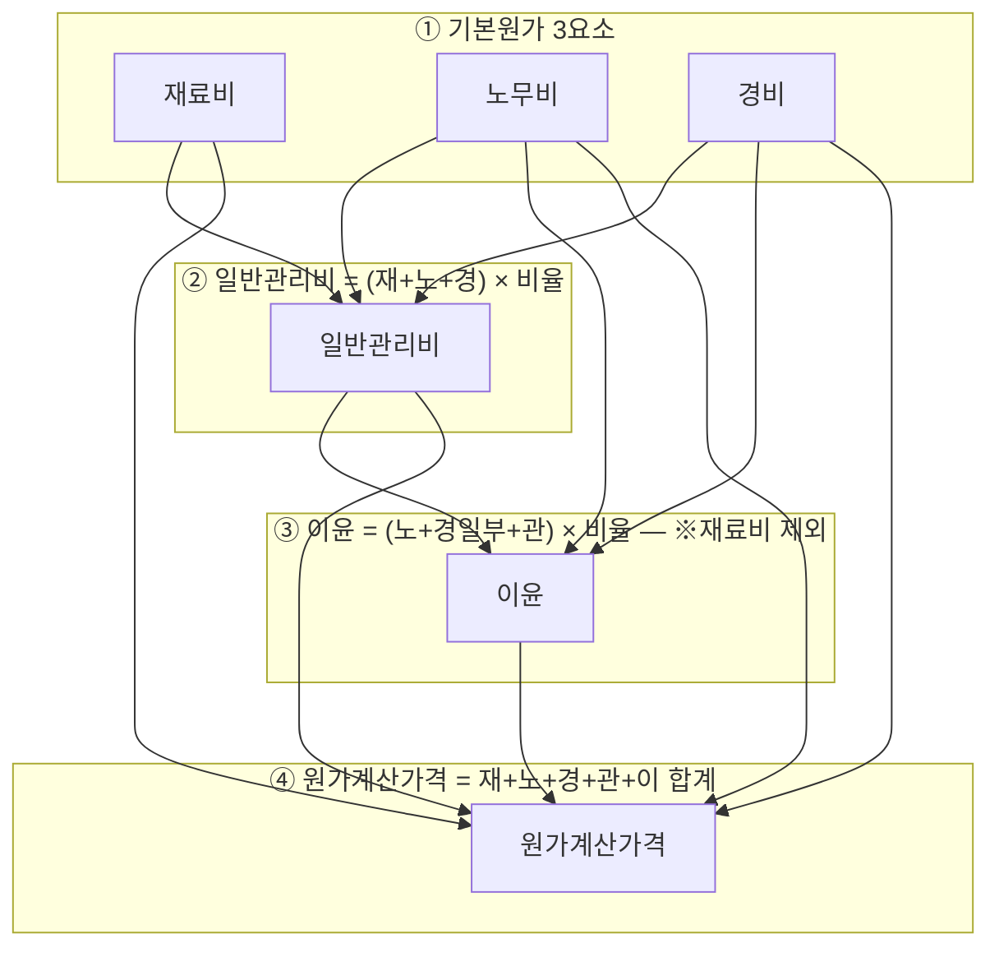

# 원가 구성 및 비율 — 재료비·노무비·경비·일반관리비·이윤 5비목

## 개요

[[예정가격-결정방법|원가계산가격]]은 예정가격 결정기준 우선순위 3위로, 신규개발품·특수규격품 등 거래실례가격이 없을 때 적용한다. 원가는 5개 비목으로 구성되며, 일반관리비와 이윤에는 법정 상한이 존재한다. 「국가계약법 시행규칙」 제8조에 근거.

> [!note] 왜 일반관리비·이윤에 상한을 두는가?
> 원가계산가격은 시장에서 검증된 가격이 없는 상황에서 이론적으로 산정하는 금액이다. 재료비·노무비·경비는 실제 투입량을 기준으로 산정하므로 자의적 부풀리기가 어렵다. 반면 일반관리비(본사 경상비 배분)와 이윤은 계산 기준이 불분명하여 업체가 과다 계상하기 쉽다. 법령이 업종별 상한을 규정하여 공공계약에서 과도한 이익을 제한하는 것이 상한 제도의 핵심 목적이다.

## 현행 규정

### 원가 5비목 구성

| 비목 | 산출식 | 비고 |
|------|------|------|
| **재료비** | 규격별 재료량 × 단위당 가격 | 실제 투입 재료 기준 |
| **노무비** | 공종별 노무량 × 노임단가 | 실제 투입 인력 기준 |
| **경비** | 비목별 경비의 합계액 | 전력비·수도비·보험료 등 |
| **일반관리비** | (재료비 + 노무비 + 경비) × 일반관리비율 | 상한: 업종별 6~14% |
| **이윤** | (노무비 + 경비 + 일반관리비) × 이윤율 ※경비 중 재정경제부장관이 정하는 비목 제외 | 상한: 제조·구매 25%, 수입·용역 10% |

> [!warning] 일반관리비와 이윤의 산출 기준이 다르다
> - **일반관리비**: 재료비 + 노무비 + 경비 전체를 기준으로 곱한다
> - **이윤**: 노무비 + 경비(일부 제외) + 일반관리비를 기준으로 곱한다 — **재료비가 제외**된다
> 
> 재료비는 이미 원재료 가격을 반영하므로, 그 위에 다시 이윤을 얹는 것은 중복 이익이 된다는 정책 논리에서 재료비를 이윤 산출 기준에서 제외한다.

### 원가 계산 흐름

### 업종별 일반관리비율 상한치 [시행규칙 제8조]

| 업종 | 비율(%) | 업종 | 비율(%) |
|------|---------|------|---------|
| 음·식료품의 제조·구매 | **14** | 비금속광물제품 제조·구매 | 12 |
| 나무·나무제품의 제조·구매 | 9 | 제1차 금속제품의 제조·구매 | **6** |
| 섬유·의복·가죽제품의 제조·구매 | 8 | 조립금속제·기계·장비의 제조·구매 | 7 |
| 종이·종이제품·인쇄출판물의 제조·구매 | **14** | 수입물품의 구매 | 8 |
| 화학·석유·석탄·고무·플라스틱제품의 제조·구매 | 8 | 기타 물품의 제조·구매 | 11 |

> [!info] 업종별 비율 차이의 이유
> 음식료품·종이류(14%)가 높은 이유는 이 업종의 일반관리비(광고비·유통비·품질관리비 등)가 구조적으로 높기 때문이다. 제1차금속(6%)이 낮은 이유는 철강·알루미늄 등 기초 소재 산업에서 일반관리비 비중이 상대적으로 작기 때문이다. 제조업·용역·시설공사업 전체 적용 범위는 6~14% 구간이다.

### 이윤 상한치

| 계약 유형 | 이윤 상한 |
|---------|---------|
| 제조·구매 | **25%** |
| 수입물품 구매 및 용역 | **10%** |

> 이윤 산출 기준: 노무비 + 경비(일부 제외) + 일반관리비의 합계액 × 이윤율

## 적용 조건

- 원가계산가격은 거래실례가격이 **없는 경우**에만 적용 (우선순위 3위)
- 일반관리비율은 업종별 상한치 — 실제 적용 비율은 상한치 이내에서 결정
- 이윤 상한: 제조·구매 25%, 수입물품·용역 10% — 시공경험 있는 공사계약과 혼동 주의

## 실무 맥락

> [!example] 원가 부풀리기 감사원 적발 사례 — 자재 단가 부풀리기
> 감사원의 공공조달 감사(2025년 발표)에서 한국수자원공사 사례가 적발되었다. 계약업체가 동일 자재의 단가를 실제 시장가의 2~5배 수준으로 자체 견적하여 제출했음에도, 발주기관이 제출 서류를 검증하지 않고 계약을 체결한 것이 문제가 되었다. 원가계산가격 방식에서 재료비의 단위당 가격은 시장조사에 의해 검증되어야 하나, 발주기관의 검증 역량 부족이 부풀리기의 주요 허점으로 지적된다.

> [!example] 일반관리비 상한 제도의 실무적 의미
> 원가계산 방식으로 예정가격을 산정하면 업체가 제출한 원가 내역서를 기반으로 가격을 결정한다. 이때 일반관리비 상한(6~14%)이 없으면 업체가 본사 경상비를 과다하게 배분하여 가격을 부풀릴 여지가 크다. 상한 제도는 이를 차단하는 법적 안전장치다. 실무에서 계약담당공무원은 업체가 제출한 원가 내역서의 일반관리비율이 업종 상한을 초과하는지 반드시 검증해야 한다.

## 시험 출제 포인트

- **5비목 암기**: 재·노·경·관·이 (재료비→노무비→경비→일반관리비→이윤) 순서
- **일반관리비 산출 기준**: 재+노+경 합계 × 비율 (이윤 기준과 혼동 주의)
- **이윤 산출 기준**: 노+경(일부)+관 (재료비 제외) × 비율
- **최고·최저 업종**: 음식료품·종이류 14% (최고), 제1차금속 6% (최저)
- **이윤 상한 구분**: 제조구매 25% ≠ 수입·용역 10%

## 관련 카드

- [[예정가격-결정방법]] — 원가계산가격이 적용되는 기준가격 우선순위 맥락
- [[가격-용어-정의]] — 예정가격의 구성 비목과 원가의 관계
- [[낙찰자선정방식-비교]] — 원가계산가격이 낙찰 기준이 되는 방식과 연결
