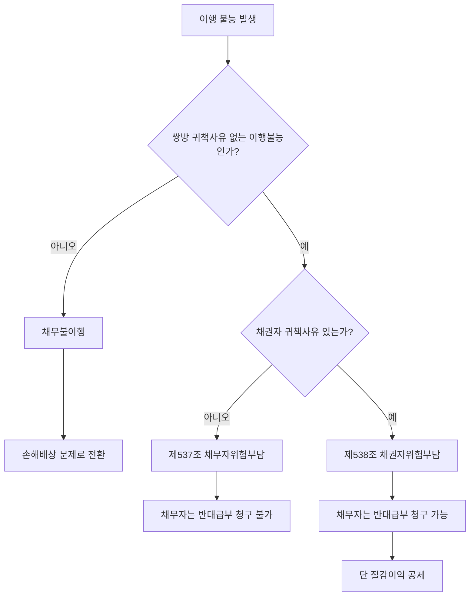

# 위험부담(危險負擔)

## 개요

> [!info] 핵심 용어: 채권 · 채무 · 채무자 · 채권자
> - **채권(債權)**: 특정인이 다른 특정인에게 일정한 행위(급부)를 요구할 수 있는 권리. 예: 발주기관이 계약자에게 "납품해 달라"고 요구하는 권리.
> - **채무(債務)**: 채권에 대응하는 이행 의무. 예: 계약자가 발주기관에 물품을 납품해야 하는 의무.
> - **채무자(債務者)**: 이행 의무를 지는 당사자. 위험부담 맥락에서는 이행 불능이 된 급부의 의무자 — 공공조달에서 보통 **계약자(수급인)**.
> - **채권자(債權者)**: 이행을 요구할 권리를 가진 당사자 — 공공조달에서 보통 **발주기관(도급인)**.
>
> 쌍무계약에서는 양 당사자가 동시에 채권자이자 채무자다. 계약자는 '납품 의무(채무자)' + '대금 청구 권리(채권자)'를, 발주기관은 '납품 요구 권리(채권자)' + '대금 지급 의무(채무자)'를 동시에 갖는다. 위험부담 규정은 이 구조 위에서, **채무자의 이행이 불능이 되었을 때 채권자의 의무(반대급부)가 어떻게 되는가**를 규율한다.

쌍무계약에서 당사자 쌍방의 귀책사유 없이 일방의 채무 이행이 불능이 된 경우, 그 손실(위험)을 누가 부담하는가의 문제다(「민법」 제537조~제538조). 원칙은 **채무자위험부담주의** — 이행 불능이 된 쪽(채무자)이 위험을 부담하며, 상대방에게 반대급부(反對給付)를 청구할 수 없다.

> [!note] 왜 채무자가 위험을 부담하는가?
> 이행불능이 발생한 시점에서 채무자는 여전히 급부를 제공할 의무를 지고 있었다. 이행하지 못한 결과를 채무자가 감수하게 함으로써 **계약 이행에 대한 인센티브를 보존**하는 것이 채무자위험부담주의의 정책적 근거다. 반대로 채권자주의(프랑스·구 일본 민법)는 목적물의 소유권 이전 시점에 위험이 함께 이전한다는 논리인데, 한국 민법은 소유권 이전 시점과 위험 이전 시점을 분리하여 채무자주의를 채택했다.

## 현행 규정

### 원칙: 채무자 위험부담 (제537조)

쌍방 귀책 없이 채무가 이행 불능이 되면 채무자는 상대방의 이행을 청구하지 못한다.

→ 납품해야 할 물품이 화재로 소실된 경우: 계약자는 대금을 청구할 수 없다.

### 예외: 채권자 귀책 시 (제538조)

채권자(발주기관)의 귀책사유로 이행 불능이 된 경우:
- 채무자(계약자)는 반대급부(대금)를 청구할 수 있다.
- 단, 채무자가 이행 불능으로 인해 얻은 이익이 있으면 공제한다.

> [!note] 제538조의 정책 근거
> 채권자(발주기관)가 이행 불능을 초래한 상황에서 계약자에게까지 손실을 전가하면 형평에 반한다. 채권자가 귀책사유 있는 이상 "반대급부를 받을 준비는 되어 있었다"고 볼 수 있으므로 계약자의 대금청구권을 보호한다. 단, 계약자가 이행 불능으로 절감한 비용(예: 미사용 자재·노무비)은 공제하여 부당이득을 방지한다.

## 적용 조건

- 불가항력(천재지변, 전쟁, 대규모 재난 등) 상황에서 주로 적용
- 계약자·수요기관 모두 귀책사유가 없어야 제537조 적용
- 귀책사유가 있는 경우에는 [[동시이행의-항변권]] 행사 후 채무불이행(손해배상) 규정이 우선 적용

## 실무 적용

공공조달 계약에서 위험부담 규정의 실제 쓰임:

| 상황 | 결과 |
|------|------|
| 납품 전 목적물이 천재지변으로 멸실 | 계약자는 대금 청구 불가 |
| 수요기관 지정 장소 문제로 납품 불가 | 계약자는 대금 청구 가능 (채권자 귀책) |
| 공사 현장이 수용(收用)으로 공사 불가 | 계약 변경 또는 [[계약의-해제와-해지]] + 기성 부분 정산 |

> [!info] 국가계약법령과의 관계
> 국가계약법령에서는 천재지변 등 불가항력 사유에 대해 별도로 계약 이행기간 연장, [[물가변동-계약금액조정-조건]] 등 계약금액 조정 규정을 두고 있다. 실무에서는 민법 위험부담 규정보다 해당 계약예규가 우선 적용되는 경우가 많다. 민법 규정은 계약예규에 명시되지 않은 공백을 보충하는 역할을 한다.

> [!example] 코로나19 불가항력 사례 (2020)
> 코로나19 팬데믹 초기, 마스크·방역물품 납품 계약에서 원자재 공급 중단으로 납품 불능이 발생한 사례들이 있었다. 법률 실무에서는 불가항력 인정 요건으로 (1) 원인이 당사자 지배영역 밖에서 발생할 것, (2) 통상의 수단을 다해도 예상·방지가 불가능했을 것 두 가지를 충족해야 한다고 보았다. 단순 수급 곤란은 불가항력으로 인정되지 않는 경우가 많아, 귀책 없는 이행불능 주장이 기각되고 채무불이행으로 처리된 사례도 있었다.

> [!warning] 시험 함정: 채권자주의와 채무자주의 혼동
> - 한국 민법의 **원칙은 채무자주의**(제537조). 채권자주의가 원칙이라는 서술은 틀림.
> - 채권자 귀책 시(제538조)에도 채무자가 절감한 이익은 공제된다 — "청구할 수 있다"는 전액 청구가 아닐 수 있음.
> - 불가항력이라도 계약예규(국가계약법 시행령 등)가 적용되면 민법 제537조가 직접 적용되지 않을 수 있다.

## 시험 출제 포인트

- **제537조** = 채무자위험부담주의 (원칙)
- **제538조** = 채권자 귀책 시 채무자의 반대급부 청구권 보장 (예외)
- 핵심 판단 순서: ① 귀책사유 없는 이행불능인가 → ② 채권자 귀책인가 → ③ 절감이익 공제 있는가

## 관련 카드

- 쌍무계약-유상계약-무상계약 — 위험부담이 적용되는 전제 — 쌍무계약의 정의와 채권·채무 구조
- [[동시이행의-항변권]] — 이행이 가능한 상황에서의 거절권
- [[계약의-해제와-해지]] — 이행 불능 시 계약 종료 수단
- [[물가변동-계약금액조정-조건]] — 불가항력에 준하는 물가 급변 시 계약금액 조정 경로
- [[공공조달-위험분석]] — 발주기관 관점의 계약 위험 관리 체계
