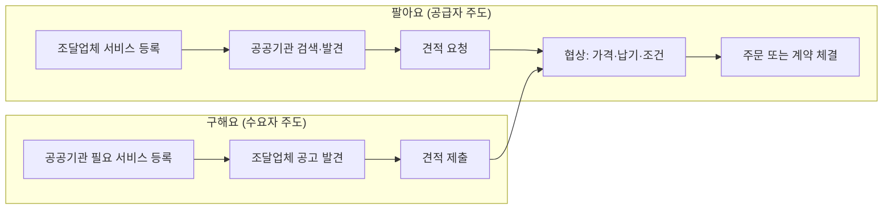

# 이음장터 — 정의·기능·소액 서비스 거래 기준

## 개요

이음장터는 수요자(공공기관)와 공급자(조달업체)가 **온라인으로 서비스를 협상·거래**할 수 있도록 조달청이 운영하는 공공조달 플랫폼이다. 조달청과 별도의 계약 없이 서비스를 자유롭게 등록·판매할 수 있는 것이 핵심 특징이다.

> [!note] 도입 배경 — 나라장터 종합쇼핑몰이 커버하지 못한 영역
> 나라장터-도입성과-기능|나라장터 종합쇼핑몰은 사전에 협상·등록된 **고정가격 상품**만 취급한다. 그러나 소액 서비스(방역·청소·콘텐츠 제작 등)는 현장 조건·규모·납기에 따라 가격이 달라지므로 고정가격 등록이 어렵다. 또한 5천만 원 미만 소규모 용역은 정식 경쟁입찰 절차(공고·심사·보증)를 거치면 행정 비용이 계약액을 상회하는 경우가 생긴다. 이음장터는 2022년 4월 이 공백을 메우기 위해 출범했다 — 자유 협상 구조로 소액 서비스를 온라인화하되, 조달청 단가계약 없이 누구나 등록할 수 있게 했다.

## 현행 규정

### 이음장터 정의 및 특징

- 수요자: 편리하게 서비스 상품 구매 가능
- 공급자: **계약체결 절차 없이** 상품 거래 가능
- 나라장터 인증서 보유 서비스 기업 누구나 회원가입 및 상품 등록 가능
- 14개 분야, 642개 조달업체의 1,177개 서비스 상품 등록

### 거래 방식

| 구분 | 방식 | 내용 |
|------|------|------|
| **팔아요** | 공급자 상품 등록 | 조달업체가 제공 가능 서비스를 자유롭게 등록 |
| **구해요** | 수요자 직접 등록 | 원하는 서비스가 없을 때 공공기관이 필요한 상품을 등록 → 업체로부터 견적 수령 후 구매 |

> [!example] 구해요 활용 시나리오 — 방역 용역
> 한 공공기관이 청사 방역 용역(예산 15만 원 수준)이 필요해 이음장터 팔아요 목록을 검색했지만 조건에 맞는 서비스가 없었다. 기관은 구해요 방식으로 "청사 1개 층 방역, 납기 3일 이내, 예산 15만 원"을 등록했다. 2개 조달업체가 각각 12만 원·14만 원 견적을 제출했다. 기관 담당자는 이음장터 내 채팅으로 납기를 조정한 뒤 12만 원 업체와 주문을 체결했다. 별도 입찰공고·보증금·계약서 없이 전 과정이 플랫폼 내에서 완결됐다.

### 거래 금액 기준

| 대상                                            | 거래 기준            |
| --------------------------------------------- | ---------------- |
| **일반**                                        | **2천만 원 이하** 서비스 |
| **여성기업, 장애인기업, 사회적 기업, 사회적 협동조합, 자활기업, 마을기업** | **5천만 원 이하**     |

> [!note] 왜 2천만 원인가?
> 벤처나라-창업벤처기업-추정가격-기준|벤처나라와 동일한 임계값(2천만 원 / 5천만 원)을 의도적으로 채택했다 — 소액 조달 플랫폼 간 기준 일관성을 유지하기 위해서다. 2천만 원 이하 거래에서는 정식 경쟁입찰 절차(공고·심사·입찰보증)의 행정 비용이 계약액에 근접하거나 초과하는 경우가 생긴다. 이음장터는 이 구간에서 절차를 대폭 줄이되, 가격·납기를 협상으로 결정해 경쟁의 흔적을 남기는 방식이다.

### 기타 이용 방법

- 기존 나라장터 이용 조달업체·공공기관은 **별도 등록절차 없이 회원가입만** 하면 이용 가능
- 가격·납품조건·공급시기 등 직접 협의 필요 → 모두 이음장터를 통해 수행
- 조달청은 소액 서비스 거래를 우선 제공하며 점진적으로 대상 확대 예정

## 시험 출제 포인트

**Q12 출제 패턴:** "이음장터의 정의 및 기능"
- 이음장터 = 소액 서비스 온라인 거래 플랫폼
- 공급자는 **조달청과 계약체결 없이** 서비스 등록·판매 가능
- 수요자가 필요 상품 없으면 직접 '구해요' 방식으로 등록 가능

**핵심 구별 — 이음장터 vs 벤처나라:**

| 구분 | 이음장터 | 벤처나라 |
|------|----------|----------|
| 대상 | 서비스(용역) | 물품 (창업·벤처기업) |
| 일반 기준 | 2천만 원 이하 | 2천만 원 이하 |
| 특수기업 기준 | 5천만 원 이하 (여성·장애인·사회적기업 등) | 5천만 원 이하 (여성·장애인·사회적기업) |

## 관련 카드
- [[나라장터-도입성과-기능]] — 나라장터 7가지 플랫폼 전체 목록
- [[벤처나라-창업벤처기업-추정가격-기준]] — 물품 분야 벤처나라 등록 기준
- [[물품목록번호-체계]] — 이음장터 거래 물품에 적용되는 16자리 목록번호 체계
