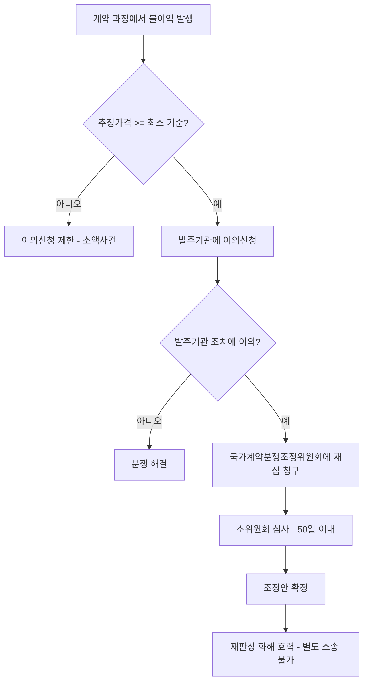

# 국가계약법 이의신청 — 최소 추정가격 기준

## 개요

국가계약에서 분쟁이 발생할 경우 계약상대자가 발주기관에 이의신청을 하거나 국가계약분쟁조정위원회에 조정을 청구할 수 있다. 이의신청이 가능한 최소 추정가격 기준은 계약 유형에 따라 다르게 규정되어 있다(「국가계약법 시행령」 제110조).

> [!note] 왜 최소 금액 기준이 있는가?
> 분쟁조정제도의 목적은 "사법절차에 의하지 않고 적은 비용으로 신속·간편하게 조정"하는 것이다(6장 원천). 최소 금액 기준은 소액 계약에서 발생하는 소소한 분쟁까지 국가계약분쟁조정위원회가 처리할 경우 행정 부담이 지나치게 커지는 것을 방지하기 위한 문턱이다. 소액사건에도 이의신청 자체는 가능하나, 금액 기준 미달 시 조정청구가 제한된다.

## 현행 규정

### 이의신청 가능 최소 추정가격

| 계약 유형 | 최소 추정가격 |
|-----------|-------------|
| **물품 계약** | **5천만 원** |
| **용역 계약** | **5천만 원** |
| 종합공사 계약 | 4억 원 |
| 전문공사 계약 | 1억 원 |
| 종합·전문공사 외의 공사 | 8천만 원 |

> [!warning] 시험 오답 유인 — 물품·용역·공사 기준의 혼동
> 물품과 용역은 동일하게 5천만 원이다. 공사는 종류별로 다르며 훨씬 높다(종합공사 4억 원, 전문공사 1억 원). "용역계약은 1억 원 이상이어야 이의신청 가능하다"는 선지는 틀림.

### 이의신청 가능 사항(대통령령)

- 입찰보증금·[[계약보증금-납부면제|계약보증금]]의 국고귀속 관련
- 기성부분·기납부분 대가 지급 관련
- 대가지급지연일수 산정 관련
- 계약금액 조정 관련
- 정산 관련
- 지체상금 및 지체일수 산입범위 관련
- 계약의 해제·해지 관련
- 선지급 후 반환 청구 관련

> [!info] 이의신청 사항의 범위 — 입찰 단계도 포함
> 이의신청은 계약이행 단계만이 아니라, 국제입찰에 따른 조달계약 범위, 부당한 특약, 입찰참가자격, 입찰공고, 낙찰자 결정 등 **입찰 전·중 단계의 사항도 포함**한다(국가계약법 제28조). 즉 이의신청은 조달 전 과정에 걸쳐 활용 가능한 구제 수단이다.

### 국가계약분쟁조정위원회 핵심 운영 사항

- **제도 목적:** 사법절차 없이 신속·간편하게 조정 (소송보다 절차 간단, 비용 절감)
- **처리속도:** 접수일로부터 **50일** 이내 심사·조정 완료 (부득이한 경우 50일 연장 가능)
- **소액사건:** 정부위원 1명 + 민간위원 2명으로 구성된 소위원회가 신속 심사
- **조정안 확정 시:** **재판상 화해**와 같은 효력 (별도 소송 불가)
- **비공개 원칙,** 당사자별 참석인원 3명 이내 제한 가능
- **이의 → 재심 경로:** 발주기관에 이의신청 → 조치에 이의 있으면 위원회에 **재심** 청구 가능

> [!info] 위원회 구성 — 소위원회 3종류
> 위원회 산하에 분야별 소위원회가 있다: ① 공사분야소위원회(건설·전기통신 공사), ② 물품·용역분야소위원회, ③ 국방·방산분야소위원회(방위사업법 국방조달). 소위원회는 해당 분야 분쟁을 전문적으로 처리한다.

## 이의신청 → 분쟁조정 흐름

## 적용 조건

- 이의신청 대상: 국가기관 및 공공기관
- 「국가계약법」에 따른 계약으로 한정

## 다운스트림 효과

이의신청 → 조정 결과가 확정되면 **재판상 화해**와 동일한 효력을 가진다. 이는 별도 소송을 제기할 수 없다는 의미로, 계약상대자 입장에서 조정 단계에서의 의사 결정이 매우 중요하다. 반대로 국가 입장에서는 조정 결과를 이행할 법적 의무가 확정 판결과 같은 강도로 부과된다.

> [!note] [[부정당업자-제재와-불공정조달행위-구별|부정당업자 제재]]에 대한 이의신청
> 부정당업자 입찰참가자격 제한 처분을 받은 자도 해당 처분에 대해 이의신청 및 행정심판·행정소송을 통해 불복할 수 있다. 다만 분쟁조정위원회의 조정 대상(입찰·계약 관련 분쟁)과 행정심판(처분의 취소·변경)은 구별되는 절차다.

## 시험 출제 포인트

- **출제 패턴 (이의신청 가능 최소 추정가격 — 용역·물품):** 물품·용역 모두 **5천만 원**
- 공사와 물품·용역의 기준이 다름 (공사는 종류별로 4억·1억·8천만 원)
- 조정위원회 처리 기한: **50일** (60일이 아님)
- 조정 효력: 재판상 화해 수준 → 별도 소송 제기 불가

## 관련 카드

- 국가계약분쟁조정위원회 — 위원회 구성, 운영, 효력 상세
- [[부정당업자-제재와-불공정조달행위-구별]] — 제재 vs 이의신청 구별
- [[계약보증금-납부면제]] — 계약보증금 국고귀속이 이의신청 대상 사항 중 하나
