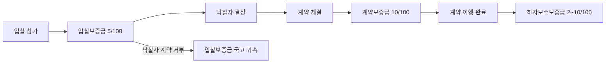

# 입찰보증금 납부 기준 — 입찰금액의 5/100 이상

## 개요

입찰보증금은 낙찰자가 정당한 이유 없이 계약을 체결하지 않을 경우 국고에 귀속시키기 위한 물적 담보로, 경쟁 입찰 참가자가 납부한다. 실무에서는 현금 납부보다 지급각서(지급확약서)로 대체하는 경우가 많다 (국가계약법 시행령 제37조).

> [!note] 왜 이 제도가 존재하는가?
> 입찰보증금에는 두 가지 기능이 있다. 첫째, **낙찰포기 억제**: 낙찰자가 계약체결을 거부하면 보증금이 국고에 귀속되므로 무분별한 투찰 후 포기를 방지한다. 둘째, **입찰 참가 신청의 실질적 증빙**: 현행 조달청 실무에서는 보증금의 담보 기능보다 입찰 의사의 진지성을 확인하는 절차적 관문으로서의 의미가 더 크다 (과목3-1장 5-1절 ①). 대법원 판례(81누366)는 입찰보증금의 국고귀속을 행정처분이 아닌 민사상 권리행사로 보아, 귀속 처분에 대한 행정소송은 불가능하다고 확인했다.

> [!note] 왜 5/100인가?
> 법령상 비율 결정 근거가 명시적으로 공개되어 있지는 않다. 다만 5%는 투찰금액의 1/20에 해당하며, 실무적으로 "입찰보증금 × 20 = 투찰 최대금액"이라는 역산 검증 공식으로 활용된다. 계약보증금(10%)의 절반으로 설정된 것은 입찰 단계의 부담을 낮춰 경쟁을 촉진하되, 일정 이상의 담보력은 유지하는 정책적 균형으로 해석된다.

## 현행 규정

### 보증금 단계별 구조 — 조달 흐름과의 위치

### 납부 기준금액

| 계약 유형 | 납부 기준 |
|-----------|-----------|
| 총액계약 | 입찰금액 × **5/100** 이상 |
| 단가계약 | 입찰단가 × 매회별 이행예정량 중 최대량 × 5/100 이상 |
| 희망수량입찰 | 입찰단가 × 희망입찰수량 × 5/100 이상 |
| 장기계속계약 | 총 제조입찰금액 × 5/100 이상 (계속비계약 포함) |

> **실무 계산**: 입찰보증금에 **20을 곱한 금액**과 투찰금액을 대조하면 투찰 가능 금액 범위 검증 가능

### 납부 면제 조건

| 발주기관 유형 | 근거 | 면제 조건 |
|---------------|------|-----------|
| 국가기관·공공기관 (중앙) | 시행령 제37조 제3항 | 전부 또는 일부 면제 가능 |
| 지방자치단체 | 지방계약법 시행령 제37조 제3항 | 면제 가능 |
| **조달청** | 내자구매업무 처리규정 제26조 제2항 | 원칙적 면제 + **지급각서로 대체** |

**조달청 입찰보증금 면제 예외** (다음 경우는 면제 불가):
- 신용정보관리규약상 채무불이행·금융질서 문란자
- 입찰공고일 이전 1년 이내에 특정 [[부정당업자-제재와-불공정조달행위-구별|부정당업자]] 사유(가목)로 입찰참가자격 제한을 받은 자
- 입찰공고일 이전 1년 이내에 5회 이상 계약이행능력심사 서류 미제출 또는 심사 포기한 자

> [!note] 왜 부정당업자는 면제 예외인가?
> 입찰보증금 면제의 전제는 계약자의 신용도가 보증금을 대체할 만하다는 신뢰다. [[부정당업자-제재와-불공정조달행위-구별|부정당업자]]로 제재받은 이력이 있다는 것은 그 신뢰가 훼손된 상태이므로, 현금·보증서로 실질적 담보를 요구하는 것이다. 부정당업자 이력을 가진 업체가 [[하자보수보증금-부정당업자-추가납부|하자보수보증금도 추가 납부]]해야 하는 것과 같은 논리다.

### 납부 형태

현금(자기앞수표 포함) 또는 다음 보증서:
- 금융기관 지급보증서
- 자본시장법상 증권
- 보험업법상 보증보험증권
- 금융기관이 발행한 보증서
- 금융기관·체신관서 발행 정기예금증서
- 신탁업자·집합투자업자 발행 수익증권

### 지급각서(지급확약서) 제출

- 입찰보증금 납부 면제 시 **지급확약서** 제출 필수
- 전자입찰 시 전자입찰서에 지급확약서가 포함되어 별도 접수 불필요

### 공동계약 시 납부

- 공동수급협정서의 출자비율·분담내용에 따라 분할 납부
- 공동이행방식: 대표자 또는 구성원 중 1인이 일괄 납부 가능

## 적용 조건

- 경쟁 입찰 참가자 모두 해당
- 낙찰자가 계약 체결 거부 시 → 입찰보증금 국고 귀속 (국가계약법 시행령 제38조)
- 보증보험증권 제출 시 피보증인: 대한민국정부(발주기관), 보증금액 ≥ 납부해야 할 보증금액

> [!example] 실제 판례 — 낙찰포기 시 귀속 분쟁 (대법원 1983. 12. 27. 선고 81누366)
> 입찰에서 착오로 금액을 잘못 기재한 업체(대금 6,078,000원을 60,780,000원으로 기재)가 낙찰을 포기했다. 발주기관은 입찰보증금을 국고에 귀속시키고 6개월의 입찰 참가 자격 제한 처분을 내렸다. 업체는 두 처분 모두에 불복해 행정소송을 제기했다. 대법원은 **입찰 참가 자격 제한 처분은 행정처분**이므로 행정소송 대상이 맞고 업체의 착오 사정을 감안해 이를 취소했다. 반면 **입찰보증금 귀속은 행정처분이 아니라 민사상 손해배상 예정**이므로 행정소송으로 다툴 수 없다고 판단했다. 즉, 업체는 귀속 처분에 관한 부분은 행정소송이 아닌 민사소송으로 별도 제기해야 했다. 입찰보증금 귀속 = 민사 사안이라는 원칙이 확립된 판례다.

> [!warning] MISMATCH 주의 — governing_articles 관련
> 이 카드의 `governing_articles`에는 시행령 제37조와 시행규칙 제53~55조가 기재되어 있다. 입찰보증금 **귀속** 근거는 시행령 **제38조**이므로, "귀속 조건"을 묻는 문제에서는 제37조(납부 기준)와 제38조(귀속)를 구분할 것.

## 시험 출제 포인트

- 핵심 수치: **5/100** (5%) — 총액계약·단가계약·희망수량·장기계속계약 모두 동일 비율
- 오답 유인: [[계약보증금-납부면제|계약보증금]](10%) 또는 [[하자보수보증금-납부비율|하자보수보증금]](2~10%)과 혼동하는 선택지
- 조달청 특칙: 원칙 면제 + 지급각서 대체 — 예외 3가지 조건 암기
- '20배 법칙': 입찰보증금 × 20 = 투찰 가능 최대금액 — 실무 계산 포인트

## 관련 카드
- [[하자보수보증금-납부비율]] — 계약 종결 시 납부하는 하자보수보증금과의 비교
- [[하자보수보증금-부정당업자-추가납부]] — 부정당업자 제재기간 연동 추가 납부 제도
- [[입찰보증증서-보증기간]] — 입찰보증금을 보증증서로 납부할 때 개시일·종료일 기준
- [[계약보증금-납부면제]] — 입찰 단계 보증금(5%)과 계약 체결 후 보증금(10%)의 연속적 관계
- [[부정당업자-제재와-불공정조달행위-구별]] — 부정당업자 면제 예외의 법적 근거
