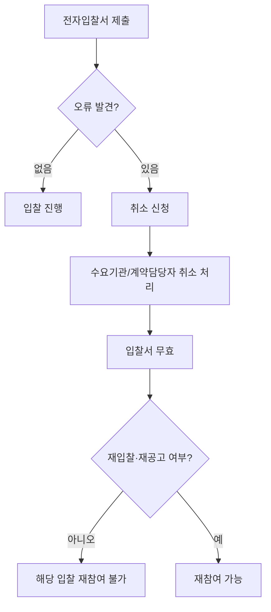

# 전자입찰서 제출 규칙 — 1컴퓨터 1건 원칙 및 취소 제한

## 개요

「전자조달의 이용 및 촉진에 관한 법률 시행령」제5조는 전자입찰서 제출의 핵심 절차 규칙을 정한다. **같은 입찰에 대해 같은 컴퓨터에서 입찰서 1건만 제출**할 수 있으며, 일단 제출한 입찰서는 원칙적으로 교환·변경·취소가 불가하다. 오류로 인한 취소를 신청하여 전자입찰서가 무효로 처리되면 해당 입찰 참여 자격을 잃는다(제5조⑤).

> [!note] 1컴퓨터 1건 원칙의 담합 방지 취지
> 같은 컴퓨터(IP)에서 여러 업체 명의로 입찰서를 제출하는 방식은 **들러리 입찰(담합)** 의 전형적인 수법이다. 한 사람이 여러 업체를 대신하여 입찰금액을 조율해 제출하면 경쟁 외형만 갖추고 실질은 단일 업체가 낙찰받는 결과가 된다.
> 「전자조달법 시행령」제5조 제2항의 "같은 컴퓨터에서 하나의 전자입찰서만" 규정은 이 패턴을 원천 차단하기 위한 기술적 통제 수단이다. 위반 시 전자조달법 제18조~제20조 처벌 대상이 되고, [[전자조달시스템-이용제한]] 제①호에 따라 3년간 나라장터 이용이 제한된다.

## 현행 규정

**① 1컴퓨터 1건 원칙**
같은 입찰에 대해 같은 컴퓨터에서 하나의 전자입찰서만 제출할 수 있다.

**② 제출 후 교환·변경·취소 불가 원칙**
전자조달시스템으로 제출한 전자입찰서는 교환·변경하거나 취소할 수 없다.

**③ 오류 취소 신청 — 예외적 허용 및 재참여 금지**

| 구분 | 내용 |
|------|------|
| 취소 신청 사유 | 입찰금액 등 중요 입력사항에 오류가 있는 경우 |
| 취소 신청 대상 | 수요기관의 장 또는 계약담당자에게 신청 |
| 취소 효과 | 해당 입찰서 무효 처리 (수요기관의 장·계약담당자 재량; 시행령 제5조④ "할 수 있다") |
| 재참여 | **불가** — 취소 신청이 받아들여져 전자입찰서가 무효로 처리되면 동일 입찰에 다시 참여할 수 없음 (제5조⑤) |
| 예외 | 재입찰 또는 재공고입찰의 경우 재참여 가능 |

**④ 부속서류 판독 불가 처리**
암호 설정·바이러스 감염 등으로 전자입찰 부속서류를 판독하기 곤란한 경우 → 부속서류가 제출되지 아니한 것으로 본다.

> [!warning] 부속서류 vs. 입찰서 구분
> 부속서류(첨부파일)에 바이러스가 감염되거나 암호가 설정된 경우, **입찰서 자체는 유효**하다. 무효 처리되는 것은 부속서류뿐이다. "입찰 전체가 무효"라는 오답이 나올수가 있다.

## 적용 조건

전자조달시스템을 통해 전자입찰서를 제출하는 모든 경쟁입찰에 적용된다. 국가계약·지방계약 모두 해당하며, 전자견적서(수의계약)에는 이 조항이 준용된다(제6조).

## 시험 출제 포인트

- **오답 유인 1**: "취소 신청 후 재공고입찰에도 참여할 수 없다" → 재입찰·재공고입찰은 예외이므로 틀림
- **오답 유인 2**: "부속서류에 바이러스가 감염된 경우 입찰 자체가 무효다" → 입찰서가 아닌 부속서류만 미제출 처리이므로 틀림
- **오답 유인 3**: "다른 컴퓨터에서 같은 입찰에 추가 입찰서를 제출할 수 있다" → 1컴퓨터 1건 원칙 위반이므로 틀림

## 관련 카드
- [[전자적공고-우선순위]] — 전자조달 입찰 공고 단계의 우선순위 규칙
- [[전자조달시스템-이용제한]] — 전자조달법 위반(1컴퓨터 1건 위반 포함) 시 3년 이용제한으로 이어지는 규정
- [[나라장터-도입성과-기능]] — 이 제출 규칙이 적용되는 나라장터의 전자입찰 기능과 도입 성과
