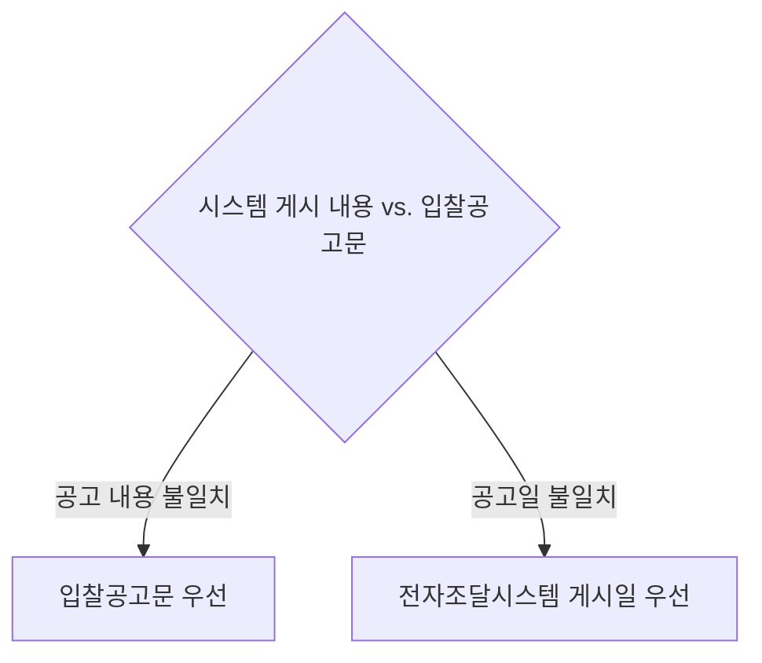

# 전자적 공고 우선순위 — 입찰공고문 vs. 전자조달시스템 게시 내용

## 개요

나라장터([[나라장터-도입성과-기능]])에 게시된 내용과 붙임 파일 형태의 입찰공고문이 서로 다를 경우 어느 쪽이 법적으로 우선하는지를 정한 규칙이다. 「전자조달의 이용 및 촉진에 관한 법률 시행령」제4조 제3항이 근거이며, **내용과 날짜에 대해 우선순위가 반대 방향**으로 작동한다는 점이 실무·시험 모두에서 중요하다.

## 현행 규정

| 구분 | 우선하는 쪽 | 비고 |
|------|------------|------|
| **공고 내용** (사양, 조건 등) | 입찰공고문 (첨부 파일) | 시스템 게시 내용보다 공고문 우선 |
| **입찰공고일** (날짜 자체) | 전자조달시스템에 게시한 날 | 공고문에 적힌 날짜보다 시스템 날짜 우선 |

> [!note] 왜 내용과 날짜의 우선순위가 반대인가?
> - **내용 → 공고문 우선**: 입찰공고문은 담당자가 상세하게 작성하여 첨부한 공식 문서다. 시스템 게시 화면은 요약·표시 과정에서 내용이 잘려나가거나 오류가 생길 수 있다. 따라서 원문에 가까운 공고문을 기준으로 삼는 것이 입찰자 보호에 유리하다.
> - **날짜 → 시스템 우선**: 입찰공고일은 입찰 참가 자격 및 기간 계산의 출발점이다. 공고문에 적힌 날짜는 담당자가 작성 시 임의로 기입하므로 실제 공개된 날(시스템 게시일)과 다를 수 있다. 입찰자가 공고를 실제로 열람할 수 있는 날이 기준이 되어야 하므로 시스템 게시일을 우선한다.

> [!warning] 실무 분쟁 유형
> 입찰 무효 다툼에서 이 조항이 직접 쟁점이 되는 전형적인 시나리오:
> - 시스템 게시 화면에는 납품 수량이 100개로 표시되었지만, 첨부 공고문에는 1,000개로 기재된 경우 → 입찰공고문(1,000개) 기준이 우선한다.
> - 공고문에는 "2026년 3월 1일 공고"라고 기재되었지만, 시스템에 실제 게시된 날은 2월 28일인 경우 → 입찰참가 기간 계산은 2월 28일을 기준으로 한다.
> 어느 쪽이 우선하는지를 잘못 적용하면 입찰 무효 또는 낙찰 취소로 이어질 수 있다.

## 적용 조건

경쟁입찰에서 전자조달시스템을 통해 공고가 이루어진 모든 계약에 적용된다. 국가계약법·지방계약법 모두 해당하며, 국제입찰의 경우에도 이 규칙이 준용된다.

## 시험 출제 포인트

우선순위가 **교차(크로스)** 구조로 되어 있어 수험생이 혼동하기 쉽다.
- 자주 나오는 오답 유인: "전자조달시스템 게시가 항상 우선한다" → 내용은 공고문이 우선하므로 틀림
- 반대 오답 유인: "입찰공고문이 항상 우선한다" → 공고일은 시스템이 우선하므로 틀림
- 출제 방식: 4지선다 "옳지 않은 것은?" 형태로 두 규칙 중 하나를 뒤집어 제시하는 패턴

## 관련 카드
- [[전자입찰서-제출규칙]] — 전자조달 입찰 절차의 다음 단계: 입찰서 제출 규칙
- [[전자조달시스템-이용제한]] — 전자조달시스템 이용이 제한되는 3가지 사유
- [[나라장터-도입성과-기능]] — 이 우선순위 규칙이 적용되는 나라장터의 도입 성과·7가지 연계 플랫폼·5대 기능
