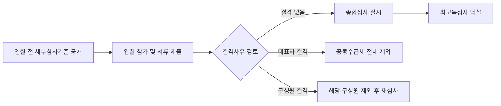

# 종합심사낙찰제 — 적용 대상 요건 및 심사 방법

## 개요

종합심사낙찰제는 대형 공사 및 건설기술용역에서 입찰가격 외에 공사수행능력, 사회적 책임 등을 종합 심사하여 최고점수 업체를 낙찰자로 결정하는 제도이다.

> [!note] 왜 도입되었나? — 최저가낙찰제의 대형 공사 폐단
> 기존 최저가낙찰제는 가격 기준만으로 낙찰자를 선정해 대형 시설공사에서 덤핑낙찰, 부실시공, 저가 하도급, 임금체불, 산업재해 증가 등의 폐단이 반복되었다. 국토교통부는 2014~2015년 시범사업을 거쳐 **2016년 300억 원 이상 공공 시설공사에 종합심사낙찰제를 본격 도입**하였고, 이후 적용 범위가 100억 원 이상으로 확대되었다. 가격뿐 아니라 공사수행능력, 사회적 책임(고용·건설안전·공정거래)을 종합 평가함으로써 덤핑 억제와 시공품질 향상을 동시에 추구한다.

> [!warning] "제도 도입 후 비가격 요소 변별력이 충분히 개선되었다" — 실무상 논란 있음
> 도입 초기부터 비가격 항목(공사수행능력, 사회적 책임)의 점수 차이가 미미하여 사실상 최저가낙찰제와 유사하게 작동한다는 비판이 지속되고 있다.

## 현행 규정

### 적용 대상 (국가계약법 시행령 제42조 제4항)

| 계약 유형 | 추정가격 기준 |
|---|---|
| 시설공사 | **100억 원 이상** |
| 국가유산수리 | 국가유산청장이 정하는 공사 |
| 건설사업관리 용역 | **50억 원 이상** |
| 건설공사기본계획 용역 또는 기본설계 용역 | **30억 원 이상** |
| 실시설계 용역 | **40억 원 이상** |

> 100억 미만 시설공사: 적격심사 적용 (종합심사낙찰제 아님)

### 심사 항목

- 계약이행실적
- 인력배치계획
- 사회적 책임 이행 노력
- 입찰가격

### 결격사유 (심사 제외)

| 결격 사유 | 비고 |
|---|---|
| 부도, 파산, 해산 | 기업회생절차 개시결정 + 정상적 금융거래 재개 확인 시 제외 가능 |
| 부정당업자 제재 | — |
| 영업정지 (건설업 등록말소·취소 포함) | — |
| 입찰무효 | — |

**공동수급체 결격 처리:**
- 일부 구성원 결격 → 해당 구성원 제외 후 잔존 구성원으로 재심사 가능
- 공동수급체 **대표자** 결격 → 공동수급체 전체 제외

### 심사 기준 적용 절차

## 적용 조건

- 낙찰자 결정 전 입찰 참가자에게 세부심사기준 **사전 공개** 의무
- 물품은 해당 없음 — 물품은 [[종합낙찰제-대상품목|종합낙찰제]] 적용
- 100억 미만 공사는 [[낙찰자선정방식-비교|적격심사제]] 적용

> [!example] 공동수급체 결격 처리 실례
> 3개사 공동수급체 입찰 중 구성원 B사에 영업정지 처분이 내려진 경우: B사를 제외하고 A사+C사 잔존 구성원의 시공비율을 재조정하여 심사를 속행할 수 있다. 단, 대표사(A사)에 결격이 발생했다면 해당 공동수급체 전체가 심사에서 제외된다.

## 시험 출제 포인트

**출제 패턴:** 낙찰자 선정 방식별 기준 비교 — 종합심사낙찰제가 적용되는 계약 유형과 금액 기준.

**핵심 숫자 암기:**

| 유형 | 기준 |
|---|---|
| 공사 | **100억 이상** |
| 건설사업관리 용역 | **50억 이상** |
| 기본계획·기본설계 용역 | **30억 이상** |
| 실시설계 용역 | **40억 이상** |

**오답 유인:**
- "50억 이상 공사" — 오답 (공사는 100억)
- "건설사업관리 용역 100억 이상" — 오답 (50억)
- 물품에도 적용된다 — 오답 (물품은 종합낙찰제)
- 대표자 결격 시 잔존 구성원으로 재심사 — 오답 (대표자 결격 = 공동수급체 전체 제외)

## 관련 카드
- [[종합낙찰제-대상품목]] — 물품 대상 종합낙찰제 (에너지효율 6종 등)
- 적격심사-scoring-tables — 100억 미만 공사에 적용되는 적격심사 배점
- [[낙찰자선정방식-비교]] — 전체 낙찰 방식 비교표 (종합심사낙찰제 위치 확인)
