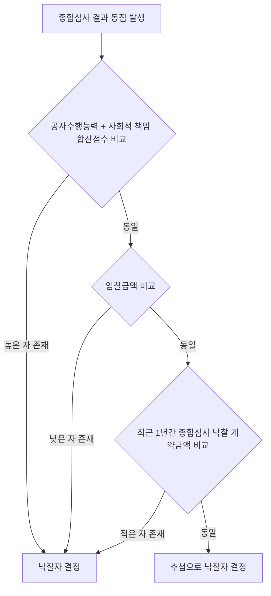

# 종합심사낙찰제 동가입찰 — 낙찰자 결정 우선순위

## 개요

종합심사낙찰제(추정가격 100억 원 이상 공사 적용)에서 입찰 결과 낙찰 적격자가 동점인 경우, 국가계약법 시행령 제47조에 따라 정해진 우선순위에 따라 낙찰자를 결정한다.

> [!note] 왜 4단계 우선순위인가?
> [[낙찰자선정방식-비교|종합심사낙찰제]]는 입찰가격·공사수행능력·사회적 책임을 종합 평가하는 구조이기 때문에, 동점이 발생하면 "가격 외의 요소"를 먼저 고려하는 것이 제도의 취지에 부합한다. 1순위(합산점수)가 이를 반영한다. 그 다음 2순위(낮은 가격)는 재정 효율성, 3순위(최근 1년 낙찰 계약금액)는 시장 쏠림 방지(특정 업체의 대형공사 독점 억제), 4순위(추첨)는 어떤 기준으로도 구분이 불가할 때의 최후 수단이다.

## 현행 규정 — 종합심사 동가입찰 시 우선순위

| 순위 | 결정 기준 |
|------|---------|
| 1순위 | 공사수행능력점수와 사회적 책임점수의 **합산점수가 높은 자** |
| 2순위 | **입찰금액이 낮은 자** |
| 3순위 | 입찰공고일 기준 최근 1년간 종합심사낙찰제로 낙찰 받은 **계약금액이 적은 자** |
| 4순위 | **추첨** |

> [!note] 3순위 기준의 의미 — "최근 1년간 낙찰 계약금액이 적은 자"
> 이 기준은 [[종합심사낙찰제-대상|종합심사낙찰제]] 대상 공사(100억 원 이상)에서 특정 대형 건설사가 연속 낙찰을 통해 공공 대형공사를 독점하는 것을 방지하는 장치다. 최근 1년간 이미 대형 계약을 많이 수주한 업체보다, 수주 실적이 적은 업체에게 우선권을 줌으로써 시장 참여 기회를 분산시킨다. 감사원도 이 기준의 적용 누락을 지적한 사례가 있다.

### 비교: 적격심사 동가입찰 시

| 순위 | 결정 기준 |
|------|---------|
| 1순위 | 계약이행능력 심사결과 **최고점수인 자** |
| 2순위 | 위 결과도 동일한 경우 **추첨** |

> [!note] 왜 적격심사 동가 기준은 단순 2단계인가?
> [[낙찰자선정방식-비교|적격심사]]는 300억 원 미만 공사에 적용되는 단순화된 제도다. 이미 예정가격 이하 최저가 순으로 심사하므로, 동점 시 추가 가격 비교는 의미가 없다. 계약이행능력 점수 비교 후 곧바로 추첨으로 가는 단순 구조는 소규모 공사에서 행정 부담을 줄이기 위한 실용적 설계다.

## 적용 조건

- [[종합심사낙찰제-대상|종합심사낙찰제]] 대상: 추정가격 **100억 원 이상** 공사
- [[낙찰자선정방식-비교|적격심사 낙찰제]] 대상: 300억 원 미만 일반공사 (종합심사낙찰제 및 일괄·대안 입찰 제외)
- [[건설공사-범위-제외공종|건산법 제외 공종]](전기·정보통신·소방·국가유산)에도 동일 기준 적용

## 낙찰자 결정 흐름 — 종합심사 동가 발생 시

## 시험 출제 포인트

- **핵심:** "종합심사낙찰제 동가입찰 시 낙찰자 결정 우선순위"
  - 1순위: 공사수행능력 + 사회적 책임 **합산점수가 높은 자**
  - 2순위: **입찰금액이 낮은 자**
  - 3순위: 최근 1년간 **종합심사낙찰제 계약금액이 적은 자**
  - 4순위: **추첨**
- 적격심사 동가입찰과 구별: 종합심사는 4단계, 적격심사는 2단계

> [!warning] 시험 함정 — "입찰가격이 낮은 자"가 1순위라고 착각
> 종합심사낙찰제는 가격뿐 아니라 비가격 요소를 종합 평가하는 제도다. 따라서 동가 시 1순위는 **가격이 아니라 공사수행능력+사회적 책임 합산점수**다. 가격(2순위)은 비가격 점수가 같을 때 비로소 비교된다.

> [!warning] 시험 함정 — "최근 1년 계약금액이 많은 자"가 우선
> 3순위는 "많은 자"가 아니라 "**적은 자**"가 우선이다. 시장 독점 방지가 목적이므로 반드시 방향을 확인할 것.

> [!example] 동가입찰 시나리오 예시
> 250억 원 도로공사에서 A사와 B사가 동점. 1단계: A사 공사수행+사회적 책임 합산 = 52.3점, B사 = 52.3점 (동일). 2단계: A사 입찰금액 = 234억 원, B사 = 234억 원 (동일). 3단계: A사의 최근 1년 종합심사낙찰 계약금액 = 450억 원, B사 = 120억 원. → B사가 낙찰자로 결정된다.

## 관련 카드
- [[낙찰자선정방식-비교]] — 종합심사·적격심사·협상 방식 비교
- [[종합심사낙찰제-대상]] — 100억 이상 공사 적용 기준
- [[건설공사-범위-제외공종]] — 종합심사낙찰제 적용 공사의 건설공사 정의 범위
- [[공사입찰-공고기간-기준]] — 100억 이상 공사의 입찰 공고기간
- [[PQ-2차심사-심사분야별-평점]] — PQ 대상 공사와 종합심사 대상 공사의 규모 비교
- [[WTO-GPA-옵셋금지-원칙]] — 국제입찰 공사 낙찰 시 GPA 원칙 적용
- [[하도급-적정성심사-기준하도급율]] — 낙찰 결정 후 하도급 적정성 심사 연계
