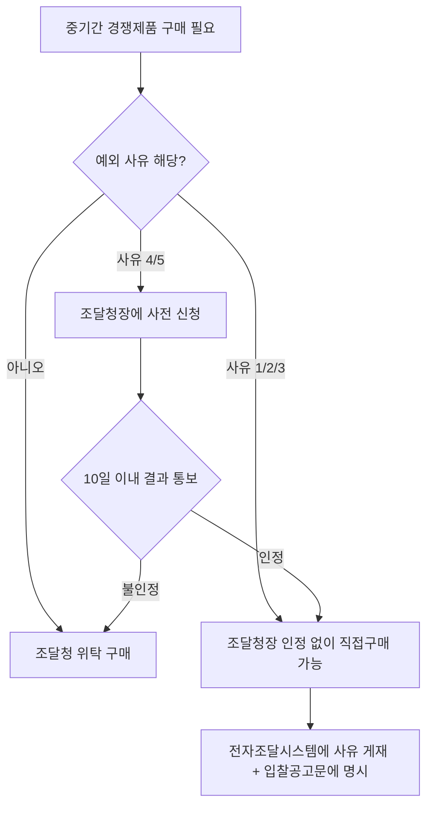

# 중기간 경쟁제품 구매위탁 의무 예외 — 공기업·준정부기관 직접구매

## 개요

「공기업·준정부기관 계약사무규칙」제7조의2는 중소기업자간 경쟁 제품을 원칙적으로 조달청 위탁을 통해 구매해야 하는 의무에 대한 예외를 정한다. 5가지 사유에 해당하면 공기업·준정부기관이 직접 구매할 수 있으며, 일부 사유는 조달청장의 사전 인정을 받아야 하고 조달청장은 **신청을 받은 날부터 10일 이내**에 결과를 통보해야 한다.

> [!note] 왜 중기간 경쟁제품은 원칙적으로 조달청 위탁인가?
> 「중소기업제품 구매촉진 및 판로지원에 관한 법률」은 중소기업자 간 경쟁제품으로 지정된 물품에 대해 공공기관이 조달청을 통해 구매하도록 함으로써, 중소기업 제품의 안정적 판로를 보장하는 동시에 공공기관이 개별 협상을 통해 특정 업체를 우대하는 것을 방지하려는 정책 목적이 있다. 예외를 인정하면서도 **조달청장 인정** 요건과 **사유 공개 의무**를 둔 것은 예외 남용을 견제하기 위한 장치다.

## 현행 규정

### 직접구매 예외 사유 (5가지)

| 번호 | 사유 | 조달청장 인정 필요 여부 |
|------|------|----------------------|
| 1 | 계약목적을 달성하기 위하여 중소기업자간 경쟁 제품을 **긴급히** 구매할 필요가 있는 경우 | 불요 |
| 2 | **디자인 공모 및 선호도 조사** 결과 등을 반영하여 미리 제품을 선정하고 구매할 필요가 있는 경우 | 불요 |
| 3 | 전산업무 소프트웨어 개발 등 **용역사업과 관련된 제품**으로서 각 기관의 고유사업을 지원하기 위해 직접 구매하는 것이 적합한 경우 | 불요 |
| 4 | **핵심 기자재**로서 구매 전문성 및 품질 확보 등을 위해 직접 구매할 필요가 있다고 **조달청장이 인정**하는 경우 | **필요** |
| 5 | 그 밖에 제품의 특수성·전문성·안전성 및 구매 시기 등을 고려할 때 직접 구매가 적합하다고 **조달청장이 인정**하는 경우 | **필요** |

> [!warning] 시험 핵심 구분 — 조달청장 인정 필요 여부
> 사유 1·2·3은 조달청장 인정 없이 직접구매 가능. 사유 4·5는 반드시 조달청장의 사전 인정을 받아야 한다. "긴급 구매는 조달청장 인정이 필요하다"는 선지는 틀림.

### 절차 규칙

**직접구매 시 공개 의무:**
기관장 또는 계약담당자는 해당 제품과 해당하지 않는 제품을 전자조달시스템(또는 자체 시스템)에 각각 게재해야 한다.

**사유 명시 의무:**
직접 구매하는 경우 그 사유를 발주계획서 및 입찰공고문에 구체적으로 밝혀야 한다.

**조달청장 인정 신청 및 통보 기한:**

| 항목 | 내용 |
|------|------|
| 신청 서류 | 품명·규격·수량·추정가격·수요시기·직접구매 필요성 기재 신청서 |
| 제출 시기 | 미리(사전) 조달청장에게 제출 |
| 통보 기한 | 신청을 받은 날부터 **10일 이내** |

> [!note] 10일 기한의 정책적 의미
> 조달청장의 인정 통보 기한을 10일로 단기간으로 설정한 것은, 인정 지연으로 인해 공기업·준정부기관의 적시 조달이 차질을 빚지 않도록 하기 위해서다. 다만 인정을 받지 못하면 조달청 위탁 경로로 돌아가야 하므로, 기관은 수요 발생 전 충분히 미리 신청해야 한다.

## 직접구매 결정 흐름

## 적용 조건

「공공기관의 운영에 관한 법률」에 따라 지정된 공기업 및 준정부기관에 한정된다. 국가기관·지방자치단체에는 중소기업제품 구매촉진법의 별도 규정이 적용된다.

> [!info] 공개 의무와 감사 위험
> 직접구매 시 사유를 발주계획서·입찰공고문에 명시해야 하므로, 사유가 불분명한 상태에서 직접구매를 감행할 경우 감사원·조달청 점검에서 지적 위험이 있다. 특히 사유 4·5에서 조달청장 인정 없이 직접구매한 경우 법령 위반으로 처리될 수 있다.

## 시험 출제 포인트

- **오답 유인**: "조달청장은 30일 이내에 통보해야 한다" → 정답은 **10일** 이내
- **오답 유인**: "긴급 구매는 조달청장 인정 없이도 직접구매 가능" → 긴급 구매(사유 1)는 조달청장 인정 불요, 맞음; 반면 사유 4·5는 조달청장 인정 필요
- 사유 4·5(조달청장 인정 필요)와 사유 1·2·3(인정 불요)의 구분이 출제 포인트

## 관련 카드
- [[공기업-국제입찰-예외]] — 공기업·준정부기관 계약사무규칙의 또 다른 예외 규정
- [[공공조달-기본원칙-구성요소]] — 중소기업 우선구매 원칙과 조달청 위탁 의무의 관계
