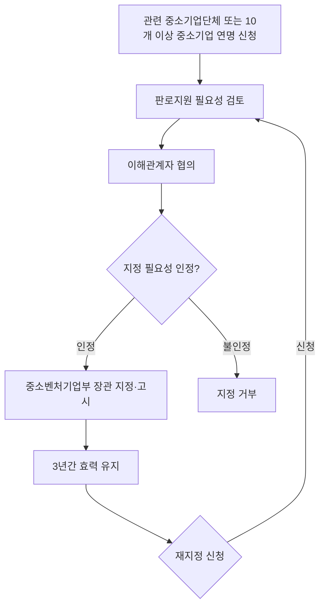

# 중소기업자간 경쟁제도 — 지정 요건·절차·유효기간

## 개요

공공기관이 '중소기업자간 경쟁제품'을 구매할 때 중소기업자만을 대상으로 하는 **제한경쟁** 또는 **지명경쟁** 입찰 방식으로 조달계약을 체결하도록 의무화하는 제도이다. 대기업·수입 유통업체의 국내시장 진입으로 중소기업의 판로가 축소되는 것을 방지하기 위해 도입되었다.

> [!note] 왜 이 제도가 필요한가?
> 특정 물품 시장에서 대기업이나 수입제품이 공공조달 시장에 진입하면, 중소기업은 가격·물량 경쟁에서 구조적으로 불리하다. 이 제도는 해당 제품에 대한 공공조달 입찰을 **중소기업 전용 경쟁**으로 제한함으로써 공공시장에서 중소기업의 최소 수요를 보장한다. 목적은 단순 보호가 아니라, 중소기업이 공공시장에서 일정 규모의 수요를 확보한 상태에서 기술혁신과 원가경쟁력을 키우도록 유도하는 것이다.
> 「판로지원법」이 특별법 지위를 가져 국가계약법에 우선 적용되기 때문에, 지정 제품에 대한 일반경쟁 입찰은 법령 위반이 된다.

## 현행 규정

### 지정 요건 (기본요건)

| 기준 | 내용 |
|------|------|
| 업체 수 | 국내 제조 중소기업 **10개 이상** |
| 공공수요 | 연간 공공수요 **10억 원 이상** |

위 기본요건을 충족하는 제품에 한해, 대기업·수입품 경쟁으로 중소기업의 판로가 실질적으로 축소되고 있다는 사실을 파악할 수 있는 사례·통계가 있어 산업정책상 지정 필요성이 인정될 경우 지정한다.

### 지정 절차

### 유효기간

- 지정 후 **3년간** 효력 유지 (5년이 아님)

### 입찰 방식

지정된 제품은 공공기관이 반드시 중소기업만 대상으로 하는 제한경쟁입찰을 통해 조달계약을 체결해야 한다.

## 직접생산 확인제도 — 제도의 실질적 집행 장치

> [!info] 직접생산 확인제도란?
> 중소기업자간 경쟁입찰에 참여하거나 1,000만 원 이상 소액 수의계약을 체결하려는 기업은 **직접생산 확인 증명서**를 사전에 발급받아야 한다. 이는 낙찰 후 대기업 제품이나 수입품을 납품하거나, 하도급 생산 제품을 납품하는 행위를 방지하기 위한 핵심 집행 장치이다.

> [!example] 직접생산 확인 위반 적발 사례
> 감사원이 공공기관 감사를 실시하던 중, D사가 직접생산 확인증명서를 발급받고도 지방자치단체에 하청 생산한 제품을 납품한 사실이 적발되었다. 해당 기업은 모든 직접생산 확인증명서가 취소되고 6개월간 재신청이 제한되었다. 이외에도 생산 시설을 매각한 후 30일 이내에 증명서를 반납하지 않거나, 타 법인의 명의를 빌려 수의계약 후 하청 납품한 사례들도 적발되어 동일한 제재를 받았다.

## 적용 조건

- 공공기관이 지정제품을 구매하는 경우 적용
- 「판로지원법」이 국가계약법에 우선하여 적용

## 다운스트림 영향 — 지정 제품 구매 시 무엇이 달라지는가

| 단계 | 변화 내용 |
|------|-----------|
| 발주 계획 | 해당 제품 조달 시 일반경쟁 입찰 불가; 중소기업 제한경쟁으로 공고 필수 |
| 입찰 참가 | 입찰 참여 기업은 직접생산 확인증명서 사전 발급 필수 |
| 낙찰·계약 | 대기업·수입유통업체 낙찰 불가; 위반 시 계약 취소 및 입찰 참가 제한 |
| 사후 관리 | 발주처는 납품 자재의 직접생산 여부 확인 의무 |

> [!warning] 시험 오답 함정
> - 지정 요건 업체 수: **10개** 이상 (5개·15개·20개로 출제 시 틀림)
> - 공공수요 기준: 연간 **10억 원** 이상 (5억·20억으로 출제 시 틀림)
> - 유효기간: **3년** (5년으로 출제 시 틀림 — 가장 자주 나오는 오답)
> - 신청 주체: 중소기업단체 **또는** 10개 이상 중소기업 연명 (둘 다 가능)

## 시험 출제 포인트

- **Q16(지정 요건 — 업체 수 및 공공수요 금액 기준):**
  - 업체 수 기준: **10개 이상** 국내 제조 중소기업
  - 공공수요 기준: 연간 **10억 원 이상**
- 유효기간 오답 함정: **3년** (5년이 자주 오답 보기로 출제됨)
- 신청 요건: 중소기업단체 또는 **10개 이상** 중소기업 연명 신청

## 관련 카드

- [[공공구매제도-우선구매비율]] — 중소기업 포함 각종 의무구매비율 전체
- [[공사용자재직접구매제도]] — 공사용 자재 직접구매와의 관계; 직접생산 확인 위반 제재 공유
- [[사회적가치-지원조달-대상범위]] — 중소기업지원 조달과 사회적 가치 지원 조달의 구별
