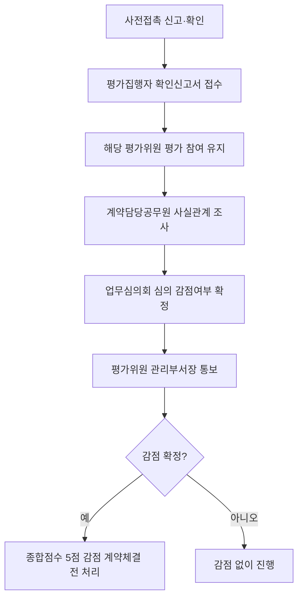

# 평가위원 사전접촉 금지 — 감점 5점 규정

## 개요

협상에 의한 계약에서 입찰자(공동수급체 구성원 및 하도급자 포함)가 평가위원에게 의도적으로 접촉한 사실이 확인되면 해당 제안서 종합점수에서 **5점을 감점**한다.

> [!note] 왜 사전접촉을 제도로 금지하는가?
> 협상에 의한 계약은 제안서 기술 평가(80점)가 낙찰 결과를 좌우한다. 평가위원의 신원이 사전에 알려지고 업체가 접촉할 수 있다면 평가의 독립성이 훼손된다. **SNS·문자·이메일을 포함한 "의도적 인식"까지 접촉으로 정의**함으로써, 직접 대면이 아닌 온라인 로비까지 차단하는 것이 이 제도의 핵심이다.

## 현행 규정

### 감점 요건

- **기간:** 사전규격공개일부터 제안서 평가일까지
- **대상:** 입찰자 소속 임직원 (공동수급체 구성원·제안서 명시 하도급자 포함)
- **접촉 유형:** SNS, 문자, E-메일 등 활용하여 의도적으로 평가위원에게 입찰자를 인식시키는 행위

### 감점 적용

| 항목 | 내용 |
|---|---|
| 감점 점수 | **5점** (종합점수 100점 만점 기준) |
| 감점 범위 | 해당 입찰에 한정 |
| 확정 절차 | 소속 업무심의회 심의를 통해 감점여부 확정 |
| 처리 시한 | 계약체결 전에 완료해야 함 |

### 감점 처리 흐름

### 절차

1. 평가집행자: 확인(신고)서 접수
2. 사전접촉 사실 확인(신고)한 평가위원도 평가 참여 유지
3. 계약담당공무원: 지체 없이 사실관계 조사 → 업무심의회 심의 → 감점여부 확정
4. 결과를 평가위원 관리부서의 장에게 통보
5. 감점 사항은 입찰공고에 명확히 기재 의무

### 허위 신고 처리

입찰자가 허위 신고로 다른 입찰자의 참가를 방해한 경우 → 국가계약법 시행령 등 관련 법령에 따라 처리

> [!warning] 시험 함정 — 감점 점수 혼동
> 감점은 **5점**이다. 10점·3점·1점으로 혼동하는 오답이 자주 출제된다. 또한 감점은 **해당 입찰에만** 적용되며, 다른 입찰의 제안서 점수에는 영향을 주지 않는다.

> [!info] "의도적 인식"의 범위
> 단순 인사·우연한 만남은 접촉으로 보기 어렵다. 조달청 세부기준은 "의도적으로 평가위원에게 입찰자를 인식시키는 행위"를 접촉으로 정의하므로, 자사 홍보 자료를 이메일로 발송하거나 링크드인 메시지로 회사 소개를 보내는 행위가 해당될 수 있다.

## 시험 출제 포인트

직접 출제 신호는 없으나 Q13·Q14 관련 배경 지식으로 활용.

**핵심:**
- 감점: **5점** (10점·3점 아님)
- 적용 범위: 해당 입찰에 한정 (다른 입찰에는 영향 없음)
- 사전접촉 기간: 규격공개일부터 평가일까지

## 관련 카드
- [[평가위원회-구성-및-회피]] — 회피 요건 (재직 3년)
