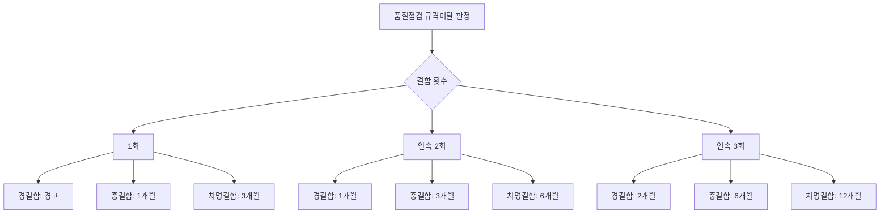

# 품질점검 규격미달 — 결함 정도별·횟수별 조치 기간

## 개요

조달청은 MAS 물품·조달우수제품의 생산현장 및 납품현장 실사 점검을 통해 규격미달 여부를 확인한다. 규격미달 판정 시 횟수와 결함 정도에 따라 쇼핑몰 거래정지 또는 배정중지 조치를 취한다.

> [!note] 왜 이 제도가 존재하는가?
> MAS(다수공급자계약)는 조달청이 사전에 계약을 체결해 놓고 수요기관이 나라장터 쇼핑몰에서 자유롭게 구매하는 구조다. 입찰 없이 수의계약처럼 납품이 이뤄지기 때문에, 업체가 계약 후 실제 납품 시 계약규격보다 낮은 품질의 물품을 납품해도 사전에 걸러지지 않을 위험이 있다. 품질점검제도는 납품 현장을 직접 방문해 표본을 채취하고 공인시험기관에서 시험하는 방식으로 이 위험을 사후에 통제한다. 거래정지 조치는 위반업체에 대한 제재이자 다른 업체에 대한 억지력이다.

## 현행 규정 — 규격미달 횟수별 조치내용

| 규격미달 횟수 | 결함의 정도 | 조치 기간 |
|------------|---------|---------|
| **1회** | 경결함 | 경고 |
| **1회** | 중결함 | **1개월** 쇼핑몰 거래정지 또는 배정중지 |
| **1회** | 치명결함 | **3개월** 쇼핑몰 거래정지 또는 배정중지 |
| **연속 2회** | 경결함 | **1개월** 쇼핑몰 거래정지 또는 배정중지 |
| **연속 2회** | **중결함** | **3개월** 쇼핑몰 거래정지 또는 배정중지 |
| **연속 2회** | 치명결함 | **6개월** 쇼핑몰 거래정지 또는 배정중지 |
| **연속 3회** | 경결함 | **2개월** 쇼핑몰 거래정지 또는 배정중지 |
| **연속 3회** | 중결함 | **6개월** 쇼핑몰 거래정지 또는 배정중지 |
| **연속 3회** | 치명결함 | **12개월** 쇼핑몰 거래정지 또는 배정중지 |

> [!note] 조치 기간 패턴 이해
> 숫자를 암기하기보다 패턴을 이해하면 유리하다:
> - **1회 치명 = 연속 2회 중결함 = 3개월** (중대 위반의 등가성)
> - **연속 2회 치명 = 연속 3회 중결함 = 6개월** (중대 반복 위반의 등가성)
> - **연속 3회 치명 = 12개월** (최장 제재)
> - 경결함은 한 단계씩 낮은 제재 (1회 경결함 → 경고만)

### 조치 기간 시각화

## 품질점검 절차

> [!abstract] 점검 절차 요약
> 점검물품 확인(계약물품과 동일 여부) → 시료 채취 → 공인시험기관 시험 의뢰 → 적합 여부(시험 결과와 계약규격 비교) 판정·통보

## 적용 조건

- 품질점검 대상: MAS 물품, 조달우수제품
- 점검 절차: 점검물품 확인 → 시료 채취 → 공인시험기관 시험 의뢰 → 적합 여부 판정·통보
- 관능검사 5감각: 시각, 후각, 청각, 미각, 촉각 (**평형감각 제외**)

> [!note] 관능검사(sensory evaluation)란
> 관능검사는 물품을 인간의 5가지 감각(시각·후각·청각·미각·촉각)을 활용해 품질을 과학적으로 측정·분석하는 방법이다. 공인시험기관의 이화학시험 전에 현장에서 1차로 실시하는 검사다.
>
> **평형감각(균형감각)은 관능검사에 포함되지 않는다.** — 이 점이 시험 출제 포인트.

> [!warning] 관능검사 포함 항목 시험 함정
> "다음 중 관능검사 방법으로 옳지 않은 것은?" 유형 문제에서 **평형감각**이 오답 선택지로 등장한다. 5감각(시·후·청·미·촉) 외의 모든 항목은 관능검사에 포함되지 않는다.

> [!example] 거래정지 조치의 법적 성격
> 대법원 2018년 판결(2015두52395)에 따르면, 조달청이 계약이행내역 점검 결과 일부 제품이 계약규격과 다르다는 이유로 내린 나라장터 종합쇼핑몰 거래정지 6개월 처분은 **행정처분에 해당**하므로 항고소송의 대상이 된다. 즉 거래정지를 받은 업체는 행정심판이나 행정소송으로 다툴 수 있다.

> [!note] 품질점검과 단계별 품질관리제도의 위치
> [[공공조달-단계별-품질관리제도|단계별 품질관리제도]] 구조에서 품질점검은 **계약이행(제조) 단계**에 위치한다. 계약 체결 이후 실제 생산·납품 과정에서 규격 준수 여부를 확인하는 단계로, 계약 체결 전의 계약규격 사전검토(계약 단계)와는 다른 시점이다.

## 시험 출제 포인트

- **Q30 핵심:** "품질점검 연속 규격미달 시 결함 정도별 조치 기간 — 중결함·2회"
  - 연속 2회 규격미달 + 중결함 → **3개월** 쇼핑몰 거래정지
- 혼동 포인트:
  - 1회 중결함: **1개월**
  - 연속 2회 중결함: **3개월** (= 1회 치명결함과 동일)
  - 연속 2회 치명결함: **6개월**
  - 연속 3회 중결함: **6개월** (= 연속 2회 치명결함과 동일)

## 관련 카드
- [[공공조달-단계별-품질관리제도]] — 품질점검이 속하는 계약이행 단계
- [[MAS-suspension-mechanics]] — MAS 거래정지 전반

:::tip[실무에서 이 규정 적용하기]
고객 계약별로 이 기준을 자동 적용하고 싶다면 → [공공조달관리사 워크플로우 플랫폼](https://kr-public-procurement-demo.up.railway.app)

조달관리사 실무 워크플로우 플랫폼 — 규제 변경 알림, 클라이언트별 적격심사 점수 자동 계산, 계약 이행 이력 관리.
:::
