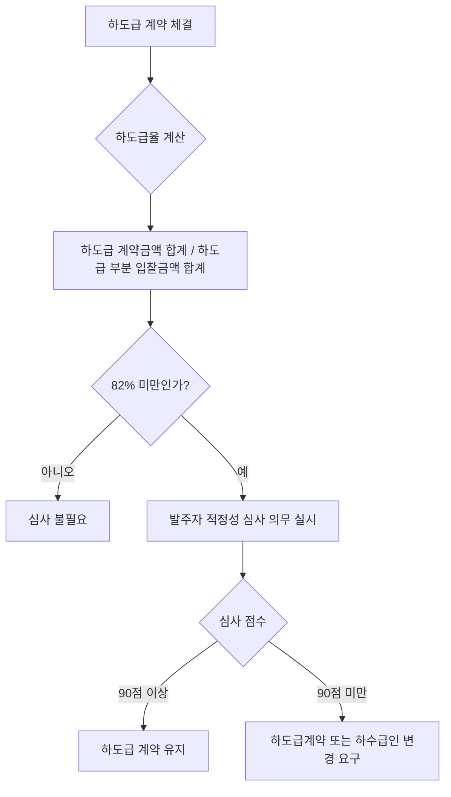

# 하도급 적정성 심사 — 기준 하도급율 (82% 미만)

## 개요

공사 적격심사 낙찰제에서 수행능력 평가 항목 중 하나인 **하도급 관리계획의 적정성** 심사는 하도급업체에게 지급될 계약금액 합계가 적정한지 여부를 평가한다. 덤핑 하도급 방지가 목적이다.

> [!note] 왜 이 규정이 존재하는가?
> 원도급 업체가 저가로 낙찰받은 후 하도급업체에 그 손실을 전가하는 **덤핑 하도급** 문제가 건설업계의 고질적 병폐였다. 하수급인이 적정 대가를 받지 못하면 부실시공·산재사고로 이어진다. 82% 기준은 하도급 계약금액이 원도급 입찰금액의 일정 비율 이상이어야 한다는 하한선으로, 지나치게 낮은 하도급 계약이 체결된 경우 발주자가 이를 심사해 변경하도록 강제하는 장치다.
>
> 건설산업기본법 제31조 제2항은 **하도급율 82% 미만** 시 발주자가 의무적으로 적정성 심사를 실시하도록 규정하고 있다.

## 현행 규정

| 항목 | 기준 |
|------|------|
| 하도급 관리계획의 적정성 | 하도급업체와 계약을 체결할 금액의 합계가 하도급할 부분의 입찰금액 합계에 **100분의 82 이상**을 준수하는지 여부 평가 |
| 배점 (국가계약법, 50~100억) | 10점 (100억 이상 시에도 10점) |

- 공사 적격심사 낙찰제 적용 대상: **300억 원 미만** 일반공사

> [!note] 왜 82%인가?
> 82%는 예정가격 대비 낙찰가율(통상 90% 전후)에서 최소한의 하도급 마진을 보장하기 위한 절충 수준이다. 하도급율이 82% 미만이면 하수급인이 적정 이윤을 확보하기 어렵다는 업계·정책 판단이 반영됐다. 별도로, 하도급 계약금액이 발주자 **예정가격의 64% 미만**인 경우에도 적정성 심사 대상이 된다.

> [!warning] 82% 기준 적용 방향 혼동 주의
> 시험에서 "하도급율이 **82% 이상**이면 심사 대상"이라는 오답 선택지가 등장할 수 있다. 정확한 방향은:
> - 82% **이상** → 심사 불필요 (적정)
> - 82% **미만** → 발주자가 적정성 심사 **의무 실시**

### 적정성 심사 트리거 조건

### 공사 적격심사 심사분야 배점 (50~100억 미만 기준)

| 심사분야 | 배점 |
|---------|------|
| 수행능력: 시공경험 | 15 |
| 수행능력: 경영상태 | 15 |
| 수행능력: 신인도 | ±0.9 |
| 입찰가격 | 50 |
| 자재·인력 조달가격 적정성 | 10 |
| **하도급 관리계획 적정성** | **10** |
| 합계 | 100 |

> [!note] 하도급 적정성 항목이 50억 미만에는 왜 없는가?
> 10억~50억 미만 공사는 하도급 관리계획 항목이 없다. 소규모 공사는 하도급 구조 자체가 단순하거나 하도급이 발생하지 않는 경우가 많아 별도 심사의 실익이 낮기 때문이다. 지방계약법 기준으로는 구간 설정이 일부 다르게 적용될 수 있다.

## 적용 조건

- 50억 이상 ~ 100억 미만 공사에서 하도급 관리계획 항목(10점) 포함
- 10억 이상 ~ 50억 미만: 하도급 관리계획 항목 **없음**
- 낙찰 통과점수: 100억 이상 **92점 이상**, 그 외 **95점 이상**
- 지방계약법 기준: 300억 이상 100억 미만 구간에서도 하도급 계획 평가 포함
- 하도급 계약 체결 후 **30일 이내** 발주자에 통보 의무 (건산법 제32조)

> [!example] 하도급율 심사 회피 적발 사례
> 원도급 업체가 하도급율이 77.5%에 불과함에도 발주자에 하도급 신규계약 통지를 하지 않은 사례가 있었다. 82% 미만이면 적정성 심사가 발동되므로, 통지 자체를 누락하는 방식으로 심사를 회피한 것이다. 건산법은 이러한 통지 미이행에 대해 500만 원 이하 과태료를 부과한다.

> [!note] PQ와 하도급 심사의 연결
> PQ-2차심사-심사분야별-평점|PQ 심사는 입찰 **전** 시공능력을 검증하는 사전 관문이고, 하도급 적정성 심사는 낙찰·계약 **후** 하도급 가격의 적절성을 검증하는 사후 관문이다. 두 제도 모두 부실시공을 막기 위한 층위가 다른 안전장치다.

## 시험 출제 포인트

- **Q28 핵심:** "하도급 적정성 심사 기준 하도급율 — 82% 미만"
  - 하도급 계약금액 합계 ÷ 하도급할 부분의 입찰금액 합계 ≥ **82%** (= 100분의 82)
  - 82% **미만**이면 하도급 적정성 심사 발동 (심사 후 90점 미만 시 변경 요구)
- 물품·용역 적격심사에는 하도급 관리계획 평가 항목 없음 (공사 전용 항목)

## 관련 카드
- [[건설공사-범위-제외공종]] — 하도급 제한이 적용되는 공사 범위
- [[PQ-2차심사-심사분야별-평점]] — 하도급 심사 대상 공사의 입찰참가자격 사전심사
- [[공사입찰-공고기간-기준]] — 하도급 심사 대상 공사의 입찰 공고 절차
- [[종합심사낙찰제-동가입찰-낙찰자결정]] — 100억 이상 공사에서 낙찰 후 하도급 관리 연계
- [[WTO-GPA-옵셋금지-원칙]] — 하도급 계약 시 GPA 옵셋 금지 원칙과의 관계
