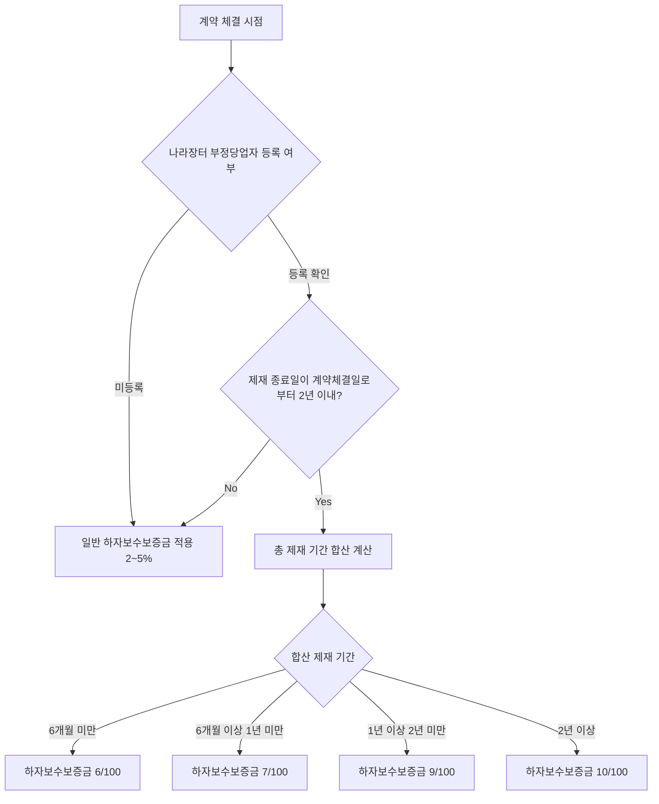

# 하자보수보증금 추가 납부 — 부정당업자 제재기간 연동

## 개요

[[부정당업자-제재와-불공정조달행위-구별|입찰참가자격이 제한된 부정당업자]]가 제재기간 종료 후 계약을 체결하는 경우, 이행 품질에 대한 추가 담보로서 **제재 기간의 합산 총 기간에 비례하여** 하자보수보증금을 추가 납부해야 한다. 동일 기준으로 [[계약보증금-납부면제|계약보증금]]도 상향 적용된다.

> [!note] 왜 이 제도가 존재하는가?
> 부정당업자 제재는 입찰 참가 자격을 일시적으로 박탈하는 제도이지만, 제재 기간이 끝나면 다시 계약을 체결할 수 있다. 문제는 과거에 하자·불량 납품 등으로 제재를 받은 업체가 재진입했을 때 동일한 부실을 반복할 위험이 높다는 점이다. 추가 보증금 적립은 제재 이력이 있는 업체에 대해 발주기관이 더 두꺼운 안전망을 확보하는 동시에, 업체 입장에서는 높은 보증금 부담이 재진입 비용으로 작용해 자정 효과를 유도한다.

## 현행 규정

### 적용 트리거

**나라장터에 부정당업자로 등록·확인된 업체** 중 **제재기간 종료일이 계약체결일로부터 최근 2년 이내**인 경우에 적용된다. 모든 중앙관서·지방자치단체·공공기관 발주 계약에 적용.

### 하자보수보증금 추가 납부 비율 (총 제재 기간 합산)

| 총 제재 기간 합산 | 하자보수보증금 추가 납부 비율 |
|-------------------|-------------------------------|
| 6개월 미만 | **6/100** |
| 6개월 이상 ~ 1년 미만 | **7/100** |
| 1년 이상 ~ 2년 미만 | **9/100** |
| 2년 이상 | **10/100** |

> [!note] 왜 총 제재 기간 합산인가?
> 단일 제재 1회를 기준으로 하면 여러 건의 소규모 위반을 분산시켜 낮은 적립률을 유지하는 편법이 가능하다. 계약체결일 이전 2년 내에 종료된 제재를 모두 합산하는 방식은 누적 위반을 통산하여 제재 이력의 심각성을 반영한다.

### 계약보증금 상향 적용 (동일 조건)

부정당업자에 대해서는 하자보수보증금뿐만 아니라 계약보증금도 동일 트리거(제재 종료일이 계약체결일로부터 2년 이내)에 따라 상향 적립된다:

| 총 제재 기간 합산 | 계약보증금 비율 |
|-------------------|-----------------|
| 6개월 미만 | **15/100** |
| 6개월 이상 ~ 1년 미만 | **20/100** |
| 1년 이상 ~ 2년 미만 | **25/100** |
| 2년 이상 | **30/100** |

> [!warning] 시험 함정 — 하자보수보증금과 계약보증금 비율 혼동
> 추가납부 맥락에서 두 보증금의 비율이 다르다. 하자보수보증금(6/7/9/10%)과 계약보증금(15/20/25/30%)은 동일 제재기간 구간에서 적용 비율이 전혀 다르다. "2년 이상이면 둘 다 10%"라는 선택지는 오답이다.

### 부정당업자 제재기간 → 하자보수보증금 추가납부 흐름

### 부정당업자 제재기간과의 연계 구조 (과목1-6장 참조)

제재를 촉발하는 하자비율·보수비율 기준:

| 하자비율 (공사) | 제재기간 |
|-----------------|----------|
| 500/100 이상 | 2년 |
| 300/100 이상 ~ 500/100 미만 | 1년 |
| 200/100 이상 ~ 300/100 미만 | 8개월 |
| 100/100 이상 ~ 200/100 미만 | 3개월 |

| 보수비율 (물품) | 제재기간 |
|-----------------|----------|
| 25/100 이상 | 2년 |
| 15/100 이상 ~ 25/100 미만 | 1년 |
| 10/100 이상 ~ 15/100 미만 | 8개월 |
| 6/100 이상 ~ 10/100 미만 | 3개월 |

> 하자비율 = 하자담보책임기간 중 하자검사결과 **하자보수보증금 대비** 하자발생 누계금액비율
> 보수비율 = 물품보증기간 중 **계약금액 대비** 보수비용발생 누계금액비율

### 조달물자 하자처리 공개 기준 (과목3-1장 제15조)

| 사유 | 공개기간 |
|------|----------|
| 하자로 판명되었으나 조치하지 않은 내역 | 조치 불이행 확정일로부터 **12개월** |
| 하자가 **3회 이상** 신고된 업체 | **6개월** 공개 가능 (최근 1년 이내 기준) |

## 적용 조건

- 제재기간 산정: 하자신고 접수일 기준, 최근 1년 이내 동일 수요기관·동일 하자내용으로 조치 완료된 경우 1회로 산정
- 3회 이상 하자신고 공개 여부는 조달품질원 품질관리업무심의회 심의를 거쳐 결정

> [!example] 가상 시나리오 — 제재 이력 확인 미흡으로 보증금 과소 징수
> *(이 시나리오는 특정 실제 사건을 인용한 것이 아니라, 제재 이력 미확인의 위험을 설명하기 위해 구성한 교육용 가상 사례입니다.)*
>
> 조달청 물품 계약 담당자가 계약 체결 시 나라장터의 부정당업자 등록 여부를 확인하지 않아, 제재 종료일로부터 18개월이 지나지 않은 업체에 대해 일반 하자보수보증금(3%)만 징수했다. 이 경우 적정 징수 기준은 9/100이었으며, 담당자는 내부 감사에서 과소 징수 지적을 받았다. 계약 체결 전 나라장터 부정당업자 등록 조회는 필수 확인 절차다.

## 시험 출제 포인트

- 출제 패턴: "부정당업자 제재기간별 하자보수보증금 추가 납부 비율로 옳은 것은?" — 4단계 구간별 비율(6/7/9/10%) 암기
- 연계 출제: 하자비율·보수비율 정의(공사=하자보수보증금 대비, 물품=계약금액 대비)
- 계약보증금 상향(15/20/25/30%)과 하자보수보증금 추가(6/7/9/10%)를 혼동하지 말 것
- 조달품질신문고 공개 기간(12개월, 6개월) 수치도 함께 출제될 수 있음
- 적용 트리거: "제재 종료일이 계약체결일 기준 **2년 이내**" — 이 기간 조건을 빠뜨리면 오답

## 관련 카드
- [[하자보수보증금-납부비율]] — 기본 납부 비율 (공종별 2~5%)
- [[입찰보증금-납부기준]] — 입찰 단계 보증금(5%)과 하자보수보증금 비교
- [[부정당업자-제재와-불공정조달행위-구별]] — 부정당업자 제재 제도의 법적 근거 및 제재기간 기준
- [[계약보증금-납부면제]] — 부정당업자 계약보증금 상향(15~30%) 규정과의 연계
