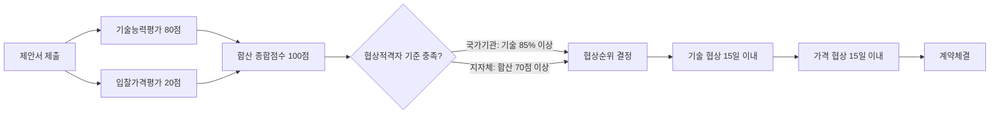

# 협상에 의한 계약 — 기술능력·가격 배점 기준

## 개요

협상에 의한 계약은 제안서 평가를 통해 [[협상에의한계약-협상적격자-선정|우선협상대상자]]를 선정한다. 평가는 기술능력평가와 입찰가격평가로 구성되며, 배점 비율은 국가기관과 지자체 모두 동일하게 **기술 80점 : 가격 20점**이다. 단, 기술능력평가 내부의 정성·정량 구분은 기관 유형에 따라 다르다.

> [!note] 왜 기술 80% : 가격 20%인가?
> 협상에 의한 계약은 "단순 최저가 낙찰이 아닌, 기술력과 창의성이 핵심인 사업"에 적용된다. 연구개발·컨설팅·정보시스템 같은 용역에서 가격을 주 선정 기준으로 삼으면 저가 수주 → 품질 저하 → 재발주·사업실패의 악순환이 발생한다. 이 때문에 기술 비중을 80%로 높여 **가격이 아닌 역량으로 경쟁**하도록 설계되어 있다. 배점은 사업 특성에 따라 조정이 가능하며(배점은 조정이 가능함), 가격 의존도를 높여야 할 경우에도 기술과 가격의 비율 조정은 발주기관이 입찰공고에 명시해야 한다.

## 현행 규정

### 기본 배점 구조 (국가기관·지자체 공통)

| 평가 분야 | 배점 |
|---|---|
| 기술능력평가 | 80점 |
| 입찰가격평가 | 20점 |
| **합계** | **100점** |

### 기술능력평가 항목 (주요)

| 평가항목 |
|---|
| 기술·지식능력 |
| 인력·조직관리기술 |
| 사업수행계획 |
| 지원기술·사후관리 |
| 수행실적 |
| 재무구조·경영상태 |
| 상호협력 |
| 외주근로자근로조건 |
| 원가절감의 적정성 |

### 국가기관 vs. 지자체 — 세부 구분 차이

| 구분 | 기술능력평가 내부 구성 |
|---|---|
| **국가기관** | 항목별 배점한도 **30점** 초과 불가 |
| **지자체** | 정량적 기술능력평가 **20점** + 정성적 기술능력평가 **60점** |

> 과목2-3장 Q6 해설 기준: 지자체가 정량(20점)/정성(60점) 구분 적용. 세부 내용은 [[기술능력평가-정성정량구별]] 참조.

> [!warning] 국가기관 항목별 배점한도는 30점 (20점 아님)
> 시험 보기 ①에 자주 등장하는 함정: "국가기관의 기술능력평가 항목별 배점한도는 20점을 초과하지 못한다" → **오답**. 정답은 **30점**이다. 20점은 지자체 정량적 평가의 합계 배점이므로 혼동하지 말 것.

### 협상기간

- 기술 및 가격 협상기간: **15일 이내**

## 평가 → 협상 흐름도

> 협상적격자 세부 기준은 [[협상에의한계약-협상적격자-선정]] 참조.

## 적용 조건

- 고도의 전문성·기술성·창의성이 요구되는 용역, 연구개발, 컨설팅 등 복잡한 사업
- 지식기반 사업 우선 적용: 엔지니어링, 정보통신, 디자인, 문화·콘텐츠, 학술 등
- 지자체: 청소·경비 등 단순 노무 용역은 적용 불가

## 공정성 보호 장치

> [!warning] 평가위원 사전접촉 시 5점 감점
> 입찰자(공동수급체 구성원·하도급자 포함)의 임직원이 **구매규격 사전공개일부터 제안서 평가일까지** SNS·문자·이메일 등으로 평가위원을 의도적으로 접촉한 사실이 확인되면, **종합점수(100점 만점)에서 5점을 감점**한다. 감점 여부는 업무심의회 심의로 확정하며, 계약체결 전에 처리해야 한다(조달청 협상에 의한 계약 제안서평가 세부기준 제14조의2). 이 처분은 [[평가위원회-구성-및-회피|평가위원회 공정성]] 보호의 핵심 수단이다.

## 실무 사례

> [!example] 실제 사례 — 서울시 ΟΟ관리시스템 개선사업 합산 방식 분쟁 (2019)
> *(실제 분쟁 사례입니다. 법원 가처분 절차에서 다루어진 사건으로, 공개된 최종 판결문이나 사건 번호는 없습니다. 출처: 법무법인(유한) 대륙아주 수행 사례 공개 게시물, 2019-07-16.)*
>
> 서울특별시가 협상에 의한 계약 방식으로 입찰을 실시하면서, 정성적 기술능력평가의 점수 합산 시 **평가위원별 최고·최저 제외** 방식 대신 **평가항목별 최고·최저 제외** 방식을 적용했다. 입찰공고·제안요청서에 이를 명시하지 않은 채 관례라는 이유로 적용한 것이 문제가 됐다. 법원 가처분 절차에서 이 합산 방식이 「지방자치단체 입찰시 낙찰자 결정기준」(행정안전부 예규)에 위반되며 자의적으로 우선협상대상자를 결정할 수 있게 해 입찰의 공정성·공공성을 훼손하는 것이어서 효력이 없다는 결론이 도출되었다. **핵심 교훈:** 배점 구조뿐 아니라 점수 합산 방식도 입찰공고에 명확히 명시해야 하며, 관례로 갈음할 수 없다.

> [!info] 실무적 함의 — "기술 80점"이 의미하는 것
> 기술능력평가 80점 체계에서는 가격을 아무리 낮춰도 종합점수 향상 효과가 최대 20점에 그친다. 반면 기술점수 1점 차이가 협상적격자 선정 여부를 가르는 경우가 많다. 따라서 협상 계약 참여 업체는 제안서 기술 내용의 품질 향상이 가격 인하보다 훨씬 높은 수익을 가져올 수 있다. 조달관리사 시험에서는 이 배점이 제도 설계 철학의 핵심 지점으로 반복 출제된다.

## 시험 출제 포인트

**출제 패턴:** 기술협상(협상에 의한 계약)의 평가항목 구성 — 기술능력평가 항목 리스트 중 포함·미포함 항목 구별.

**출제 패턴:** 국가기관 기술능력 대 입찰가격 배점 비율 — 80:20 확인.

**출제 패턴:** 정성적 vs. 정량적 평가 분야 구별 — 지자체에만 정량(20점)/정성(60점) 구분 존재.

**핵심 숫자 암기:**
- 기술 : 가격 = **80 : 20** (국가기관·지자체 동일)
- 지자체 정량 : 정성 = **20 : 60**
- 국가기관 항목별 배점한도 = **30점** (①번 보기 "20점을 초과하지 못한다"는 틀림)
- 협상기간 = **15일 이내** (10일 아님)

**오답 유인:**
- "국가기관 배점한도 20점" — 오답 (30점)
- "기술 60점 : 가격 40점" — 오답
- "지자체도 정성·정량 구분 없다" — 오답 (지자체만 구분함)
- 협상기간 10일 — 오답 (15일)

## 관련 카드
- [[협상에의한계약-협상적격자-선정]] — 70점/85점 통과 기준
- [[평가위원회-구성-및-회피]] — 평가위원회 구성 인원 및 사전접촉 금지
- [[기술능력평가-정성정량구별]] — 지자체 기술능력평가 정량(20점)/정성(60점) 구분
- [[경쟁적대화에의한계약]] — 사전 규격 확정이 어려운 경우의 대안 계약 방식
- [[용역-제안서-필요경우]] — 협상에 의한 계약에서 제안서가 필수인 이유 및 제한경쟁과의 구별
